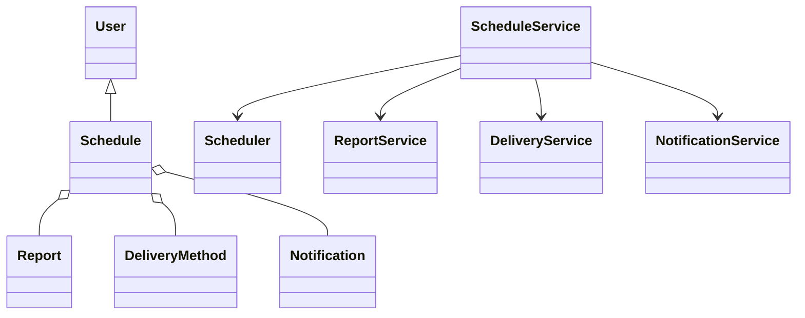
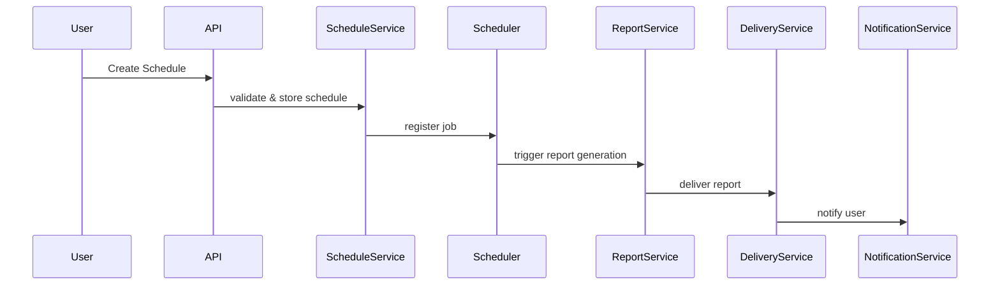
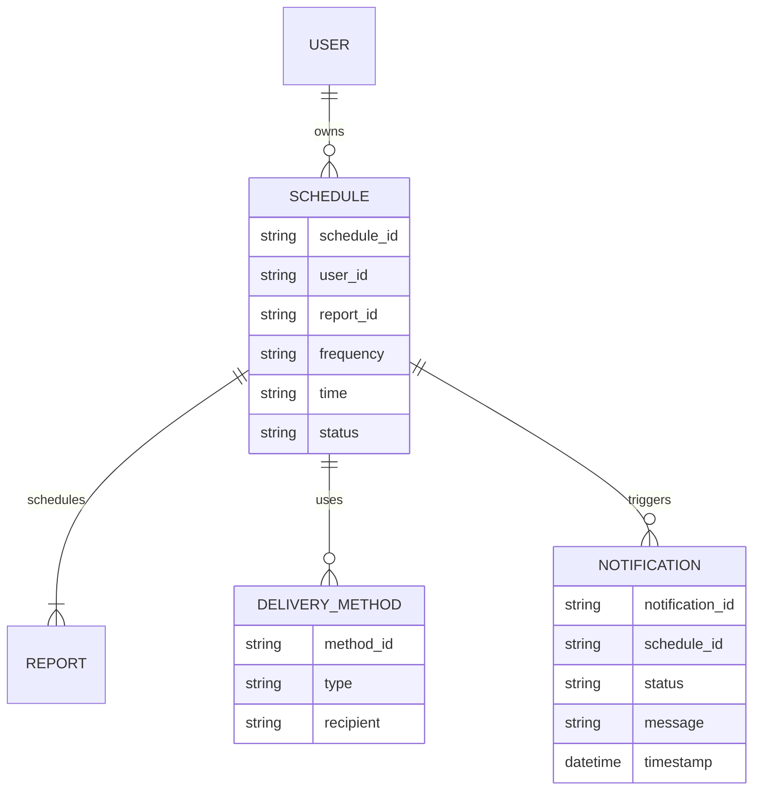

# For User Story Number [1]

1. Objective
This requirement enables business users to automate the scheduling and delivery of reports at regular intervals, reducing manual effort and ensuring timely access to updated information. Users can select reports, define frequency and time, and choose delivery methods. The system handles report generation, delivery, and notification based on the defined schedule.

2. API Model
2.1 Common Components/Services
- Scheduler Service (Quartz Scheduler/Spring Scheduler)
- Email Service (Spring Mail)
- Notification Service
- Report Generation Service
- User Authentication & Authorization (Spring Security)

2.2 API Details
| Operation | REST Method | Type | URL | Request | Response |
|-----------|------------|------|-----|---------|----------|
| Create Schedule | POST | Success/Failure | /api/schedules | {"reportId": "123", "frequency": "DAILY", "time": "08:00", "deliveryMethods": ["EMAIL"], "recipients": ["user@domain.com"]} | {"scheduleId": "456", "status": "CREATED"} |
| Get Schedules | GET | Success/Failure | /api/schedules |  | [{"scheduleId": "456", "reportId": "123", "frequency": "DAILY", "time": "08:00", "deliveryMethods": ["EMAIL"], "status": "ACTIVE"}] |
| Trigger Report | POST | Success/Failure | /api/schedules/{scheduleId}/trigger |  | {"deliveryStatus": "SUCCESS", "timestamp": "2025-09-25T08:00:00Z"} |

2.3 Exceptions
| API | Exception | Message |
|-----|-----------|---------|
| Create Schedule | InvalidReportTemplateException | "Selected report template is invalid." |
| Create Schedule | InvalidFrequencyException | "Frequency or time is not allowed." |
| Create Schedule | InvalidDeliveryMethodException | "Delivery method is not valid or verified." |
| Trigger Report | ReportGenerationException | "Failed to generate report." |
| Trigger Report | DeliveryException | "Failed to deliver report." |

3 Functional Design
3.1 Class Diagram

3.2 UML Sequence Diagram

3.3 Components
| Component Name | Description | Existing/New |
|---------------|-------------|--------------|
| ScheduleService | Handles scheduling logic, validation, and persistence | New |
| Scheduler | Triggers report generation as per schedule | Existing (Spring Scheduler) |
| ReportService | Generates reports based on templates and data | Existing |
| DeliveryService | Delivers reports via email/download link | Existing |
| NotificationService | Sends notifications on success/failure | Existing |
| UserService | Manages user authentication/authorization | Existing |

3.4 Service Layer Logic & Validations
| FieldName | Validation | Error Message | ClassUsed |
|-----------|-----------|--------------|-----------|
| reportId | Must be a valid report template | "Invalid report template" | ScheduleService |
| frequency | Must be within allowed values (DAILY, WEEKLY, MONTHLY) | "Invalid frequency" | ScheduleService |
| time | Must be a valid time format and within allowed range | "Invalid time" | ScheduleService |
| deliveryMethods | Must be valid and verified (e.g., valid email) | "Invalid delivery method" | DeliveryService |

4 Integrations
| SystemToBeIntegrated | IntegratedFor | IntegrationType |
|---------------------|---------------|-----------------|
| Email (SMTP) | Report delivery | API |
| Scheduler (Spring Scheduler) | Job scheduling | API |
| Notification (Email/SMS) | User notifications | API |

5 DB Details
5.1 ER Model

5.2 DB Validations
- Foreign key constraints between SCHEDULE and USER, REPORT, DELIVERY_METHOD
- Unique constraint on (user_id, report_id, frequency, time)
- Valid email format for DELIVERY_METHOD.recipient

6 Non-Functional Requirements
6.1 Performance
- Reports must be generated and delivered within 5 minutes of scheduled time
- Caching of report templates and user preferences at API layer

6.2 Security
6.2.1 Authentication
- All scheduling actions require authenticated user (Spring Security/JWT)
6.2.2 Authorization
- Only authorized users can schedule reports; role-based access
- Sensitive report data encrypted during delivery

6.3 Logging
6.3.1 Application Logging
- DEBUG: Scheduler triggers, report generation steps
- INFO: Successful schedule creation, report delivery
- ERROR: Failures in scheduling, report generation, delivery
- WARN: Retry attempts for failed deliveries
6.3.2 Audit Log
- All scheduling, delivery, and notification activities logged with user, timestamp, and action

7 Dependencies
- SMTP server for email delivery
- Quartz/Spring Scheduler for job scheduling
- Database for storing schedules, reports, notifications

8 Assumptions
- All report templates are pre-validated and available
- Email server is configured and available
- Scheduler can handle at least 1,000 concurrent schedules
- Users have valid email addresses for notifications
