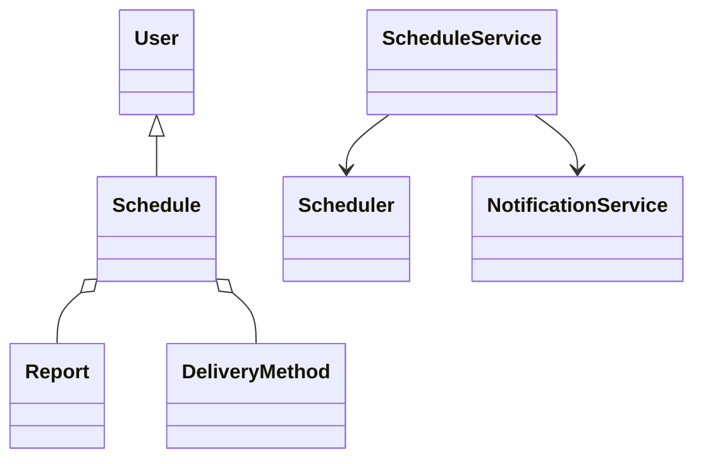
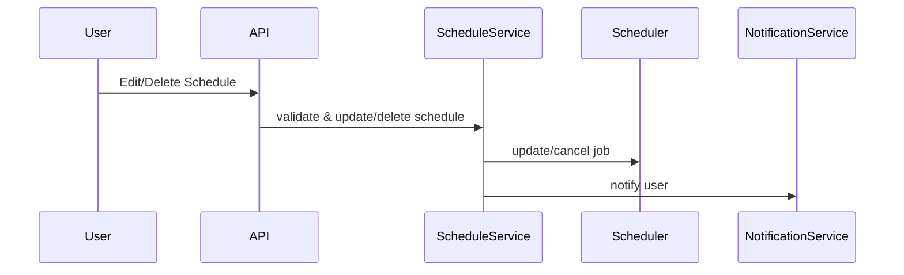
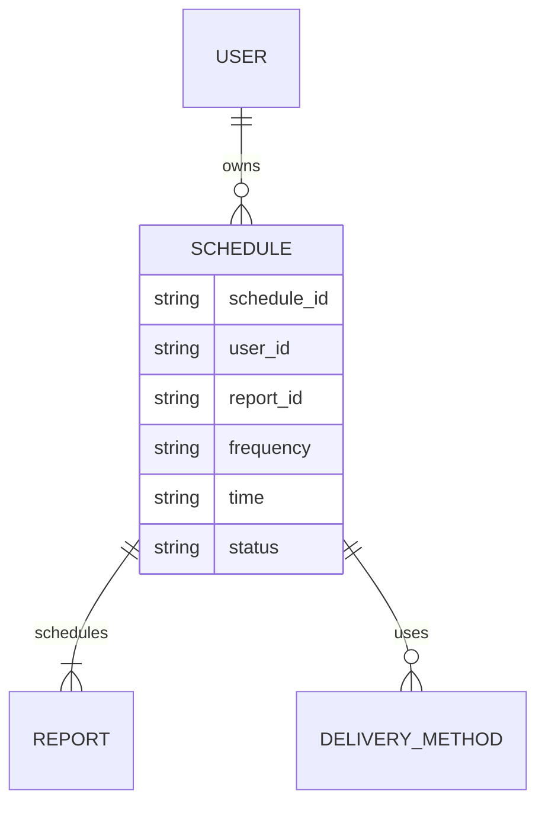

# For User Story Number [2]

1. Objective
This requirement allows business users to edit or delete their existing automated report schedules, enabling them to update reporting preferences or remove schedules as needs change. Users can modify schedule parameters such as frequency, time, report selection, and delivery method, with changes reflected immediately. The system ensures only authorized users can perform these actions and provides confirmation notifications.

2. API Model
2.1 Common Components/Services
- ScheduleService
- Scheduler (Spring Scheduler)
- NotificationService
- User Authentication & Authorization (Spring Security)

2.2 API Details
| Operation | REST Method | Type | URL | Request | Response |
|-----------|------------|------|-----|---------|----------|
| Get Schedules | GET | Success/Failure | /api/schedules |  | [{"scheduleId": "456", "reportId": "123", "frequency": "DAILY", "time": "08:00", "deliveryMethods": ["EMAIL"], "status": "ACTIVE"}] |
| Edit Schedule | PUT | Success/Failure | /api/schedules/{scheduleId} | {"frequency": "WEEKLY", "time": "09:00", "deliveryMethods": ["EMAIL"]} | {"scheduleId": "456", "status": "UPDATED"} |
| Delete Schedule | DELETE | Success/Failure | /api/schedules/{scheduleId} |  | {"scheduleId": "456", "status": "DELETED"} |

2.3 Exceptions
| API | Exception | Message |
|-----|-----------|---------|
| Edit Schedule | UnauthorizedAccessException | "User does not own this schedule." |
| Edit Schedule | InvalidScheduleParametersException | "Edited parameters are invalid." |
| Delete Schedule | UnauthorizedAccessException | "User does not own this schedule." |
| Delete Schedule | ScheduleNotFoundException | "Schedule not found." |

3 Functional Design
3.1 Class Diagram

3.2 UML Sequence Diagram

3.3 Components
| Component Name | Description | Existing/New |
|---------------|-------------|--------------|
| ScheduleService | Handles schedule retrieval, update, and deletion | New |
| Scheduler | Manages scheduled jobs and triggers | Existing |
| NotificationService | Sends notifications for edits/deletions | Existing |
| UserService | Manages user authentication/authorization | Existing |

3.4 Service Layer Logic & Validations
| FieldName | Validation | Error Message | ClassUsed |
|-----------|-----------|--------------|-----------|
| scheduleId | Must belong to authenticated user | "Unauthorized access" | ScheduleService |
| frequency | Must be valid and allowed | "Invalid frequency" | ScheduleService |
| time | Must be valid time format | "Invalid time" | ScheduleService |
| deliveryMethods | Must be valid and verified | "Invalid delivery method" | ScheduleService |

4 Integrations
| SystemToBeIntegrated | IntegratedFor | IntegrationType |
|---------------------|---------------|-----------------|
| Scheduler (Spring Scheduler) | Job update/cancel | API |
| Notification (Email/SMS) | User notifications | API |

5 DB Details
5.1 ER Model

5.2 DB Validations
- Foreign key constraints between SCHEDULE and USER, REPORT
- Only owner can edit/delete schedule
- Valid frequency and time

6 Non-Functional Requirements
6.1 Performance
- Schedule changes reflected within 1 minute
- Prevent race conditions during concurrent edits

6.2 Security
6.2.1 Authentication
- Authenticated user required for all actions
6.2.2 Authorization
- Only owner or admin can edit/delete schedules

6.3 Logging
6.3.1 Application Logging
- DEBUG: Edit/delete requests and processing
- INFO: Successful edits/deletions
- ERROR: Unauthorized access, failures
6.3.2 Audit Log
- All changes and deletions logged with user, timestamp, and action

7 Dependencies
- Scheduler for job management
- Database for storing schedules

8 Assumptions
- Users have access only to their own schedules
- Scheduler supports immediate update/cancel of jobs
