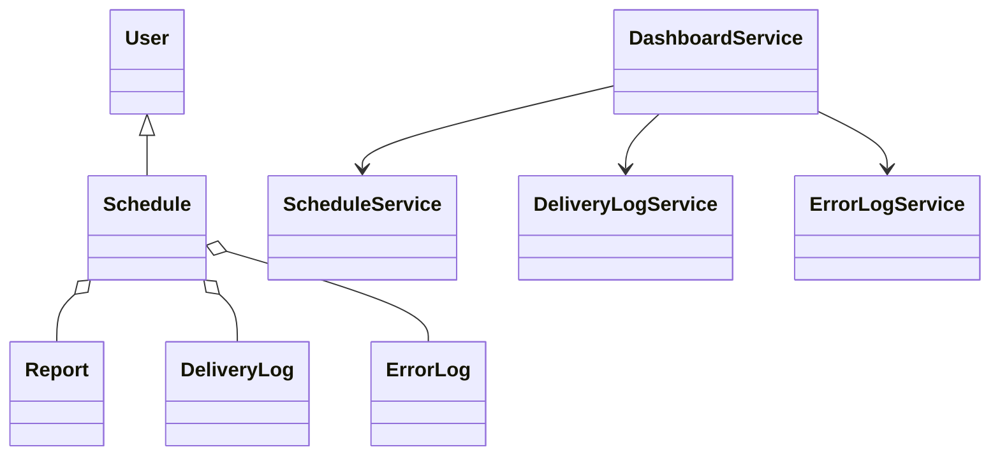
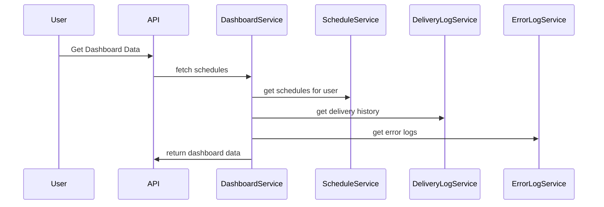
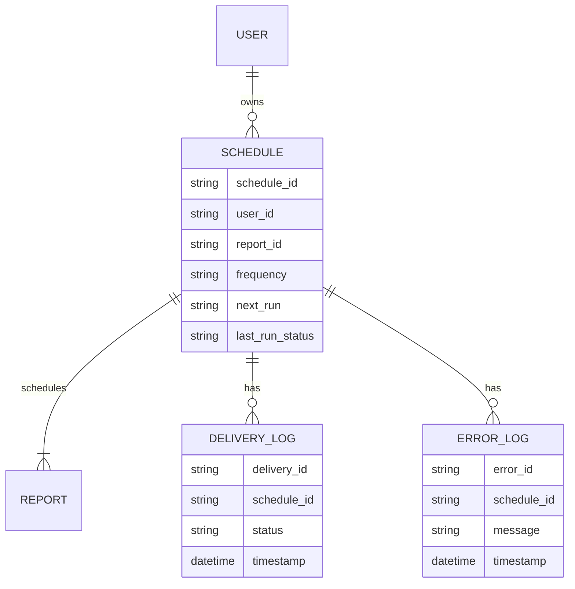

# For User Story Number [3]

1. Objective
This requirement provides business users with a dashboard to monitor, manage, and review all their scheduled reports, including status, history, and errors. Users can filter, sort, and search schedules, and access actions to edit or delete them. The dashboard supports efficient management and real-time visibility into report scheduling activities.

2. API Model
2.1 Common Components/Services
- DashboardService
- ScheduleService
- DeliveryLogService
- ErrorLogService
- User Authentication & Authorization (Spring Security)

2.2 API Details
| Operation | REST Method | Type | URL | Request | Response |
|-----------|------------|------|-----|---------|----------|
| Get Dashboard Data | GET | Success/Failure | /api/dashboard/schedules |  | [{"scheduleId": "456", "reportName": "Sales Report", "frequency": "DAILY", "nextRun": "2025-09-26T08:00:00Z", "lastRunStatus": "SUCCESS"}] |
| Get Delivery History | GET | Success/Failure | /api/dashboard/schedules/{scheduleId}/deliveries |  | [{"deliveryId": "789", "status": "SUCCESS", "timestamp": "2025-09-25T08:00:00Z"}] |
| Get Error Logs | GET | Success/Failure | /api/dashboard/schedules/{scheduleId}/errors |  | [{"errorId": "101", "message": "Delivery failed", "timestamp": "2025-09-25T08:01:00Z"}] |

2.3 Exceptions
| API | Exception | Message |
|-----|-----------|---------|
| Get Dashboard Data | UnauthorizedAccessException | "User does not own these schedules." |
| Get Delivery History | ScheduleNotFoundException | "Schedule not found." |
| Get Error Logs | ErrorLogNotFoundException | "No error logs found for this schedule." |

3 Functional Design
3.1 Class Diagram

3.2 UML Sequence Diagram

3.3 Components
| Component Name | Description | Existing/New |
|---------------|-------------|--------------|
| DashboardService | Aggregates dashboard data for user | New |
| ScheduleService | Retrieves schedules for user | Existing |
| DeliveryLogService | Fetches delivery history | New |
| ErrorLogService | Fetches error logs | New |
| UserService | Manages user authentication/authorization | Existing |

3.4 Service Layer Logic & Validations
| FieldName | Validation | Error Message | ClassUsed |
|-----------|-----------|--------------|-----------|
| userId | Only schedules owned by user are visible | "Unauthorized access" | ScheduleService |
| scheduleId | Must exist and belong to user | "Schedule not found" | ScheduleService |
| errorLog | Must display actionable message | "No error logs found" | ErrorLogService |

4 Integrations
| SystemToBeIntegrated | IntegratedFor | IntegrationType |
|---------------------|---------------|-----------------|
| Real-time update (WebSocket/SignalR) | Dashboard refresh | API |
| Audit Logging | Dashboard actions | API |

5 DB Details
5.1 ER Model

5.2 DB Validations
- Foreign key constraints between SCHEDULE and USER, DELIVERY_LOG, ERROR_LOG
- Retain delivery and error logs for at least 90 days

6 Non-Functional Requirements
6.1 Performance
- Dashboard must load within 3 seconds for up to 100 schedules
- Efficient queries and caching for dashboard data

6.2 Security
6.2.1 Authentication
- Authenticated user required for dashboard access
6.2.2 Authorization
- Only owner can view their dashboard data

6.3 Logging
6.3.1 Application Logging
- DEBUG: Dashboard data fetch requests
- INFO: Successful dashboard loads
- ERROR: Unauthorized access, failures
6.3.2 Audit Log
- All dashboard actions logged with user, timestamp, and action

7 Dependencies
- Real-time update mechanism (WebSocket/SignalR)
- Database for storing schedules, delivery logs, error logs

8 Assumptions
- Users have up to 100 schedules for dashboard performance
- Delivery and error logs are retained for 90 days
