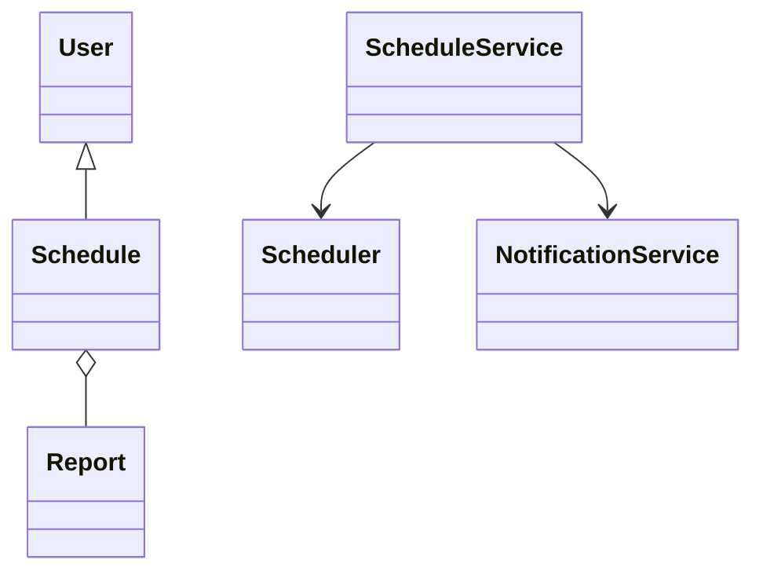
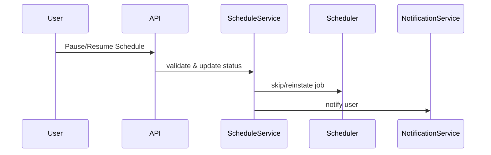
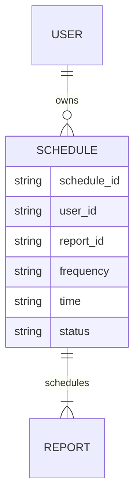

# For User Story Number [4]

1. Objective
This requirement allows business users to pause and resume their scheduled reports, enabling temporary suspension and restoration of automated report delivery. Users can control schedule status from the dashboard or details page, with immediate effect and confirmation notifications. The system ensures only authorized users can perform these actions and prevents duplicate operations.

2. API Model
2.1 Common Components/Services
- ScheduleService
- Scheduler (Spring Scheduler)
- NotificationService
- User Authentication & Authorization (Spring Security)

2.2 API Details
| Operation | REST Method | Type | URL | Request | Response |
|-----------|------------|------|-----|---------|----------|
| Pause Schedule | POST | Success/Failure | /api/schedules/{scheduleId}/pause |  | {"scheduleId": "456", "status": "PAUSED"} |
| Resume Schedule | POST | Success/Failure | /api/schedules/{scheduleId}/resume |  | {"scheduleId": "456", "status": "ACTIVE"} |

2.3 Exceptions
| API | Exception | Message |
|-----|-----------|---------|
| Pause Schedule | InvalidScheduleStateException | "Only active schedules can be paused." |
| Resume Schedule | InvalidScheduleStateException | "Only paused schedules can be resumed." |
| Pause/Resume Schedule | DuplicateActionException | "Duplicate pause/resume action detected." |
| Pause/Resume Schedule | UnauthorizedAccessException | "User does not own this schedule." |

3 Functional Design
3.1 Class Diagram

3.2 UML Sequence Diagram

3.3 Components
| Component Name | Description | Existing/New |
|---------------|-------------|--------------|
| ScheduleService | Handles pause/resume logic and status updates | New |
| Scheduler | Manages job triggers and skips/reinstates jobs | Existing |
| NotificationService | Sends notifications for pause/resume actions | Existing |
| UserService | Manages user authentication/authorization | Existing |

3.4 Service Layer Logic & Validations
| FieldName | Validation | Error Message | ClassUsed |
|-----------|-----------|--------------|-----------|
| scheduleId | Must belong to authenticated user | "Unauthorized access" | ScheduleService |
| status | Only active schedules can be paused; only paused can be resumed | "Invalid schedule state" | ScheduleService |
| action | Prevent duplicate pause/resume actions | "Duplicate action" | ScheduleService |

4 Integrations
| SystemToBeIntegrated | IntegratedFor | IntegrationType |
|---------------------|---------------|-----------------|
| Scheduler (Spring Scheduler) | Job skip/reinstate | API |
| Notification (Email/SMS) | User notifications | API |
| Audit Logging | Status changes | API |

5 DB Details
5.1 ER Model

5.2 DB Validations
- Foreign key constraints between SCHEDULE and USER, REPORT
- Status must be updated immediately
- Prevent duplicate status changes

6 Non-Functional Requirements
6.1 Performance
- Pause/resume actions must take effect within 30 seconds
- Handle up to 500 concurrent pause/resume actions

6.2 Security
6.2.1 Authentication
- Authenticated user required for all actions
6.2.2 Authorization
- Only owner or admin can pause/resume schedules

6.3 Logging
6.3.1 Application Logging
- DEBUG: Pause/resume requests and processing
- INFO: Successful status changes
- ERROR: Unauthorized access, failures
6.3.2 Audit Log
- All status changes logged with user, timestamp, and action

7 Dependencies
- Scheduler for job management
- Database for storing schedules

8 Assumptions
- Scheduler supports immediate skip/reinstate of jobs
- Users have access only to their own schedules
