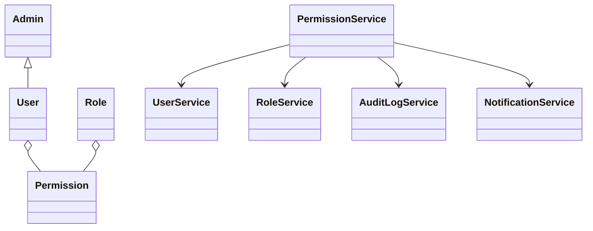
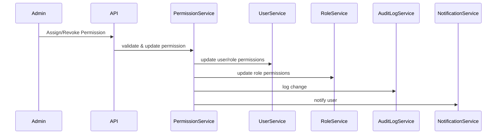
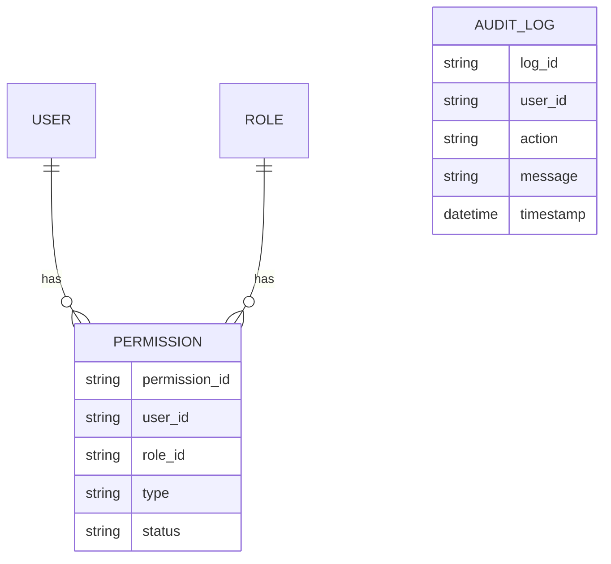

# For User Story Number [5]

1. Objective
This requirement enables administrators to manage user and role-based permissions for scheduling automated reports, ensuring only authorized users can access, create, edit, pause, or view scheduled reports. Permission changes are enforced immediately and logged for auditing. The system integrates with IAM and supports large-scale role-based access control.

2. API Model
2.1 Common Components/Services
- PermissionService
- UserService
- RoleService
- NotificationService
- AuditLogService
- User Authentication & Authorization (Spring Security, RBAC)

2.2 API Details
| Operation | REST Method | Type | URL | Request | Response |
|-----------|------------|------|-----|---------|----------|
| Assign Permission | POST | Success/Failure | /api/permissions/assign | {"userId": "123", "permission": "SCHEDULE_REPORT"} | {"userId": "123", "status": "ASSIGNED"} |
| Revoke Permission | POST | Success/Failure | /api/permissions/revoke | {"userId": "123", "permission": "SCHEDULE_REPORT"} | {"userId": "123", "status": "REVOKED"} |
| Get Permissions | GET | Success/Failure | /api/permissions/{userId} |  | [{"permission": "SCHEDULE_REPORT", "status": "ASSIGNED"}] |

2.3 Exceptions
| API | Exception | Message |
|-----|-----------|---------|
| Assign/Revoke Permission | UnauthorizedAccessException | "Only administrators can manage permissions." |
| Assign/Revoke Permission | PermissionNotFoundException | "Permission not found." |
| Assign/Revoke Permission | IAMIntegrationException | "Failed to update IAM system." |
| Get Permissions | UserNotFoundException | "User not found." |

3 Functional Design
3.1 Class Diagram

3.2 UML Sequence Diagram

3.3 Components
| Component Name | Description | Existing/New |
|---------------|-------------|--------------|
| PermissionService | Manages permission assignments and checks | New |
| UserService | Handles user details and authentication | Existing |
| RoleService | Handles role details and assignments | Existing |
| NotificationService | Sends notifications for permission changes | Existing |
| AuditLogService | Logs permission assignments and access attempts | New |

3.4 Service Layer Logic & Validations
| FieldName | Validation | Error Message | ClassUsed |
|-----------|-----------|--------------|-----------|
| userId | Must exist in system | "User not found" | UserService |
| permission | Must be valid and allowed | "Permission not found" | PermissionService |
| action | Only admin can assign/revoke | "Unauthorized access" | PermissionService |

4 Integrations
| SystemToBeIntegrated | IntegratedFor | IntegrationType |
|---------------------|---------------|-----------------|
| IAM System | User/role permission management | API |
| Notification (Email/In-app) | Permission change notification | API |
| Audit Logging | Permission assignments and access attempts | API |

5 DB Details
5.1 ER Model

5.2 DB Validations
- Foreign key constraints between PERMISSION and USER, ROLE
- Only admin can assign/revoke permissions
- Log all permission changes

6 Non-Functional Requirements
6.1 Performance
- Permission changes propagate within 1 minute
- Support for at least 10,000 users with role-based permissions

6.2 Security
6.2.1 Authentication
- Authenticated admin required for permission management
6.2.2 Authorization
- RBAC enforced for all scheduling features
- No unauthorized access to scheduling features or data

6.3 Logging
6.3.1 Application Logging
- DEBUG: Permission assignment/revoke requests
- INFO: Successful permission changes
- ERROR: Unauthorized access, IAM failures
6.3.2 Audit Log
- All permission assignments and access attempts logged with user, timestamp, and action

7 Dependencies
- IAM system for user/role management
- Database for storing permissions and audit logs

8 Assumptions
- IAM system is integrated and available
- Only administrators can manage permissions
