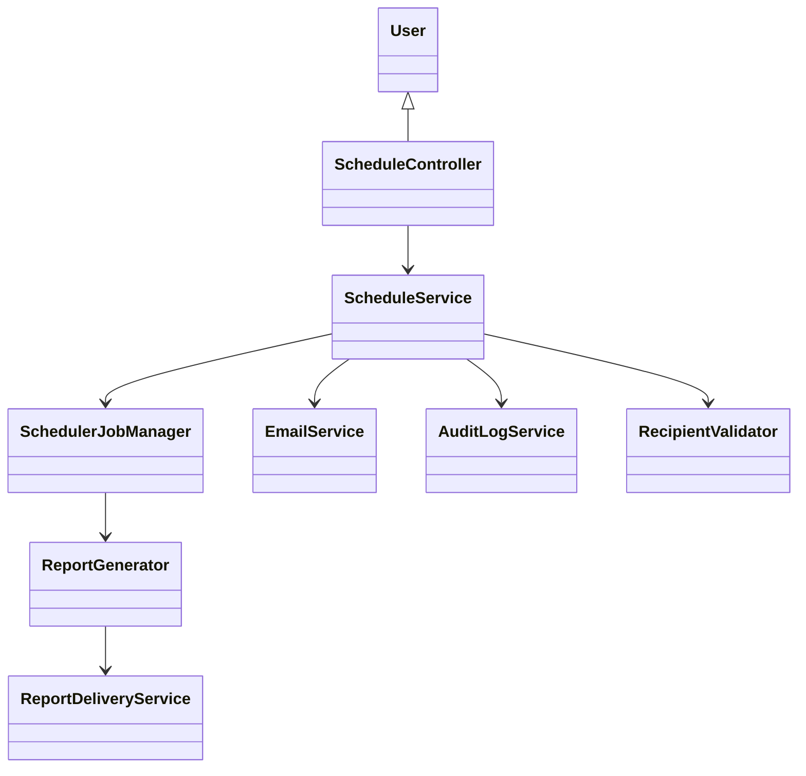
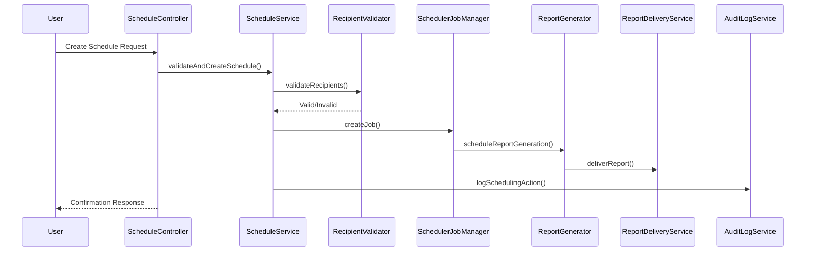
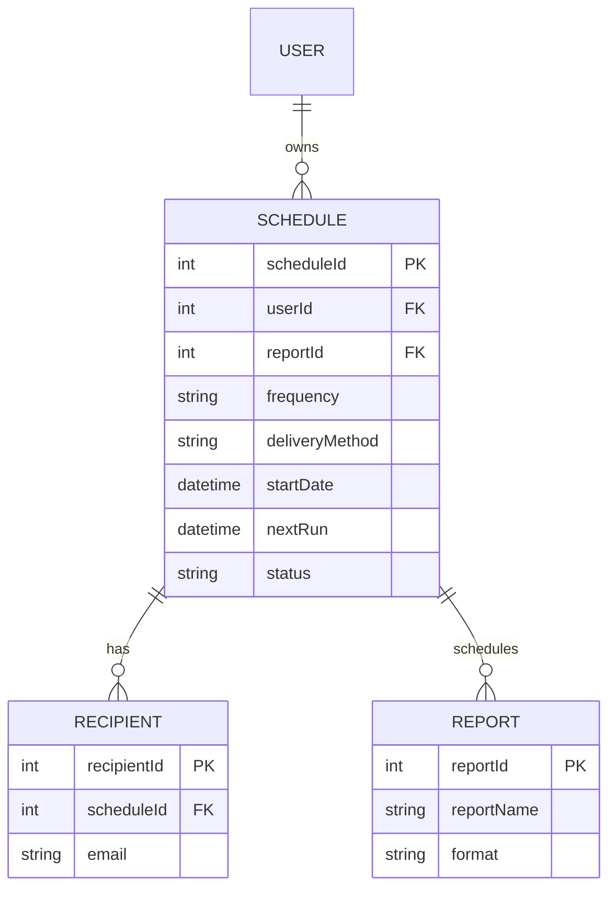

# For User Story Number [1]

1. Objective
This requirement enables business users to automate the scheduling and delivery of reports at configurable intervals. It aims to eliminate manual intervention for regular report generation and ensures timely delivery to intended recipients. The solution supports multiple delivery channels and enforces business rules for scheduling and recipient management.

2. API Model
2.1 Common Components/Services
- User Authentication & Authorization Service (Spring Security)
- Email Service (JavaMailSender)
- Scheduler Service (Quartz Scheduler or Spring Task Scheduler)
- Audit Logging Service

2.2 API Details
| Operation | REST Method | Type | URL | Request | Response |
|-----------|-------------|------|-----|---------|----------|
| Create Schedule | POST | Success/Failure | /api/schedules | {"reportId": 123, "frequency": "DAILY", "recipients": ["user@example.com"], "deliveryMethod": "EMAIL", "startDate": "2024-07-01T09:00:00"} | {"scheduleId": 456, "status": "SCHEDULED", "confirmation": "Report scheduled successfully."} |
| List Schedules | GET | Success/Failure | /api/schedules | N/A | [{"scheduleId": 456, "reportId": 123, "frequency": "DAILY", "recipients": ["user@example.com"], "deliveryMethod": "EMAIL", "nextRun": "2024-07-02T09:00:00"}] |
| Remove Recipient | PUT | Success/Failure | /api/schedules/{scheduleId}/recipients | {"recipients": ["user@example.com"]} | {"scheduleId": 456, "recipients": ["other@example.com"], "status": "UPDATED"} |
| Confirm Scheduling | GET | Success/Failure | /api/schedules/{scheduleId}/confirmation | N/A | {"scheduleId": 456, "confirmation": "Report scheduled successfully."} |

2.3 Exceptions
| API | Exception | Description |
|-----|-----------|-------------|
| POST /api/schedules | InvalidEmailException | Recipient email is invalid |
| POST /api/schedules | PastDateException | Scheduled date/time is in the past |
| POST /api/schedules | FrequencyRuleException | Frequency violates business rules |
| All APIs | UnauthorizedException | User is not authorized |
| All APIs | InternalServerException | Unexpected error |

3 Functional Design
3.1 Class Diagram

3.2 UML Sequence Diagram

3.3 Components
| Component Name | Description | Existing/New |
|----------------|-------------|--------------|
| ScheduleController | REST API controller for scheduling operations | New |
| ScheduleService | Business logic for scheduling and validation | New |
| SchedulerJobManager | Manages backend scheduled jobs | New |
| ReportGenerator | Generates reports as per schedule | Existing |
| ReportDeliveryService | Delivers reports via email/download | Existing |
| RecipientValidator | Validates recipient emails | New |
| AuditLogService | Logs scheduling actions | Existing |
| EmailService | Sends emails | Existing |

3.4 Service Layer Logic and Validations
| FieldName | Validation | Error Message | ClassUsed |
|-----------|-----------|--------------|-----------|
| recipients | Valid email format | "Invalid email address." | RecipientValidator |
| startDate | Must be future date/time | "Cannot schedule for past date/time." | ScheduleService |
| frequency | Must comply with business rules | "Frequency not allowed." | ScheduleService |

4 Integrations
| SystemToBeIntegrated | IntegratedFor | IntegrationType |
|----------------------|--------------|-----------------|
| SMTP Server | Email delivery | API |
| Azure Functions | Scheduling backend | API |
| Audit Log System | Action tracking | API |

5 DB Details
5.1 ER Model

5.2 DB Validations
- Email must be unique per schedule.
- startDate must be >= current timestamp.
- frequency must match allowed values.

6 Non-Functional Requirements
6.1 Performance
- All scheduled reports must be generated and delivered within 5 minutes of scheduled time.
- Use caching for report templates at API layer if applicable.

6.2 Security
6.2.1 Authentication
- Use Spring Security for user authentication and role-based access.
6.2.2 Authorization
- Only authorized users can schedule reports and manage recipients.

6.3 Logging
6.3.1 Application Logging
- Log all scheduling requests at INFO level.
- Log validation failures at WARN level.
- Log system errors at ERROR level.
6.3.2 Audit Log
- Log all scheduling actions with user, timestamp, action type, and outcome.

7 Dependencies
- Quartz Scheduler or Spring Task Scheduler
- JavaMailSender for email delivery
- Azure Functions integration

8 Assumptions
- Report templates and report generation logic are already implemented.
- SMTP server is configured and available.
- Users have valid email addresses.
- Frequency rules are configurable via application properties.