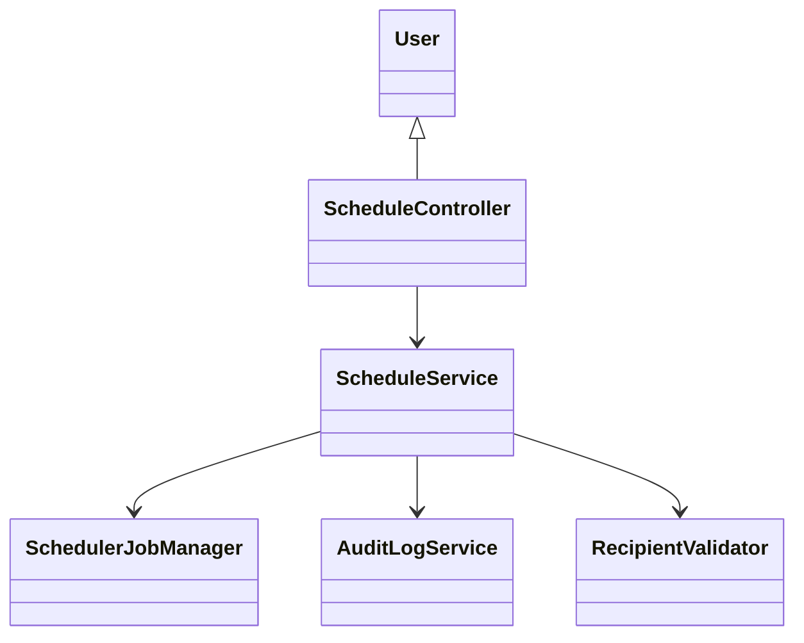
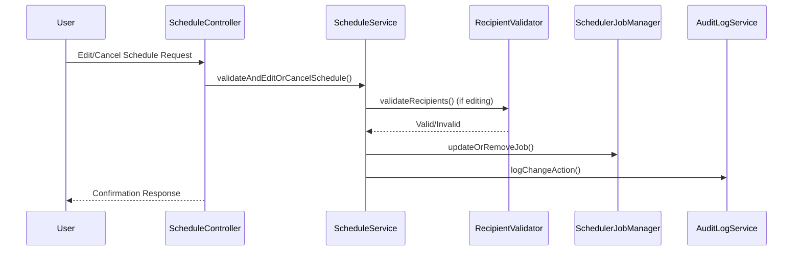
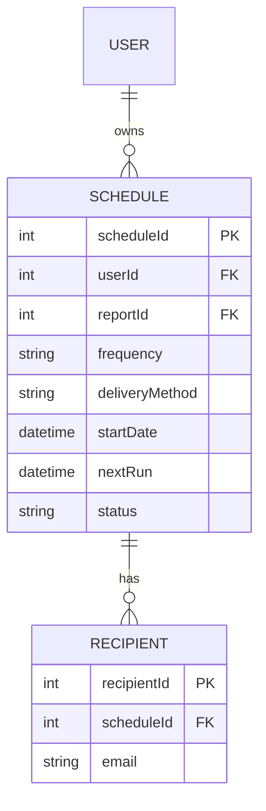

# For User Story Number [2]

1. Objective
This requirement allows business users to view, edit, or cancel their existing scheduled report jobs. It provides flexibility for users to manage reporting schedules as their needs change and ensures that only authorized users can make modifications or cancellations. All changes are tracked for audit and compliance purposes.

2. API Model
2.1 Common Components/Services
- User Authentication & Authorization Service (Spring Security)
- Scheduler Service (Quartz Scheduler or Spring Task Scheduler)
- Audit Logging Service

2.2 API Details
| Operation | REST Method | Type | URL | Request | Response |
|-----------|-------------|------|-----|---------|----------|
| List Schedules | GET | Success/Failure | /api/schedules | N/A | [{"scheduleId": 456, "reportId": 123, "frequency": "DAILY", "recipients": ["user@example.com"], "deliveryMethod": "EMAIL", "nextRun": "2024-07-02T09:00:00"}] |
| Edit Schedule | PUT | Success/Failure | /api/schedules/{scheduleId} | {"frequency": "WEEKLY", "recipients": ["user@example.com", "other@example.com"], "parameters": {...}} | {"scheduleId": 456, "status": "UPDATED", "confirmation": "Schedule updated successfully."} |
| Cancel Schedule | DELETE | Success/Failure | /api/schedules/{scheduleId} | N/A | {"scheduleId": 456, "status": "CANCELLED", "confirmation": "Schedule cancelled successfully."} |

2.3 Exceptions
| API | Exception | Description |
|-----|-----------|-------------|
| PUT /api/schedules/{scheduleId} | UnauthorizedException | User is not owner or authorized |
| PUT /api/schedules/{scheduleId} | InvalidFrequencyException | Frequency violates business rules |
| PUT /api/schedules/{scheduleId} | InvalidRecipientException | Recipient email is invalid |
| DELETE /api/schedules/{scheduleId} | UnauthorizedException | User is not owner or authorized |
| DELETE /api/schedules/{scheduleId} | AlreadyCancelledException | Schedule already cancelled |
| All APIs | InternalServerException | Unexpected error |

3 Functional Design
3.1 Class Diagram

3.2 UML Sequence Diagram

3.3 Components
| Component Name | Description | Existing/New |
|----------------|-------------|--------------|
| ScheduleController | REST API controller for schedule management | New |
| ScheduleService | Business logic for editing/cancelling schedules | New |
| SchedulerJobManager | Manages backend scheduled jobs | Existing |
| RecipientValidator | Validates recipient emails | Existing |
| AuditLogService | Logs schedule changes | Existing |

3.4 Service Layer Logic and Validations
| FieldName | Validation | Error Message | ClassUsed |
|-----------|-----------|--------------|-----------|
| user | Must be owner or authorized | "User not authorized to edit/cancel schedule." | ScheduleService |
| frequency | Must comply with business rules | "Frequency not allowed." | ScheduleService |
| recipients | Valid email format | "Invalid email address." | RecipientValidator |

4 Integrations
| SystemToBeIntegrated | IntegratedFor | IntegrationType |
|----------------------|--------------|-----------------|
| Azure Functions | Scheduling backend | API |
| Audit Log System | Action tracking | API |

5 DB Details
5.1 ER Model

5.2 DB Validations
- Only owner or authorized user can update/delete schedule.
- Frequency and recipient fields must be validated on update.
- Cancelled schedules must have status = 'CANCELLED'.

6 Non-Functional Requirements
6.1 Performance
- Edits and cancellations must be processed within 2 seconds.

6.2 Security
6.2.1 Authentication
- Use Spring Security for user authentication and role-based access.
6.2.2 Authorization
- Only authorized users can modify/cancel schedules.

6.3 Logging
6.3.1 Application Logging
- Log all edit/cancel requests at INFO level.
- Log validation failures at WARN level.
- Log system errors at ERROR level.
6.3.2 Audit Log
- Log all schedule changes with user, timestamp, action type, and outcome.

7 Dependencies
- Quartz Scheduler or Spring Task Scheduler
- Azure Functions integration

8 Assumptions
- Schedules are uniquely identified and mapped to users.
- Audit log system is available and integrated.
- Business rules for frequency are centrally managed.