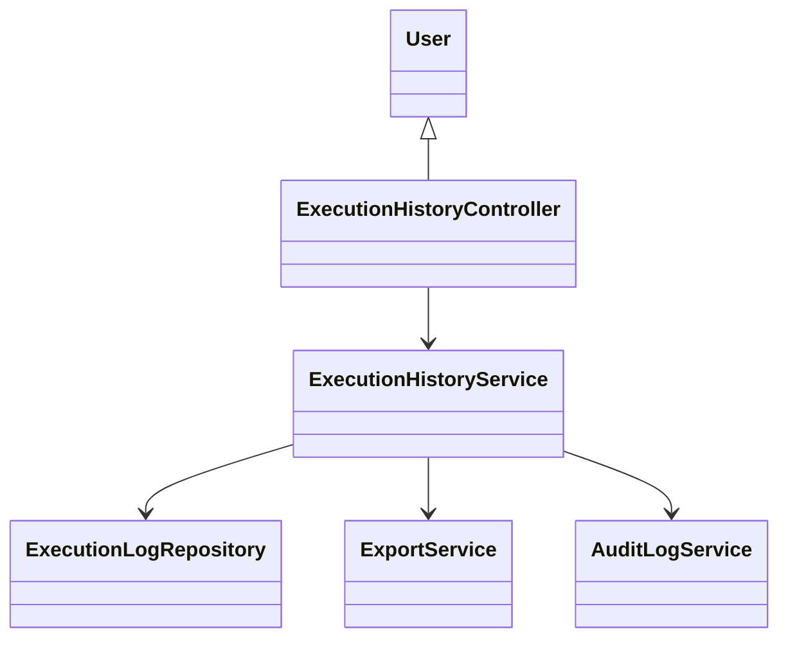
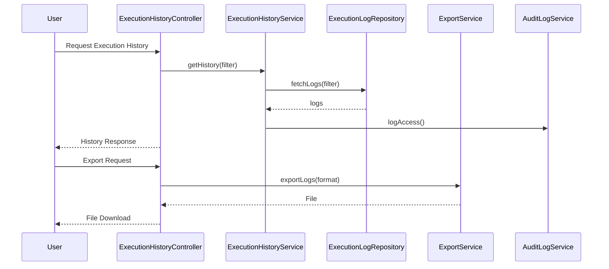
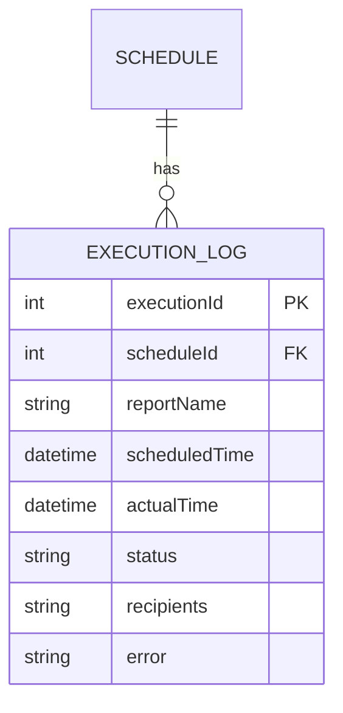

# For User Story Number [3]

1. Objective
This requirement enables business users to view the execution history of their scheduled reports, including timestamps, delivery status, and error details. It provides filtering and export capabilities to support audit and troubleshooting needs. The solution ensures that only authorized users can access execution logs and that all access is tracked for compliance.

2. API Model
2.1 Common Components/Services
- User Authentication & Authorization Service (Spring Security)
- Execution Log Service
- Audit Logging Service
- Export Service (CSV/PDF)

2.2 API Details
| Operation | REST Method | Type | URL | Request | Response |
|-----------|-------------|------|-----|---------|----------|
| Get Execution History | GET | Success/Failure | /api/schedules/{scheduleId}/history | ?dateFrom=2024-07-01&dateTo=2024-07-10&status=FAILED | [{"executionId": 789, "reportName": "Sales Report", "scheduledTime": "2024-07-02T09:00:00", "actualTime": "2024-07-02T09:01:00", "status": "FAILED", "recipients": ["user@example.com"], "error": "SMTP timeout"}] |
| Export History | GET | Success/Failure | /api/schedules/{scheduleId}/history/export | ?format=CSV | (CSV/PDF file download) |

2.3 Exceptions
| API | Exception | Description |
|-----|-----------|-------------|
| GET /api/schedules/{scheduleId}/history | UnauthorizedException | User is not owner or authorized |
| GET /api/schedules/{scheduleId}/history | InvalidDateRangeException | Date range is invalid |
| GET /api/schedules/{scheduleId}/history | InternalServerException | Unexpected error |
| GET /api/schedules/{scheduleId}/history/export | ExportFormatException | Unsupported export format |

3 Functional Design
3.1 Class Diagram

3.2 UML Sequence Diagram

3.3 Components
| Component Name | Description | Existing/New |
|----------------|-------------|--------------|
| ExecutionHistoryController | REST API controller for history operations | New |
| ExecutionHistoryService | Business logic for fetching and filtering history | New |
| ExecutionLogRepository | Data access for execution logs | New |
| ExportService | Handles CSV/PDF export | New |
| AuditLogService | Logs access to history | Existing |

3.4 Service Layer Logic and Validations
| FieldName | Validation | Error Message | ClassUsed |
|-----------|-----------|--------------|-----------|
| user | Must be owner or authorized | "User not authorized to view execution history." | ExecutionHistoryService |
| dateRange | Valid date range | "Invalid date range." | ExecutionHistoryService |
| status | Must match allowed values | "Invalid status filter." | ExecutionHistoryService |

4 Integrations
| SystemToBeIntegrated | IntegratedFor | IntegrationType |
|----------------------|--------------|-----------------|
| Audit Log System | Action tracking | API |
| Export Service | CSV/PDF export | API |

5 DB Details
5.1 ER Model

5.2 DB Validations
- Only owner or authorized user can access logs.
- All log entries must have valid status and timestamps.

6 Non-Functional Requirements
6.1 Performance
- History page must load within 3 seconds for up to 1,000 records.

6.2 Security
6.2.1 Authentication
- Use Spring Security for user authentication and role-based access.
6.2.2 Authorization
- Only authorized users can access execution logs.

6.3 Logging
6.3.1 Application Logging
- Log all history access at INFO level.
- Log export actions at INFO level.
- Log system errors at ERROR level.
6.3.2 Audit Log
- Log all access to execution history with user, timestamp, and filter parameters.

7 Dependencies
- Audit log system
- Export service for CSV/PDF

8 Assumptions
- Execution logs are stored in a dedicated table.
- Export formats are limited to CSV and PDF.
- Filtering and sorting are supported at DB/query level.