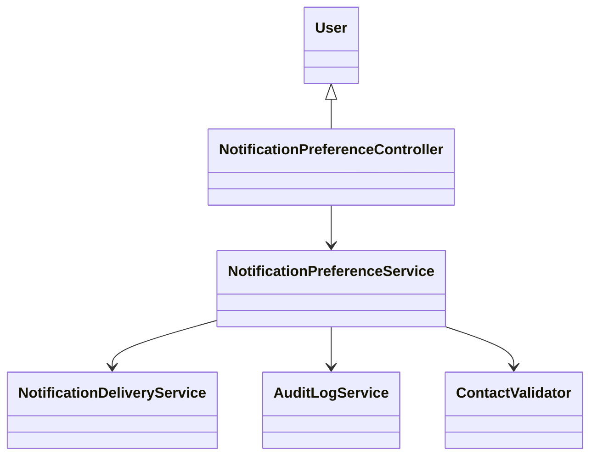
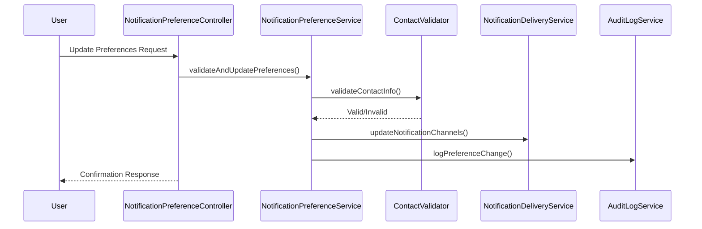
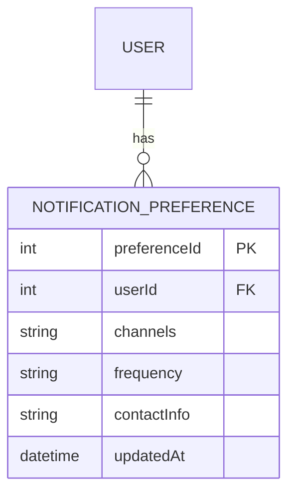

# For User Story Number [4]

1. Objective
This requirement enables business users to manage their notification preferences for scheduled report deliveries and failures. It allows users to select notification channels (email, SMS, in-app), set notification frequency, and ensures that notifications are sent according to their preferences. The solution enforces validation of contact information and maintains audit logs for notification actions.

2. API Model
2.1 Common Components/Services
- User Authentication & Authorization Service (Spring Security)
- Notification Preference Service
- Notification Delivery Service (JavaMailSender, SMS Gateway, In-App Notification)
- Audit Logging Service

2.2 API Details
| Operation | REST Method | Type | URL | Request | Response |
|-----------|-------------|------|-----|---------|----------|
| Get Preferences | GET | Success/Failure | /api/notifications/preferences | N/A | {"channels": ["EMAIL", "SMS"], "frequency": "DAILY_DIGEST", "contactInfo": {"email": "user@example.com", "phone": "+1234567890"}} |
| Update Preferences | PUT | Success/Failure | /api/notifications/preferences | {"channels": ["EMAIL", "IN_APP"], "frequency": "IMMEDIATE", "contactInfo": {"email": "user@example.com"}} | {"status": "UPDATED", "confirmation": "Preferences updated successfully."} |

2.3 Exceptions
| API | Exception | Description |
|-----|-----------|-------------|
| PUT /api/notifications/preferences | InvalidContactException | Contact information is invalid |
| PUT /api/notifications/preferences | SMSOptInRequiredException | SMS channel selected without opt-in |
| All APIs | UnauthorizedException | User is not authorized |
| All APIs | InternalServerException | Unexpected error |

3 Functional Design
3.1 Class Diagram

3.2 UML Sequence Diagram

3.3 Components
| Component Name | Description | Existing/New |
|----------------|-------------|--------------|
| NotificationPreferenceController | REST API controller for notification preferences | New |
| NotificationPreferenceService | Business logic for managing preferences | New |
| NotificationDeliveryService | Delivers notifications via selected channels | Existing |
| ContactValidator | Validates contact information | New |
| AuditLogService | Logs preference changes | Existing |

3.4 Service Layer Logic and Validations
| FieldName | Validation | Error Message | ClassUsed |
|-----------|-----------|--------------|-----------|
| contactInfo | Valid email/phone format | "Invalid contact information." | ContactValidator |
| channels | SMS requires opt-in | "SMS channel requires opt-in." | NotificationPreferenceService |
| frequency | Must match allowed values | "Invalid frequency option." | NotificationPreferenceService |

4 Integrations
| SystemToBeIntegrated | IntegratedFor | IntegrationType |
|----------------------|--------------|-----------------|
| SMTP Server | Email notifications | API |
| Azure Notification Hubs | SMS/In-App notifications | API |
| Audit Log System | Action tracking | API |

5 DB Details
5.1 ER Model

5.2 DB Validations
- Contact information must be valid and unique per user.
- SMS channel requires opt-in flag.
- Preferences must persist across sessions.

6 Non-Functional Requirements
6.1 Performance
- Notifications must be sent within 1 minute of event occurrence.
- Preference updates must be processed within 2 seconds.

6.2 Security
6.2.1 Authentication
- Use Spring Security for user authentication.
6.2.2 Authorization
- Only authenticated users can manage their preferences.

6.3 Logging
6.3.1 Application Logging
- Log all preference changes at INFO level.
- Log validation failures at WARN level.
- Log system errors at ERROR level.
6.3.2 Audit Log
- Log all preference changes with user, timestamp, and change details.

7 Dependencies
- SMTP server for email
- Azure Notification Hubs for SMS/In-App
- Audit log system

8 Assumptions
- Notification channels are pre-integrated and available.
- SMS opt-in is managed via user profile settings.
- Preferences are stored in a dedicated table.