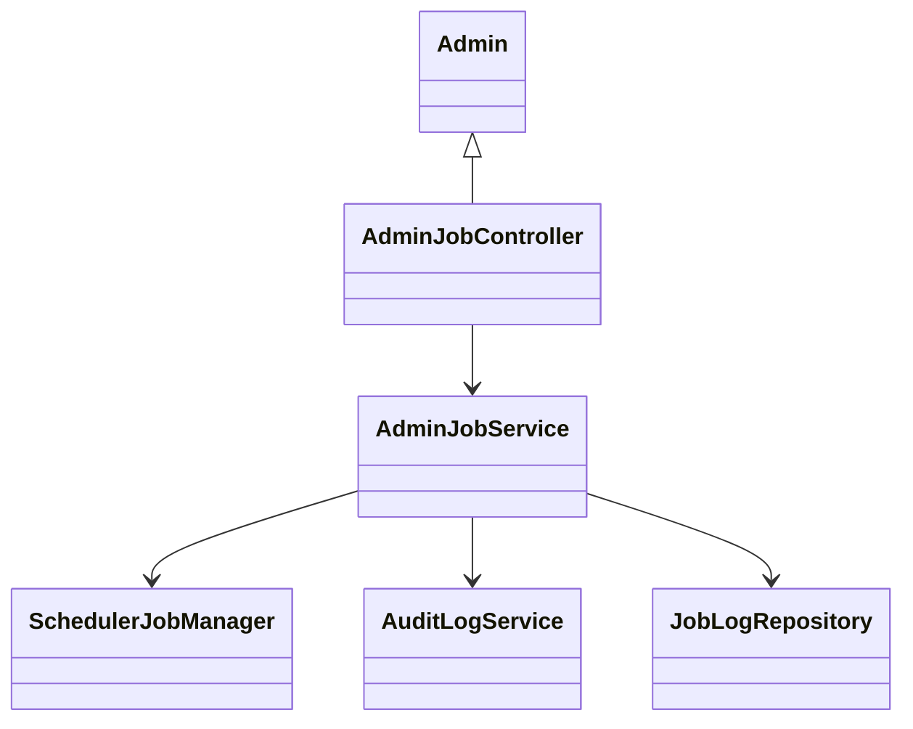
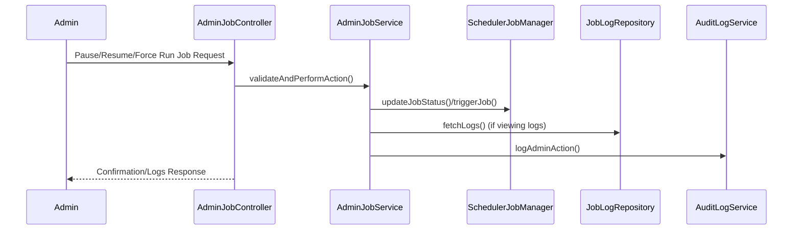
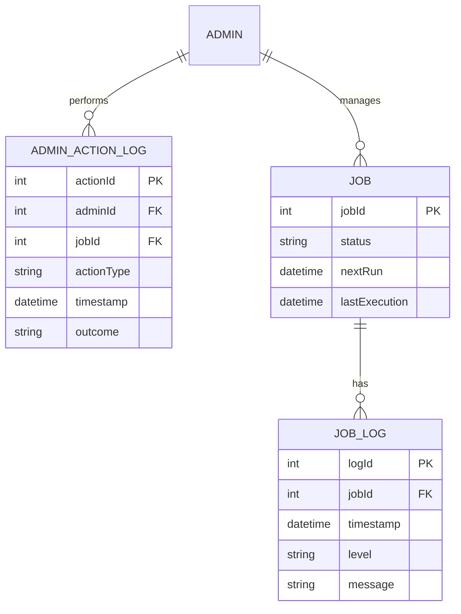

# For User Story Number [5]

1. Objective
This requirement enables administrators to monitor and manage all scheduled report jobs in the system. It provides a dashboard for viewing job status, next run time, last execution, and error logs, and allows admins to pause, resume, or force-run jobs. All admin actions are tracked for audit and compliance, ensuring system reliability and effective user support.

2. API Model
2.1 Common Components/Services
- Admin Authentication & Authorization Service (Spring Security, MFA)
- Scheduler Service (Quartz Scheduler or Spring Task Scheduler)
- Audit Logging Service
- Job Management Service

2.2 API Details
| Operation | REST Method | Type | URL | Request | Response |
|-----------|-------------|------|-----|---------|----------|
| List Jobs | GET | Success/Failure | /api/admin/jobs | N/A | [{"jobId": 101, "status": "RUNNING", "nextRun": "2024-07-02T09:00:00", "lastExecution": "2024-07-01T09:00:00", "errorLogs": []}] |
| Pause Job | POST | Success/Failure | /api/admin/jobs/{jobId}/pause | N/A | {"jobId": 101, "status": "PAUSED", "confirmation": "Job paused successfully."} |
| Resume Job | POST | Success/Failure | /api/admin/jobs/{jobId}/resume | N/A | {"jobId": 101, "status": "RUNNING", "confirmation": "Job resumed successfully."} |
| Force Run Job | POST | Success/Failure | /api/admin/jobs/{jobId}/run | N/A | {"jobId": 101, "status": "RUNNING", "confirmation": "Job triggered successfully."} |
| View Job Logs | GET | Success/Failure | /api/admin/jobs/{jobId}/logs | N/A | [{"timestamp": "2024-07-01T09:00:00", "level": "ERROR", "message": "SMTP timeout"}] |

2.3 Exceptions
| API | Exception | Description |
|-----|-----------|-------------|
| All Admin APIs | UnauthorizedException | User is not admin or lacks MFA |
| POST /api/admin/jobs/{jobId}/pause | AlreadyPausedException | Job is already paused |
| POST /api/admin/jobs/{jobId}/resume | NotPausedException | Job is not paused |
| POST /api/admin/jobs/{jobId}/run | JobRunException | Failed to trigger job |
| All APIs | InternalServerException | Unexpected error |

3 Functional Design
3.1 Class Diagram

3.2 UML Sequence Diagram

3.3 Components
| Component Name | Description | Existing/New |
|----------------|-------------|--------------|
| AdminJobController | REST API controller for admin job management | New |
| AdminJobService | Business logic for admin actions | New |
| SchedulerJobManager | Manages backend scheduled jobs | Existing |
| JobLogRepository | Data access for job logs | New |
| AuditLogService | Logs admin actions | Existing |

3.4 Service Layer Logic and Validations
| FieldName | Validation | Error Message | ClassUsed |
|-----------|-----------|--------------|-----------|
| admin | Must have admin privileges and MFA | "Admin privileges or MFA required." | AdminJobService |
| jobId | Must exist and be valid | "Job not found." | SchedulerJobManager |
| action | Must be valid (pause, resume, run) | "Invalid action or job state." | AdminJobService |

4 Integrations
| SystemToBeIntegrated | IntegratedFor | IntegrationType |
|----------------------|--------------|-----------------|
| Audit Log System | Action tracking | API |
| Scheduler Backend | Job management | API |

5 DB Details
5.1 ER Model

5.2 DB Validations
- Only admins can access job management tables.
- All admin actions must be logged with timestamp and admin identity.
- Paused jobs must not execute until resumed.

6 Non-Functional Requirements
6.1 Performance
- Admin dashboard must load within 2 seconds for up to 10,000 jobs.

6.2 Security
6.2.1 Authentication
- Use Spring Security and MFA for admin authentication.
6.2.2 Authorization
- Only admins can perform job management actions.

6.3 Logging
6.3.1 Application Logging
- Log all admin actions at INFO level.
- Log validation failures at WARN level.
- Log system errors at ERROR level.
6.3.2 Audit Log
- Log all admin actions with admin identity, timestamp, jobId, action type, and outcome.

7 Dependencies
- Scheduler backend
- Audit log system
- MFA provider for admin authentication

8 Assumptions
- Admin privileges are managed via roles and MFA.
- Scheduler backend supports pause, resume, and force-run operations.
- Job logs are stored in a dedicated table.