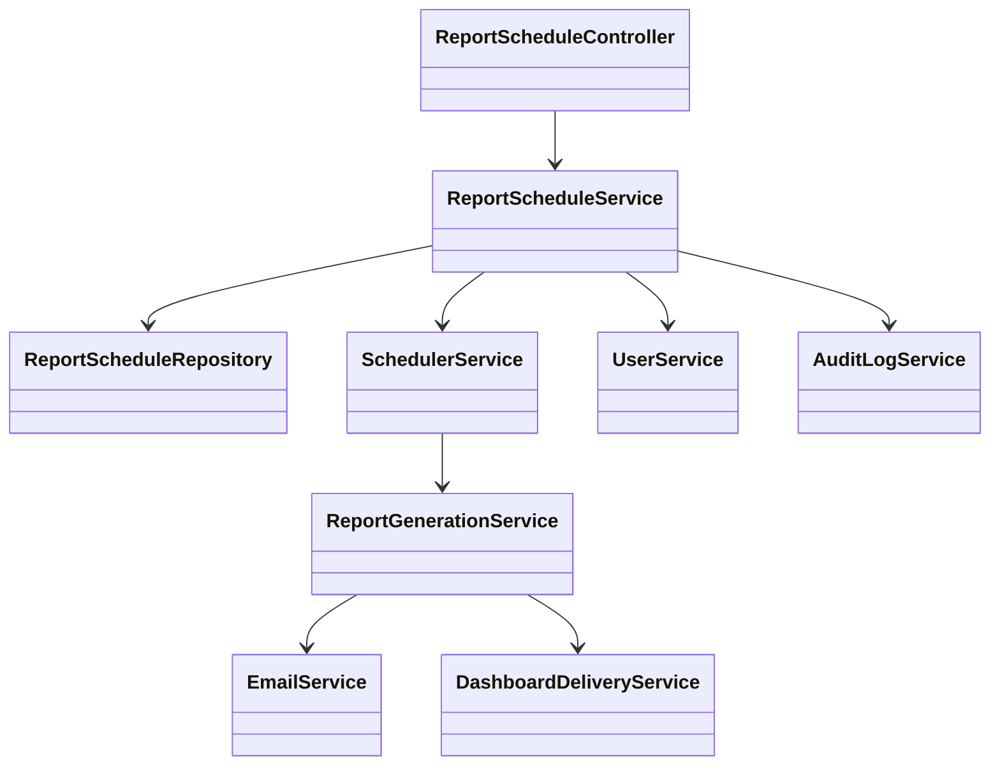
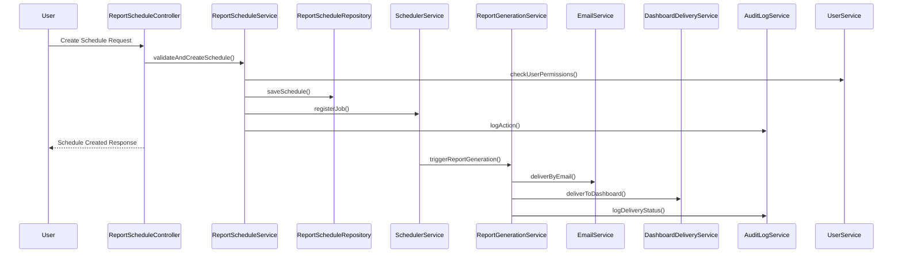
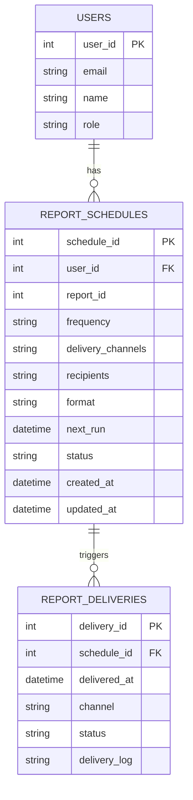

# For User Story Number [1]

1. Objective
This requirement enables business users to schedule automated reports with configurable frequencies and delivery channels, ensuring timely and hands-free access to updated data. It streamlines report generation and delivery, reducing manual intervention. The objective is to provide a robust, secure, and scalable scheduling mechanism for business reporting.

2. API Model
  2.1 Common Components/Services
  - User Authentication & Authorization Service (Spring Security)
  - Email Service (JavaMailSender)
  - Scheduler Service (Spring Scheduler/Quartz)
  - Report Generation Service
  - Audit Logging Service

  2.2 API Details
| Operation        | REST Method | Type     | URL                                 | Request (JSON)                                                                 | Response (JSON)                                                             |
|------------------|-------------|----------|-------------------------------------|-------------------------------------------------------------------------------|-----------------------------------------------------------------------------|
| Create Schedule  | POST        | Success  | /api/v1/report-schedules            | {"reportId":1,"frequency":"DAILY","recipients":["user@email.com"],"deliveryChannels":["EMAIL"],"format":"PDF"} | {"scheduleId":101,"status":"SCHEDULED","message":"Schedule created"} |
|                  |             | Failure  |                                     |                                                                               | {"errorCode":"INVALID_INPUT","message":"Invalid frequency"}           |
| Edit Schedule    | PUT         | Success  | /api/v1/report-schedules/{id}       | {"frequency":"WEEKLY","recipients":["user@email.com"],"deliveryChannels":["EMAIL","DASHBOARD"]} | {"scheduleId":101,"status":"UPDATED"}                                 |
|                  |             | Failure  |                                     |                                                                               | {"errorCode":"NOT_FOUND","message":"Schedule not found"}              |
| Delete Schedule  | DELETE      | Success  | /api/v1/report-schedules/{id}       |                                                                               | {"status":"DELETED"}                                                    |
|                  |             | Failure  |                                     |                                                                               | {"errorCode":"NOT_FOUND","message":"Schedule not found"}              |
| List Schedules   | GET         | Success  | /api/v1/report-schedules            |                                                                               | [{"scheduleId":101,"reportId":1,"frequency":"DAILY","status":"SCHEDULED"}] |
|                  |             | Failure  |                                     |                                                                               | {"errorCode":"UNAUTHORIZED","message":"Access denied"}                |

  2.3 Exceptions
  - InvalidInputException: Thrown when frequency or delivery channel is invalid.
  - UnauthorizedException: Thrown when user is not authorized to schedule reports.
  - ScheduleConflictException: Thrown on overlapping/conflicting schedules.
  - ReportDataUnavailableException: Thrown if source data is missing at scheduled time.

3. Functional Design
  3.1 Class Diagram

  3.2 UML Sequence Diagram

  3.3 Components
| Component Name            | Description                                              | Existing/New |
|--------------------------|----------------------------------------------------------|--------------|
| ReportScheduleController  | REST controller for schedule APIs                        | New          |
| ReportScheduleService     | Service layer for business logic and validations         | New          |
| ReportScheduleRepository  | JPA repository for schedule persistence                  | New          |
| SchedulerService          | Handles background job scheduling                        | New          |
| ReportGenerationService   | Generates reports as per schedule                        | Existing     |
| EmailService              | Sends reports via email                                  | Existing     |
| DashboardDeliveryService  | Delivers reports to dashboard                            | Existing     |
| UserService               | Handles user authentication and authorization            | Existing     |
| AuditLogService           | Logs all actions for auditing                            | Existing     |

  3.4 Service Layer Logic and Validations
| FieldName         | Validation Description                             | Error Message                      | ClassUsed                |
|-------------------|----------------------------------------------------|------------------------------------|--------------------------|
| userId            | Must be authorized                                 | Access denied                      | ReportScheduleService    |
| frequency         | Valid cron/frequency, no conflicts                 | Invalid frequency                  | ReportScheduleService    |
| recipients        | Valid email/channel                                | Invalid recipient                  | ReportScheduleService    |
| reportId          | Data available for report                          | Source data unavailable            | ReportGenerationService  |

4. Integrations
| SystemToBeIntegrated | IntegratedFor           | IntegrationType |
|----------------------|------------------------|-----------------|
| Email Gateway        | Report delivery        | API             |
| Dashboard Service    | Report delivery        | API             |
| User Directory/IAM   | Authorization          | API             |
| Audit Log System     | Logging actions        | API             |

5. DB Details
  5.1 ER Model

  5.2 DB Validations
  - Unique constraint on (user_id, report_id, frequency) to avoid duplicate schedules.
  - Foreign key constraints for user_id and schedule_id.
  - Email format validation on recipients.

6. Non-Functional Requirements
  6.1 Performance
    - Scheduling and delivery must occur within 5 minutes of the scheduled time.
    - Support at least 1000 concurrent scheduled jobs.
    - Use caching for user and report metadata.
  6.2 Security
    6.2.1 Authentication: OAuth2/JWT-based authentication (Spring Security), integration with IAM.
    6.2.2 Authorization: Role-based access control for scheduling APIs.
  6.3 Logging
    6.3.1 Application Logging: Log all schedule creation, update, and delivery events at INFO. Log errors at ERROR. DEBUG for troubleshooting.
    6.3.2 Audit Log: Log userId, action, timestamp, scheduleId, and delivery status for all actions.

7. Dependencies
  - Email gateway (SMTP/SendGrid)
  - Dashboard service
  - IAM/Directory service
  - Quartz/Spring Scheduler for job scheduling

8. Assumptions
  - All users have valid email addresses in the system.
  - Report templates and data sources are pre-configured and available.
  - Delivery channels (email, dashboard) are already implemented and integrated.
  - The system clock is synchronized for accurate scheduling.
