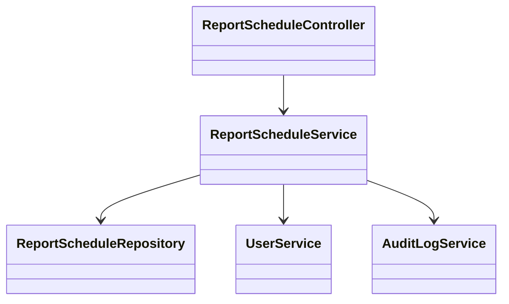
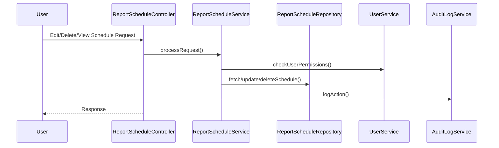
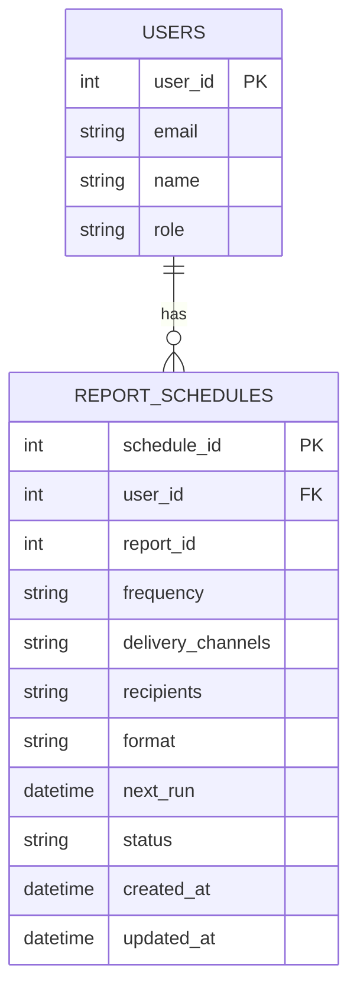

# For User Story Number [2]

1. Objective
This requirement allows business users to manage their scheduled reports, including viewing, editing, and deleting schedules, ensuring reporting remains relevant and up to date. It provides a user-friendly interface for schedule management and ensures all changes are securely logged. The objective is to maintain accurate, conflict-free scheduling with robust auditability and real-time feedback.

2. API Model
  2.1 Common Components/Services
  - User Authentication & Authorization Service (Spring Security)
  - Report Schedule Management Service
  - Audit Logging Service

  2.2 API Details
| Operation        | REST Method | Type     | URL                                 | Request (JSON)                                                                 | Response (JSON)                                                             |
|------------------|-------------|----------|-------------------------------------|-------------------------------------------------------------------------------|-----------------------------------------------------------------------------|
| List Schedules   | GET         | Success  | /api/v1/report-schedules            |                                                                               | [{"scheduleId":101,"reportId":1,"frequency":"DAILY","status":"SCHEDULED"}] |
|                  |             | Failure  |                                     |                                                                               | {"errorCode":"UNAUTHORIZED","message":"Access denied"}                |
| Edit Schedule    | PUT         | Success  | /api/v1/report-schedules/{id}       | {"frequency":"WEEKLY","recipients":["user@email.com"],"deliveryChannels":["EMAIL","DASHBOARD"]} | {"scheduleId":101,"status":"UPDATED"}                                 |
|                  |             | Failure  |                                     |                                                                               | {"errorCode":"CONFLICT","message":"Schedule conflict"}                |
| Delete Schedule  | DELETE      | Success  | /api/v1/report-schedules/{id}       |                                                                               | {"status":"DELETED"}                                                    |
|                  |             | Failure  |                                     |                                                                               | {"errorCode":"NOT_FOUND","message":"Schedule not found"}              |
| Bulk Delete      | POST        | Success  | /api/v1/report-schedules/bulk-delete| {"scheduleIds":[101,102]}                                                  | {"deleted":[101,102],"status":"SUCCESS"}                               |
|                  |             | Failure  |                                     |                                                                               | {"errorCode":"PARTIAL_FAIL","message":"Some schedules not found"}      |

  2.3 Exceptions
  - UnauthorizedException: Thrown when user is not authorized to edit/delete.
  - ScheduleConflictException: Thrown on conflicting/duplicate edits.
  - NotFoundException: Thrown if schedule does not exist.
  - BulkOperationException: Thrown if bulk delete partially fails.

3. Functional Design
  3.1 Class Diagram

  3.2 UML Sequence Diagram

  3.3 Components
| Component Name            | Description                                              | Existing/New |
|--------------------------|----------------------------------------------------------|--------------|
| ReportScheduleController  | REST controller for schedule management APIs             | New          |
| ReportScheduleService     | Service layer for business logic and validations         | New          |
| ReportScheduleRepository  | JPA repository for schedule persistence                  | Existing     |
| UserService               | Handles user authentication and authorization            | Existing     |
| AuditLogService           | Logs all actions for auditing                            | Existing     |

  3.4 Service Layer Logic and Validations
| FieldName         | Validation Description                             | Error Message                      | ClassUsed                |
|-------------------|----------------------------------------------------|------------------------------------|--------------------------|
| userId            | Must be creator or authorized                      | Access denied                      | ReportScheduleService    |
| frequency         | Valid cron/frequency, no conflicts                 | Schedule conflict                  | ReportScheduleService    |
| scheduleId        | Must exist in DB                                  | Schedule not found                 | ReportScheduleService    |
| deleteConfirm     | Must be confirmed by user                          | Deletion not confirmed             | ReportScheduleService    |

4. Integrations
| SystemToBeIntegrated | IntegratedFor           | IntegrationType |
|----------------------|------------------------|-----------------|
| User Directory/IAM   | Authorization          | API             |
| Audit Log System     | Logging actions        | API             |

5. DB Details
  5.1 ER Model

  5.2 DB Validations
  - Only creator or authorized user can update/delete (enforced via user_id).
  - Unique constraint on (user_id, report_id, frequency) for edits.
  - Cascade delete for schedules and related jobs.

6. Non-Functional Requirements
  6.1 Performance
    - UI/API must load up to 100 schedules in under 2 seconds.
    - Real-time updates using WebSockets or polling.
  6.2 Security
    6.2.1 Authentication: OAuth2/JWT-based authentication (Spring Security).
    6.2.2 Authorization: Role-based access control for schedule management APIs.
  6.3 Logging
    6.3.1 Application Logging: Log all schedule edits/deletes at INFO, errors at ERROR.
    6.3.2 Audit Log: Log userId, action, timestamp, scheduleId for all changes. Immutable logs retained for 1 year.

7. Dependencies
  - IAM/Directory service
  - Audit Log system
  - WebSocket server (for real-time updates)

8. Assumptions
  - Users can only manage their own schedules unless explicitly authorized.
  - Bulk actions are limited to 50 schedules per request.
  - Schedule status is updated instantly in the UI after any change.
