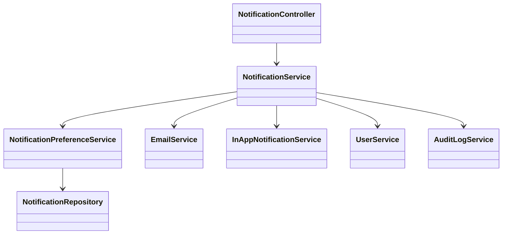
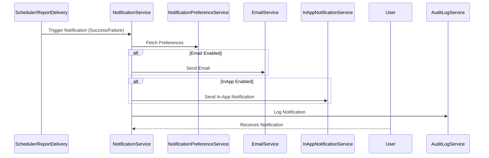
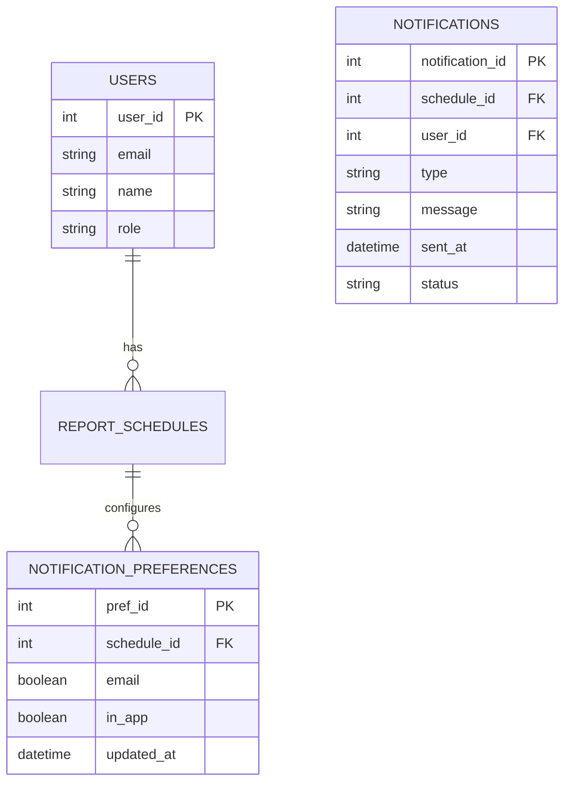

# For User Story Number [3]

1. Objective
This requirement enables business users to receive timely notifications about the status of their scheduled reports, including both successful deliveries and failures. It provides configurable notification preferences (email, in-app, or both) for each schedule. The objective is to ensure users are always informed about their report deliveries and can react promptly to any issues.

2. API Model
  2.1 Common Components/Services
  - User Authentication & Authorization Service (Spring Security)
  - Notification Service (Email, In-App)
  - Notification Preference Management Service
  - Audit Logging Service

  2.2 API Details
| Operation                | REST Method | Type     | URL                                       | Request (JSON)                                                                 | Response (JSON)                                                             |
|--------------------------|-------------|----------|-------------------------------------------|-------------------------------------------------------------------------------|-----------------------------------------------------------------------------|
| Set Notification Prefs   | POST        | Success  | /api/v1/notifications/preferences         | {"scheduleId":101,"email":true,"inApp":true}                              | {"status":"SAVED"}                                                       |
|                          |             | Failure  |                                           |                                                                               | {"errorCode":"INVALID_INPUT","message":"Invalid preferences"}           |
| Get Notification Prefs   | GET         | Success  | /api/v1/notifications/preferences/{id}    |                                                                               | {"scheduleId":101,"email":true,"inApp":false}                            |
|                          |             | Failure  |                                           |                                                                               | {"errorCode":"NOT_FOUND","message":"Preferences not found"}             |
| Send Notification        | POST        | Success  | /api/v1/notifications/send                | {"scheduleId":101,"type":"SUCCESS","message":"Report delivered"}        | {"status":"SENT"}                                                        |
|                          |             | Failure  |                                           |                                                                               | {"errorCode":"DELIVERY_FAIL","message":"Notification failed"}           |

  2.3 Exceptions
  - InvalidInputException: Thrown for invalid notification preferences.
  - UnauthorizedException: Thrown if user tries to set/get preferences for schedules not owned.
  - NotificationDeliveryException: Thrown when notification cannot be sent.

3. Functional Design
  3.1 Class Diagram

  3.2 UML Sequence Diagram

  3.3 Components
| Component Name                | Description                                              | Existing/New |
|------------------------------|----------------------------------------------------------|--------------|
| NotificationController        | REST controller for notification APIs                    | New          |
| NotificationService           | Handles notification delivery logic                      | New          |
| NotificationPreferenceService | Manages user notification preferences                    | New          |
| NotificationRepository        | JPA repository for notification data                     | New          |
| EmailService                  | Sends notifications via email                            | Existing     |
| InAppNotificationService      | Sends in-app notifications                               | Existing     |
| UserService                   | Handles user authentication and authorization            | Existing     |
| AuditLogService               | Logs all notifications for auditing                      | Existing     |

  3.4 Service Layer Logic and Validations
| FieldName         | Validation Description                             | Error Message                      | ClassUsed                       |
|-------------------|----------------------------------------------------|------------------------------------|----------------------------------|
| scheduleId        | Must belong to user                                | Access denied                      | NotificationPreferenceService    |
| preferences       | Must be valid (email/inApp/both)                   | Invalid preferences                | NotificationPreferenceService    |
| recipient         | Must be authorized                                 | Unauthorized recipient             | NotificationService              |
| failureDetails    | Must include actionable info on failure            | Insufficient failure details       | NotificationService              |

4. Integrations
| SystemToBeIntegrated | IntegratedFor           | IntegrationType |
|----------------------|------------------------|-----------------|
| Email Gateway        | Notification delivery  | API             |
| Notification Hub     | In-app notifications   | API             |
| User Directory/IAM   | Authorization          | API             |
| Audit Log System     | Logging notifications  | API             |

5. DB Details
  5.1 ER Model

  5.2 DB Validations
  - Foreign key constraints for user_id and schedule_id.
  - Only owner can update preferences.
  - Notification status must be updated after delivery attempt.

6. Non-Functional Requirements
  6.1 Performance
    - Notifications sent within 1 minute of event.
    - Support at least 10,000 notifications per day.
    - Use async processing for notification delivery.
  6.2 Security
    6.2.1 Authentication: OAuth2/JWT-based authentication (Spring Security).
    6.2.2 Authorization: Only schedule owners can set preferences; notifications must not leak sensitive data.
  6.3 Logging
    6.3.1 Application Logging: Log all notification events at INFO, failures at ERROR.
    6.3.2 Audit Log: Log userId, scheduleId, notification type, timestamp, and status for all notifications.

7. Dependencies
  - Email gateway (SMTP/SendGrid)
  - Notification hub/service
  - IAM/Directory service

8. Assumptions
  - Users have valid email addresses and in-app accounts.
  - Notification preferences are set before first delivery attempt.
  - Notification failure details are actionable and user-friendly.
