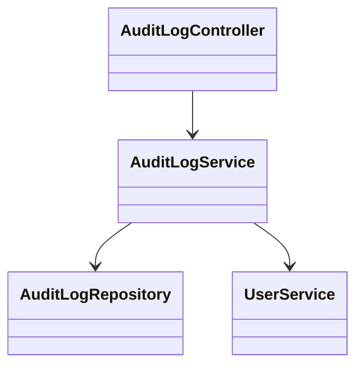
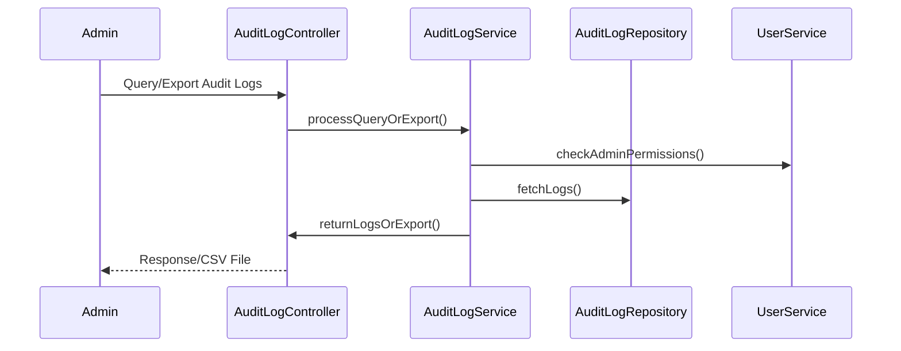
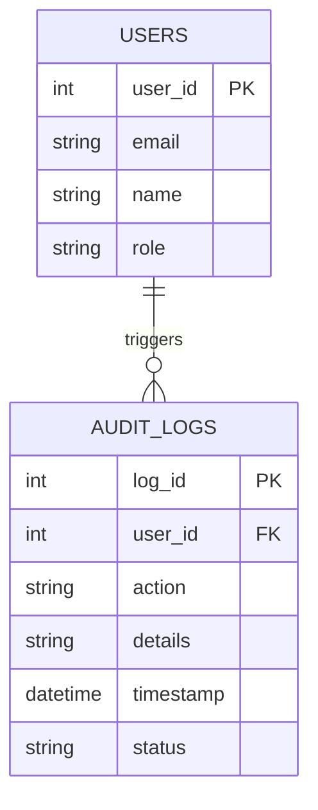

# For User Story Number [4]

1. Objective
This requirement enables administrators to audit all scheduling, editing, deletion, and delivery actions for reports, ensuring compliance, traceability, and accountability. It provides a secure, immutable audit log interface with advanced filtering and export capabilities. The objective is to support regulatory requirements and internal policies for monitoring and forensics.

2. API Model
  2.1 Common Components/Services
  - User Authentication & Authorization Service (Spring Security)
  - Audit Logging Service
  - Audit Log Query Service

  2.2 API Details
| Operation           | REST Method | Type     | URL                                    | Request (JSON)                                                                 | Response (JSON)                                                             |
|---------------------|-------------|----------|----------------------------------------|-------------------------------------------------------------------------------|-----------------------------------------------------------------------------|
| Log Action          | POST        | Success  | /api/v1/audit-logs                     | {"userId":1,"action":"SCHEDULE_CREATE","details":"..."}                | {"status":"LOGGED"}                                                      |
|                     |             | Failure  |                                        |                                                                               | {"errorCode":"LOG_FAIL","message":"Log write failed"}                   |
| Query Audit Logs    | GET         | Success  | /api/v1/audit-logs?user=1&action=EDIT  |                                                                               | [{"logId":201,"userId":1,"action":"EDIT","timestamp":"..."}]         |
|                     |             | Failure  |                                        |                                                                               | {"errorCode":"UNAUTHORIZED","message":"Access denied"}                  |
| Export Audit Logs   | GET         | Success  | /api/v1/audit-logs/export?format=csv   |                                                                               | CSV file stream                                                             |
|                     |             | Failure  |                                        |                                                                               | {"errorCode":"EXPORT_FAIL","message":"Export failed"}                   |

  2.3 Exceptions
  - UnauthorizedException: Thrown when non-admin tries to access audit logs.
  - LogWriteException: Thrown if audit log cannot be written.
  - ExportException: Thrown if export fails.

3. Functional Design
  3.1 Class Diagram

  3.2 UML Sequence Diagram

  3.3 Components
| Component Name        | Description                                              | Existing/New |
|----------------------|----------------------------------------------------------|--------------|
| AuditLogController   | REST controller for audit log APIs                       | New          |
| AuditLogService      | Handles audit log business logic and filtering           | New          |
| AuditLogRepository   | JPA repository for audit log persistence                 | New          |
| UserService          | Handles user authentication and authorization            | Existing     |

  3.4 Service Layer Logic and Validations
| FieldName         | Validation Description                             | Error Message                      | ClassUsed                |
|-------------------|----------------------------------------------------|------------------------------------|--------------------------|
| userId            | Must be admin for query/export                     | Access denied                      | AuditLogService          |
| action            | Must be a valid action type                        | Invalid action type                | AuditLogService          |
| logRetention      | Must comply with retention policy                  | Retention policy violation         | AuditLogService          |

4. Integrations
| SystemToBeIntegrated | IntegratedFor           | IntegrationType |
|----------------------|------------------------|-----------------|
| User Directory/IAM   | Authorization          | API             |
| Log Analytics/DB     | Audit log storage      | API/DB          |

5. DB Details
  5.1 ER Model

  5.2 DB Validations
  - Audit logs are immutable (no update/delete allowed).
  - Only admins can query/export logs.
  - Log retention policy enforced (e.g., 1 year).

6. Non-Functional Requirements
  6.1 Performance
    - Audit log queries must return up to 10,000 records in under 3 seconds.
    - Export to CSV supported for large datasets.
  6.2 Security
    6.2.1 Authentication: OAuth2/JWT-based authentication (Spring Security).
    6.2.2 Authorization: Only admins can access audit logs; logs encrypted at rest.
  6.3 Logging
    6.3.1 Application Logging: Log all audit log queries/exports at INFO, failures at ERROR.
    6.3.2 Audit Log: Audit logs themselves are immutable and tamper-proof.

7. Dependencies
  - IAM/Directory service
  - Log Analytics/DB storage

8. Assumptions
  - Only administrators have access to the audit log interface.
  - Log retention policy is 1 year unless otherwise specified by compliance.
  - Audit logs are written synchronously for all critical actions.
