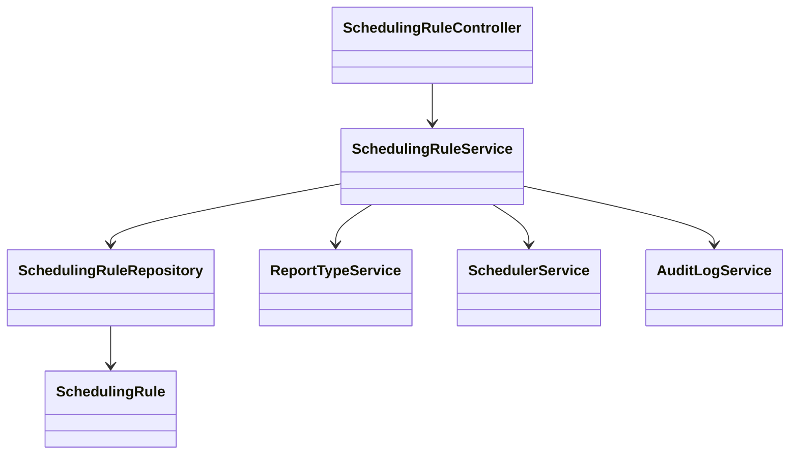
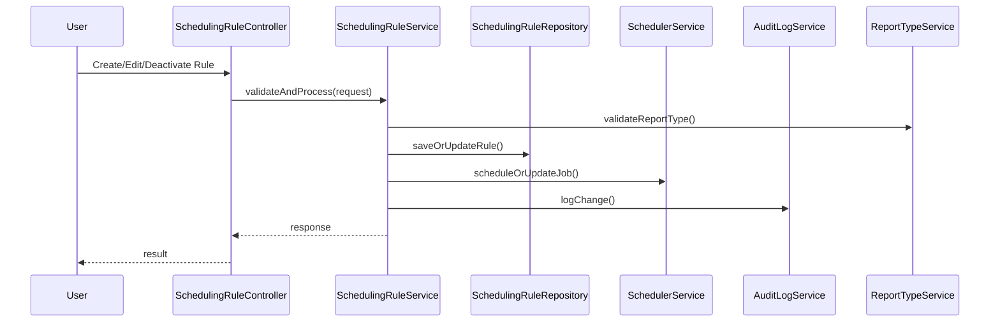
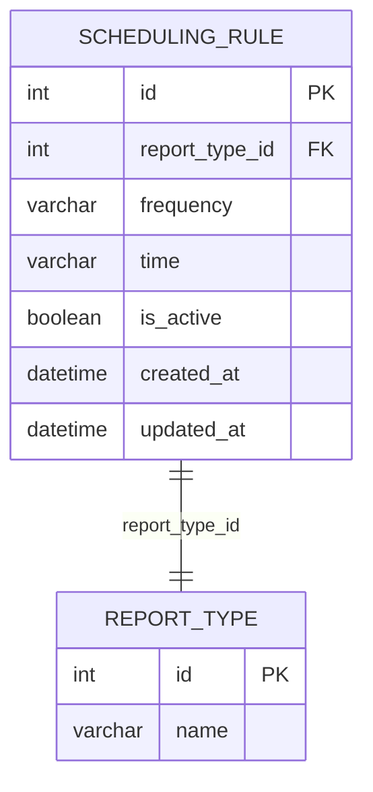

# For User Story Number [1]

1. Objective
The objective is to enable business analysts or admin users to define automated report scheduling rules, specifying frequency (daily, weekly, monthly), time of delivery, and report types. This feature streamlines report distribution, reduces manual effort, and ensures timely delivery of reports. The system should support rule creation, editing, activation/deactivation, and validation.

2. API Model
  2.1 Common Components/Services
  - AuthenticationService (for RBAC)
  - ReportTypeService (to fetch available report types)
  - SchedulerService (to manage background jobs)
  - AuditLogService (for tracking changes)

  2.2 API Details
| Operation | REST Method | Type | URL | Request | Response |
|-----------|-------------|------|-----|---------|----------|
| Create Scheduling Rule | POST | Success/Failure | /api/scheduling-rules | {"reportTypeId": 1, "frequency": "daily", "time": "14:00", "isActive": true} | {"id": 100, "status": "scheduled"} |
| Edit Scheduling Rule | PUT | Success/Failure | /api/scheduling-rules/{id} | {"frequency": "weekly", "time": "09:00"} | {"id": 100, "status": "updated"} |
| Deactivate Scheduling Rule | PATCH | Success/Failure | /api/scheduling-rules/{id}/deactivate | {} | {"id": 100, "status": "deactivated"} |
| Get Scheduling Rules | GET | Success | /api/scheduling-rules?reportTypeId=1 | - | [{"id":100, "reportTypeId":1, "frequency":"daily", "time":"14:00", "isActive":true}] |

  2.3 Exceptions
  - InvalidFrequencyException: Frequency must be daily, weekly, or monthly.
  - InvalidTimeFormatException: Time must be in 24-hour format.
  - ReportTypeNotFoundException: Report type does not exist.
  - SchedulingConflictException: Rule conflicts with existing rule.
  - UnauthorizedAccessException: User lacks permission.

3. Functional Design
  3.1 Class Diagram

  3.2 UML Sequence Diagram

  3.3 Components
| Component Name | Description | Existing/New |
|----------------|-------------|--------------|
| SchedulingRuleController | REST API controller for scheduling rules | New |
| SchedulingRuleService | Business logic for scheduling rules | New |
| SchedulingRuleRepository | Data access for scheduling rules | New |
| ReportTypeService | Service for report type validation | Existing |
| SchedulerService | Manages background jobs for scheduling | Existing |
| AuditLogService | Logs changes and actions | Existing |

  3.4 Service Layer Logic and Validations
| FieldName | Validation | Error Message | ClassUsed |
|-----------|-----------|--------------|-----------|
| frequency | Must be daily, weekly, or monthly | Invalid frequency | SchedulingRuleService |
| time | Must be 24-hour format (HH:mm) | Invalid time format | SchedulingRuleService |
| reportTypeId | Must exist in system | Report type not found | ReportTypeService |
| rule | No conflict with existing rule | Scheduling rule conflict | SchedulingRuleService |

4. Integrations
| SystemToBeIntegrated | IntegratedFor | IntegrationType |
|----------------------|---------------|-----------------|
| Azure Functions | Job scheduling/execution | API |
| Azure SQL Database | Rule persistence | DB |
| Azure Monitor | Job execution status | API |

5. DB Details
  5.1 ER Model

  5.2 DB Validations
  - Unique constraint on (report_type_id, frequency, time) when is_active=true
  - Foreign key constraint on report_type_id

6. Non-Functional Requirements
  6.1 Performance
  - Scheduling rule creation/edit completes within 2 seconds.
  - Indexes on report_type_id and is_active for fast lookups.

  6.2 Security
    6.2.1 Authentication
    - RBAC enforced via AuthenticationService; only authorized users can manage rules.
    6.2.2 Authorization
    - Only users with 'Business Analyst' or 'Admin' roles can create/edit/deactivate rules.

  6.3 Logging
    6.3.1 Application Logging
    - DEBUG: Input validation failures, job scheduling details.
    - INFO: Rule creation, update, deactivation events.
    - ERROR: Scheduling/job failures, DB errors.
    - WARN: Potential conflicts or suspicious activity.
    6.3.2 Audit Log
    - Log all rule changes (who, what, when) and job execution status.

7. Dependencies
- Azure Functions for job scheduling and execution
- Azure SQL Database for rule storage
- Azure Monitor for job tracking
- Authentication/Authorization provider for RBAC

8. Assumptions
- Report types are pre-defined and managed elsewhere in the system.
- Time is always stored and processed in UTC.
- Scheduling granularity is at the minute level (no seconds).
- Only one active rule per report type, frequency, and time combination.