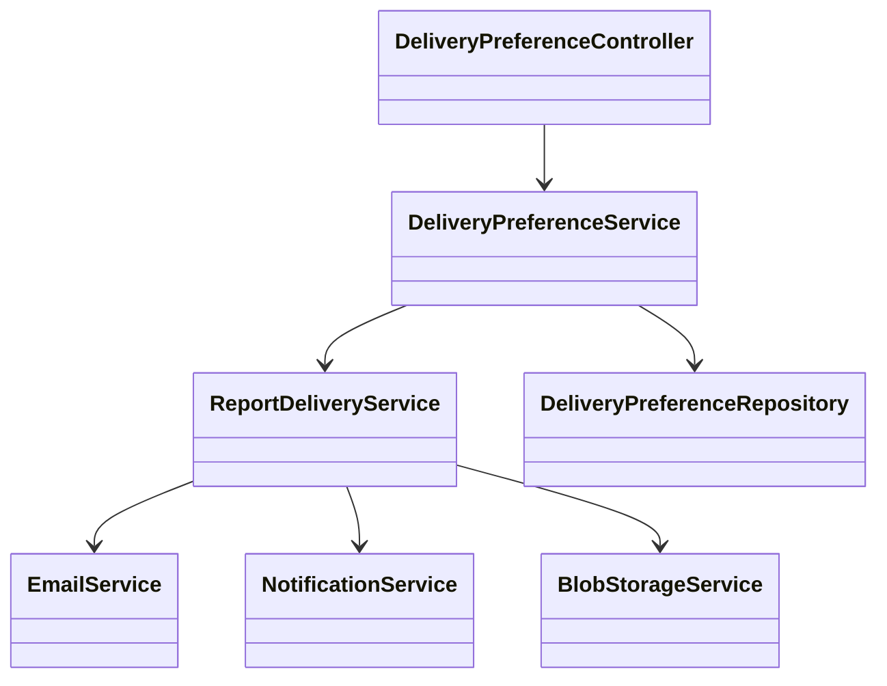
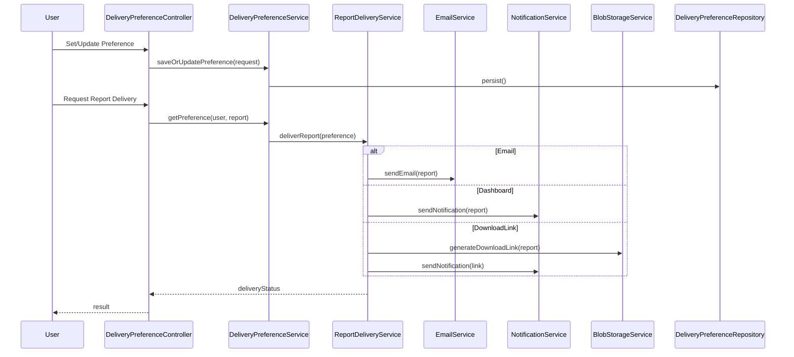
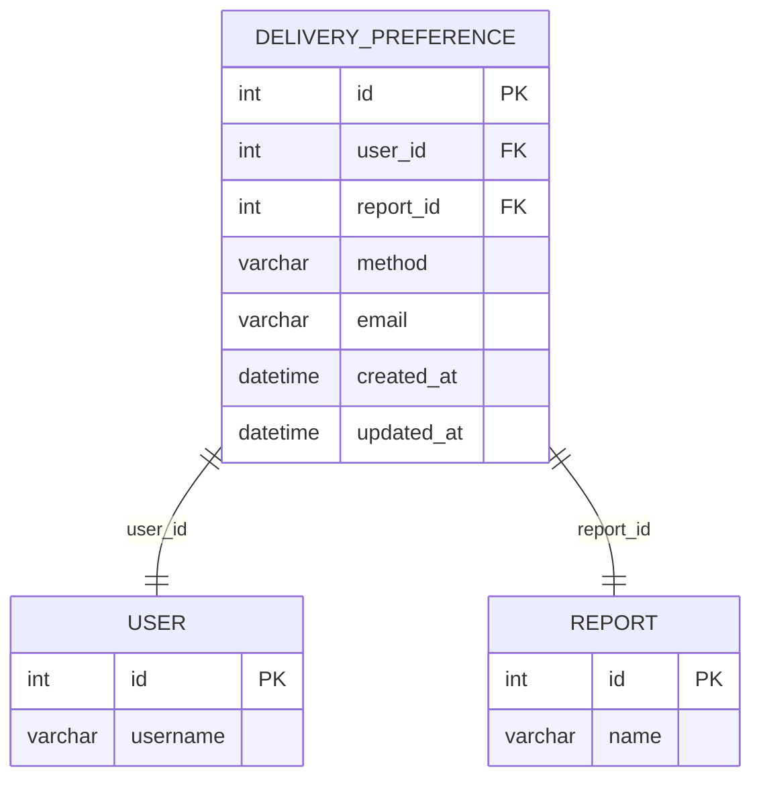

# For User Story Number [2]

1. Objective
Enable end users to select and manage their preferred delivery method for scheduled reports, including email, download link, or dashboard notification. This feature provides flexibility and enhances user experience by allowing users to receive reports in their desired format. The system must ensure secure, timely, and reliable delivery according to user preferences.

2. API Model
  2.1 Common Components/Services
  - AuthenticationService (for user authentication)
  - DeliveryPreferenceService (to manage user preferences)
  - ReportDeliveryService (to handle report sending)
  - NotificationService (for dashboard alerts)
  - EmailService (for email delivery)
  - BlobStorageService (for download links)

  2.2 API Details
| Operation | REST Method | Type | URL | Request | Response |
|-----------|-------------|------|-----|---------|----------|
| Set Delivery Preference | POST | Success/Failure | /api/delivery-preferences | {"reportId": 1, "method": "email", "email": "user@example.com"} | {"status": "updated"} |
| Update Delivery Preference | PUT | Success/Failure | /api/delivery-preferences/{id} | {"method": "dashboard"} | {"status": "updated"} |
| Get Delivery Preference | GET | Success | /api/delivery-preferences?reportId=1 | - | {"reportId":1, "method":"email", "email":"user@example.com"} |
| Deliver Report | POST | Success/Failure | /api/reports/deliver | {"reportId":1, "userId":42} | {"status": "delivered", "method": "email"} |

  2.3 Exceptions
  - InvalidEmailException: Email address is invalid.
  - UnauthorizedAccessException: User is not authenticated or authorized.
  - DeliveryMethodNotSupportedException: Unsupported delivery method.
  - DeliveryFailureException: Report delivery failed.
  - DownloadLinkAccessException: Link accessed by unauthorized user.

3. Functional Design
  3.1 Class Diagram

  3.2 UML Sequence Diagram

  3.3 Components
| Component Name | Description | Existing/New |
|----------------|-------------|--------------|
| DeliveryPreferenceController | REST API controller for delivery preferences | New |
| DeliveryPreferenceService | Business logic for managing preferences | New |
| DeliveryPreferenceRepository | Data access for preferences | New |
| ReportDeliveryService | Handles report delivery logic | New |
| EmailService | Sends emails via SendGrid | Existing |
| NotificationService | Sends dashboard notifications via SignalR | Existing |
| BlobStorageService | Generates download links | Existing |

  3.4 Service Layer Logic and Validations
| FieldName | Validation | Error Message | ClassUsed |
|-----------|-----------|--------------|-----------|
| email | Must be valid email format if method is email | Invalid email address | DeliveryPreferenceService |
| method | Must be one of [email, download_link, dashboard] | Unsupported delivery method | DeliveryPreferenceService |
| downloadLink | Must be accessible only to intended user | Unauthorized download link access | BlobStorageService |
| dashboardNotification | Must be visible to user on login | Notification not visible | NotificationService |

4. Integrations
| SystemToBeIntegrated | IntegratedFor | IntegrationType |
|----------------------|---------------|-----------------|
| Azure SendGrid | Email delivery | API |
| Azure Blob Storage | Download link generation | API |
| SignalR | Dashboard notifications | API |
| Azure SQL Database | Preference persistence | DB |
| Azure Monitor | Delivery tracking | API |

5. DB Details
  5.1 ER Model

  5.2 DB Validations
  - Unique constraint on (user_id, report_id)
  - Foreign key constraints on user_id and report_id

6. Non-Functional Requirements
  6.1 Performance
  - Report delivery occurs within 1 minute of scheduled time.
  - Preference update completes within 2 seconds.

  6.2 Security
    6.2.1 Authentication
    - Only authenticated users can set or update preferences.
    6.2.2 Authorization
    - Users can access only their own preferences and reports.

  6.3 Logging
    6.3.1 Application Logging
    - DEBUG: Preference update requests, delivery attempts.
    - INFO: Successful deliveries, preference changes.
    - ERROR: Delivery failures, invalid accesses.
    - WARN: Suspicious access attempts.
    6.3.2 Audit Log
    - Log all preference changes and report deliveries (who, what, when).

7. Dependencies
- Azure SendGrid for email delivery
- Azure Blob Storage for download links
- SignalR for dashboard notifications
- Azure SQL Database for storing preferences

8. Assumptions
- Users have unique email addresses registered in the system.
- Download links expire after a configurable duration.
- Dashboard notifications are displayed on user login.