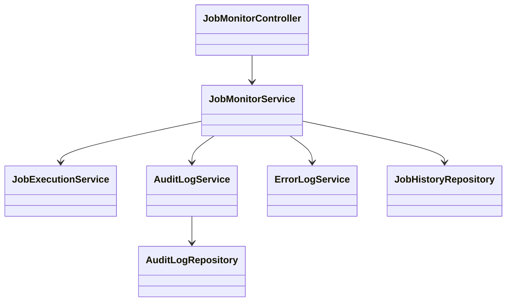
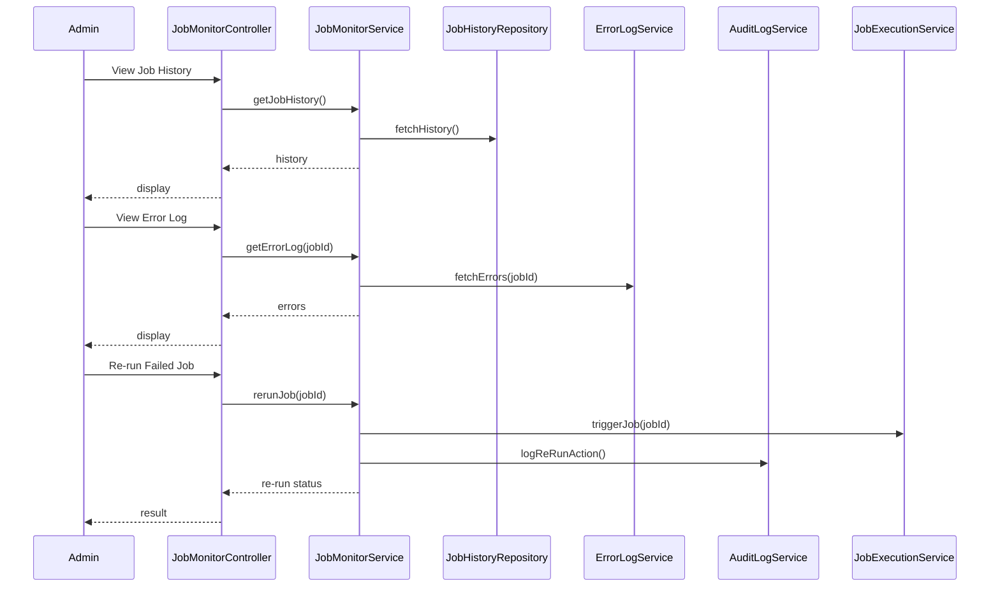
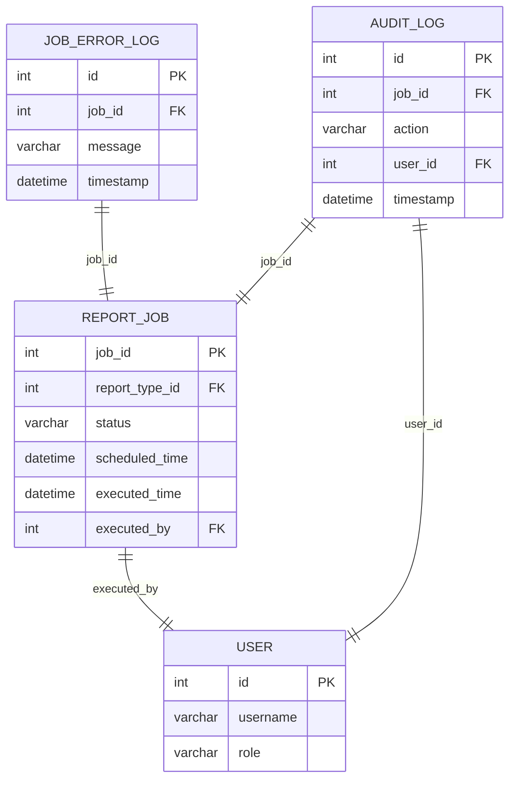

# For User Story Number [3]

1. Objective
Enable administrators to monitor and audit scheduled report jobs through a dashboard that displays job history, delivery status, error logs, and allows manual re-run of failed jobs. This ensures reliability, accountability, and the ability to troubleshoot failures in report delivery. The system must maintain a comprehensive audit trail for all job executions and re-run actions.

2. API Model
  2.1 Common Components/Services
  - AuthenticationService (for RBAC)
  - JobMonitorService (for job status/history)
  - AuditLogService (for audit trail)
  - JobExecutionService (to trigger/re-run jobs)
  - ErrorLogService (to fetch error details)

  2.2 API Details
| Operation | REST Method | Type | URL | Request | Response |
|-----------|-------------|------|-----|---------|----------|
| Get Job History | GET | Success | /api/report-jobs/history?from=...&to=... | - | [{"jobId":1,"reportType":"Sales","status":"success","timestamp":"2024-06-01T10:00:00Z"}] |
| Get Job Error Log | GET | Success/Failure | /api/report-jobs/{jobId}/errors | - | {"jobId":1,"errors":[{"timestamp":"...","message":"..."}]} |
| Re-run Failed Job | POST | Success/Failure | /api/report-jobs/{jobId}/rerun | {} | {"jobId":1,"status":"re-run triggered"} |
| Get Audit Trail | GET | Success | /api/report-jobs/audit?jobId=1 | - | [{"action":"re-run","user":"admin1","timestamp":"..."}] |

  2.3 Exceptions
  - UnauthorizedAccessException: User lacks admin role.
  - JobNotFoundException: Job ID does not exist.
  - JobReRunNotAllowedException: Job cannot be re-run.
  - AuditLogAccessException: Audit log access denied.

3. Functional Design
  3.1 Class Diagram

  3.2 UML Sequence Diagram

  3.3 Components
| Component Name | Description | Existing/New |
|----------------|-------------|--------------|
| JobMonitorController | REST API controller for job monitoring | New |
| JobMonitorService | Business logic for monitoring/audit | New |
| JobHistoryRepository | Data access for job history | New |
| ErrorLogService | Fetches error details for jobs | Existing |
| AuditLogService | Logs and fetches audit trail | Existing |
| JobExecutionService | Triggers/re-runs jobs | Existing |
| AuditLogRepository | Data access for audit logs | Existing |

  3.4 Service Layer Logic and Validations
| FieldName | Validation | Error Message | ClassUsed |
|-----------|-----------|--------------|-----------|
| userRole | Must be 'admin' | Unauthorized access | JobMonitorService |
| jobId | Must exist in job history | Job not found | JobMonitorService |
| auditLog | Must include timestamp, user, report type, status | Incomplete audit log | AuditLogService |
| reRunAction | Must be logged and tracked | Re-run not logged | AuditLogService |

4. Integrations
| SystemToBeIntegrated | IntegratedFor | IntegrationType |
|----------------------|---------------|-----------------|
| Azure Monitor | Job execution status, error logs | API |
| Application Insights | Logging and monitoring | API |
| Azure Functions | Job execution/re-run | API |
| Azure SQL Database | Job history, audit trail | DB |

5. DB Details
  5.1 ER Model

  5.2 DB Validations
  - Only users with 'admin' role can access job/audit data
  - Foreign key constraints on job_id, user_id
  - Audit log must include all required fields

6. Non-Functional Requirements
  6.1 Performance
  - Dashboard loads within 3 seconds for up to 10,000 jobs
  - Indexed queries on job_id, status, executed_time

  6.2 Security
    6.2.1 Authentication
    - RBAC enforced; only admins can access monitoring endpoints
    6.2.2 Authorization
    - Audit and error logs accessible only to admins

  6.3 Logging
    6.3.1 Application Logging
    - DEBUG: API requests, job status checks
    - INFO: Job executions, re-run actions
    - ERROR: Failed jobs, access violations
    - WARN: Suspicious admin actions
    6.3.2 Audit Log
    - Log all job executions, re-runs, and dashboard accesses (who, what, when)

7. Dependencies
- Azure Monitor and Application Insights for logging
- Azure Functions for job execution
- Azure SQL Database for job/audit data
- Authentication/Authorization provider for RBAC

8. Assumptions
- Only administrators have access to the monitoring dashboard
- Audit logs are immutable and retained as per compliance
- Job re-run is allowed only for failed jobs