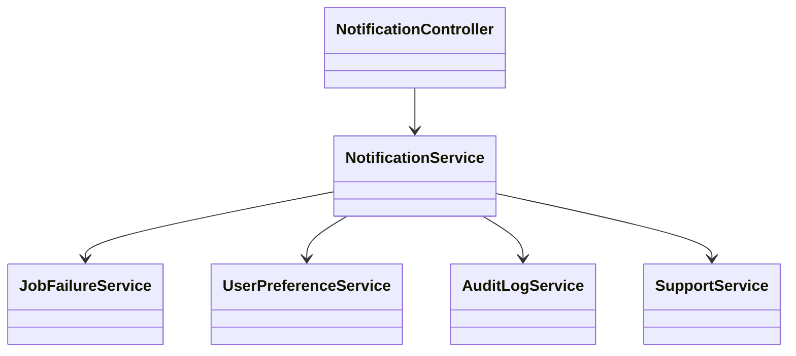
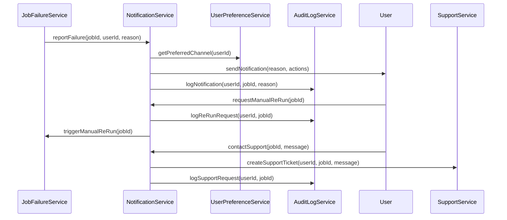
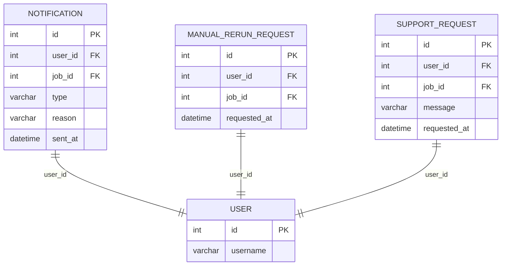

# For User Story Number [4]

1. Objective
Notify users promptly when a scheduled report fails to generate or deliver, including clear failure details and recommended next steps. Enable users to request a manual re-run or contact support directly from the notification. Ensure all failure events and user actions are logged for audit and troubleshooting.

2. API Model
  2.1 Common Components/Services
  - NotificationService (for sending notifications)
  - JobFailureService (for detecting/reporting failures)
  - UserPreferenceService (to determine preferred notification channel)
  - AuditLogService (for tracking notifications and user actions)
  - SupportService (for support requests)

  2.2 API Details
| Operation | REST Method | Type | URL | Request | Response |
|-----------|-------------|------|-----|---------|----------|
| Notify Failure | POST | Success/Failure | /api/notifications/failure | {"userId":42, "reportId":1, "reason":"Data error", "actions":["re-run","support"]} | {"status":"notified"} |
| Request Manual Re-run | POST | Success/Failure | /api/report-jobs/{jobId}/manual-rerun | {"userId":42} | {"status":"re-run requested"} |
| Contact Support | POST | Success/Failure | /api/support/contact | {"userId":42, "jobId":1, "message":"Please assist."} | {"status":"support requested"} |

  2.3 Exceptions
  - UnauthorizedNotificationException: Notification sent to unauthorized user.
  - NotificationDeliveryException: Notification could not be delivered.
  - ManualReRunRequestException: Manual re-run request failed.
  - SupportRequestException: Support request failed.

3. Functional Design
  3.1 Class Diagram

  3.2 UML Sequence Diagram

  3.3 Components
| Component Name | Description | Existing/New |
|----------------|-------------|--------------|
| NotificationController | REST API controller for notifications | New |
| NotificationService | Handles notification logic and delivery | New |
| JobFailureService | Detects and reports job failures | Existing |
| UserPreferenceService | Determines user's preferred notification channel | Existing |
| AuditLogService | Logs all notification and user actions | Existing |
| SupportService | Handles support requests | Existing |

  3.4 Service Layer Logic and Validations
| FieldName | Validation | Error Message | ClassUsed |
|-----------|-----------|--------------|-----------|
| userId | Must be the affected user | Unauthorized notification | NotificationService |
| reason | Must be provided and clear | Failure reason missing | NotificationService |
| manualReRunRequest | Must be tracked and logged | Re-run request not logged | AuditLogService |
| supportRequest | Must be tracked and logged | Support request not logged | AuditLogService |

4. Integrations
| SystemToBeIntegrated | IntegratedFor | IntegrationType |
|----------------------|---------------|-----------------|
| Azure Functions | Job execution/failure detection | API |
| Azure SendGrid | Email notifications | API |
| SignalR | Dashboard notifications | API |
| Azure SQL Database | Audit log persistence | DB |
| Azure Monitor | Notification delivery tracking | API |

5. DB Details
  5.1 ER Model

  5.2 DB Validations
  - Only affected users receive notifications
  - Foreign key constraints on user_id, job_id
  - All manual re-run and support requests are logged

6. Non-Functional Requirements
  6.1 Performance
  - Notification sent within 5 minutes of failure
  - Audit and support requests logged within 2 seconds

  6.2 Security
    6.2.1 Authentication
    - Only authenticated users receive notifications
    6.2.2 Authorization
    - Only affected users can request re-run or support

  6.3 Logging
    6.3.1 Application Logging
    - DEBUG: Notification workflow, delivery attempts
    - INFO: Notification sent, manual re-run/support requests
    - ERROR: Notification/support failures
    - WARN: Unauthorized notification attempts
    6.3.2 Audit Log
    - Log all failure notifications, re-run, and support requests (who, what, when)

7. Dependencies
- Azure Functions for job execution/failure detection
- Azure SendGrid for email notifications
- SignalR for dashboard notifications
- Azure SQL Database for audit/support logs
- Azure Monitor for notification tracking

8. Assumptions
- User preferences for notification channels are pre-configured
- Only affected users are notified of failures
- Manual re-run is subject to business rules and may require approval