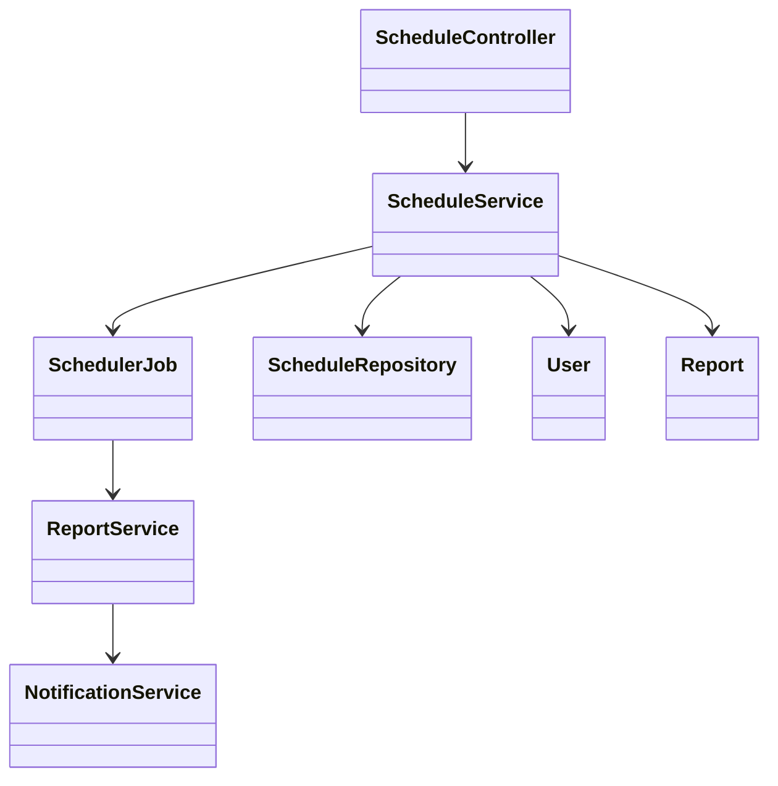
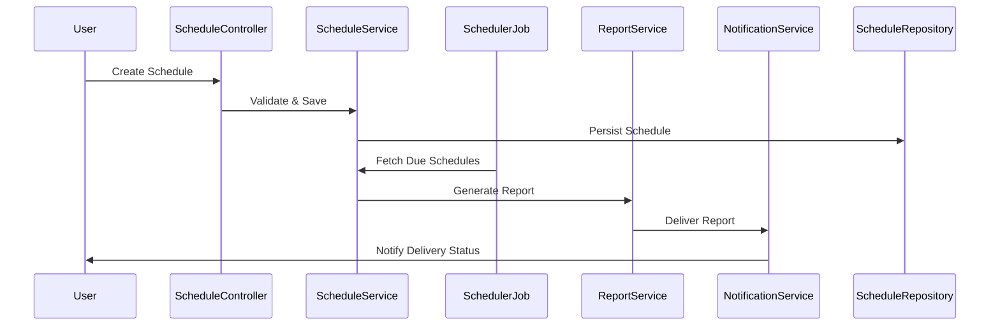
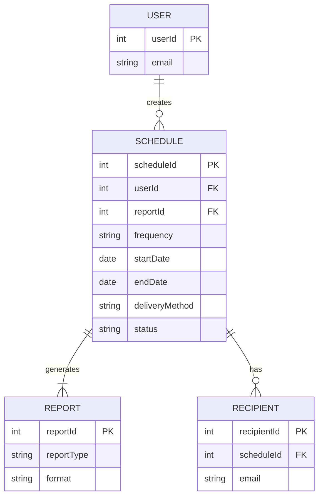

# For User Story Number [1]

1. Objective
This requirement enables business users to schedule automated reports for regular delivery without manual intervention. Users can configure report type, frequency, recipients, and delivery method, ensuring timely insights. The system automates report generation and delivery, improving efficiency and reliability.

2. API Model
  2.1 Common Components/Services
    - Scheduler Service (background job/Azure Function)
    - Notification Service (email, download link)
    - Report Generation Service (PDF/Excel)
    - OAuth2 Authentication

  2.2 API Details
| Operation   | REST Method | Type     | URL                             | Request (Sample)                                                                 | Response (Sample)                                                      |
|-------------|------------|----------|----------------------------------|----------------------------------------------------------------------------------|------------------------------------------------------------------------|
| Create      | POST       | Success  | /api/schedules                   | {"reportId":1,"frequency":"daily","startDate":"2025-10-01","endDate":"2025-12-31","recipients":["user@example.com"],"deliveryMethod":"email"} | {"scheduleId":101,"status":"Scheduled"}                                   |
| Edit        | PUT        | Success  | /api/schedules/{scheduleId}      | {"frequency":"weekly","recipients":["user2@example.com"]}                      | {"scheduleId":101,"status":"Updated"}                                     |
| Cancel      | DELETE     | Success  | /api/schedules/{scheduleId}      |                                                                                    | {"scheduleId":101,"status":"Cancelled"}                                   |
| View        | GET        | Success  | /api/schedules                   |                                                                                    | [{"scheduleId":101,"reportId":1,"frequency":"daily",...}]                |
| Notify      | POST       | Success  | /api/notifications               | {"scheduleId":101,"status":"Delivered","recipients":["user@example.com"]}    | {"notificationId":201,"status":"Sent"}                                     |
| Generate    | POST       | Success  | /api/reports/generate            | {"scheduleId":101}                                                                | {"reportUrl":"/reports/101.pdf","status":"Generated"}                   |

  2.3 Exceptions
| API                | Exception Type         | Message                                      |
|--------------------|-----------------------|----------------------------------------------|
| Create/Edit        | ValidationException   | "Invalid frequency or email address."        |
| Cancel/View        | NotFoundException     | "Schedule not found."                       |
| Generate           | GenerationException   | "Report generation failed."                  |
| Notify             | NotificationException | "Notification delivery failed."              |

3 Functional Design
  3.1 Class Diagram

  3.2 UML Sequence Diagram

  3.3 Components
| Component Name        | Description                                              | Existing/New |
|----------------------|----------------------------------------------------------|--------------|
| ScheduleController    | Handles scheduling API endpoints                         | New          |
| ScheduleService       | Business logic for scheduling and validation             | New          |
| SchedulerJob          | Background job to trigger scheduled reports              | New          |
| ReportService         | Generates reports in required formats                    | Existing     |
| NotificationService   | Sends notifications via email/download                   | Existing     |
| ScheduleRepository    | Data access for schedules                               | New          |
| User                  | Represents system user                                  | Existing     |
| Report                | Represents report entity                                | Existing     |

  3.4 Service Layer Logic and Validations
| FieldName      | Validation                                 | Error Message                         | ClassUsed         |
|---------------|--------------------------------------------|---------------------------------------|-------------------|
| frequency     | Must be daily/weekly/monthly                | "Invalid frequency option."           | ScheduleService   |
| recipients    | Must be valid email addresses               | "Invalid recipient email address."    | ScheduleService   |
| startDate     | Must be <= endDate                          | "Start date after end date."          | ScheduleService   |
| scheduleDates | Must be within allowed range                | "Schedule outside allowed dates."     | ScheduleService   |

4 Integrations
| SystemToBeIntegrated | IntegratedFor         | IntegrationType |
|----------------------|----------------------|-----------------|
| SMTP/SendGrid        | Email delivery        | API             |
| Azure Function       | Scheduling           | API             |
| SQL Server           | Schedule storage      | DB              |

5 DB Details
  5.1 ER Model

  5.2 DB Validations
- Unique constraint on (userId, reportId, frequency, startDate, endDate)
- Email format validation on RECIPIENT.email
- Foreign key constraints for all relationships

6 Non-Functional Requirements
  6.1 Performance
    - Reports generated and delivered within 5 minutes of scheduled time
    - Support for 1000 concurrent scheduled reports
    - Caching of report templates at API layer for faster access

  6.2 Security
    6.2.1 Authentication
      - OAuth2 authentication for all API endpoints
    6.2.2 Authorization
      - Role-based access for scheduling and viewing reports
      - Only authorized users can create/edit/cancel schedules

  6.3 Logging
    6.3.1 Application Logging
      - DEBUG: Scheduler triggers, report generation start/end
      - INFO: Schedule created/edited/cancelled, report delivered
      - ERROR: Report generation/delivery failures
      - WARN: Invalid schedule attempts
    6.3.2 Audit Log
      - Log schedule creation, edit, cancel, and delivery events with user and timestamp

7 Dependencies
- Azure Function/Background Job for scheduling
- SMTP/SendGrid for email delivery
- SQL Server for schedule storage
- OAuth2 provider for authentication

8 Assumptions
- Users have valid email addresses
- Report templates are pre-defined and available
- Email delivery infrastructure is reliable
- Scheduler runs at least once per minute
