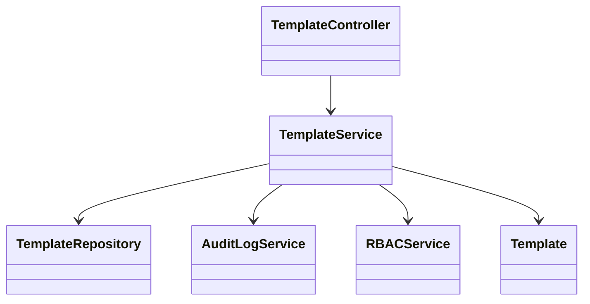
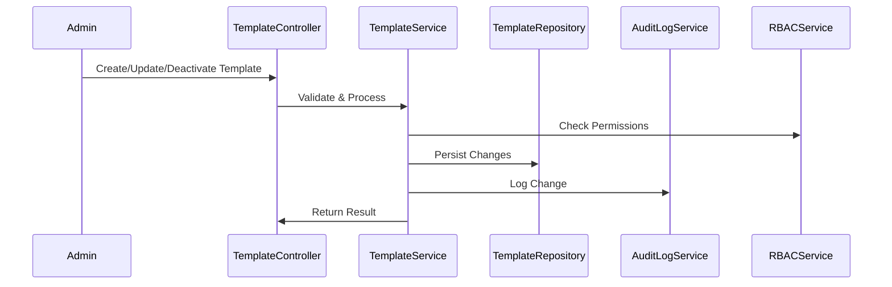
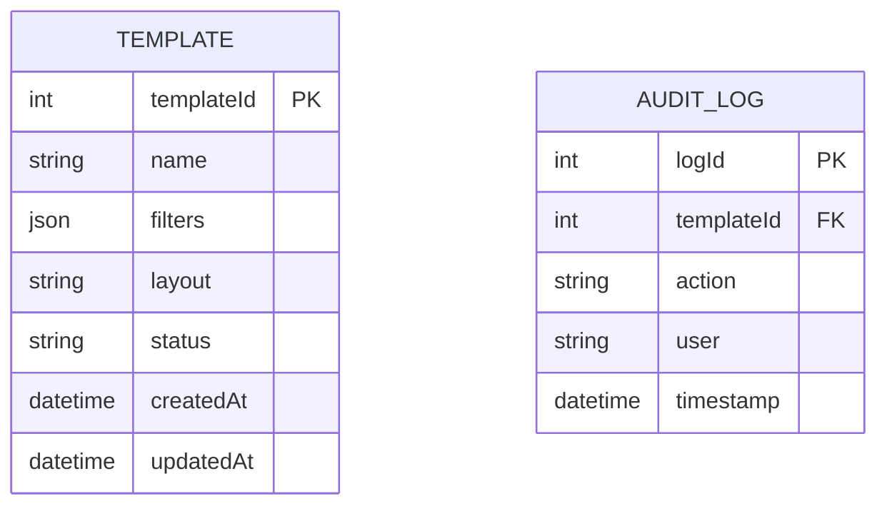

# For User Story Number [2]

1. Objective
This requirement enables report administrators to manage report templates for scheduling, ensuring users select from standardized and approved formats. Administrators can create, update, and deactivate templates, maintaining consistency and compliance. Only active templates are available for scheduling, and all template changes are auditable.

2. API Model
  2.1 Common Components/Services
    - Template Management Service
    - Role-based Access Control (RBAC)
    - Audit Logging Service

  2.2 API Details
| Operation   | REST Method | Type     | URL                                 | Request (Sample)                                                                 | Response (Sample)                                                      |
|-------------|------------|----------|--------------------------------------|----------------------------------------------------------------------------------|------------------------------------------------------------------------|
| Create      | POST       | Success  | /api/templates                       | {"name":"SalesReport","filters":{"region":"US"},"layout":"tabular"}           | {"templateId":201,"status":"Active"}                                   |
| Update      | PUT        | Success  | /api/templates/{templateId}          | {"filters":{"region":"EU"},"layout":"summary"}                                 | {"templateId":201,"status":"Active"}                                   |
| Deactivate  | PATCH      | Success  | /api/templates/{templateId}/deactivate|                                                                                    | {"templateId":201,"status":"Inactive"}                                  |
| List Active | GET        | Success  | /api/templates?status=active         |                                                                                    | [{"templateId":201,"name":"SalesReport",...}]                           |

  2.3 Exceptions
| API                | Exception Type         | Message                                      |
|--------------------|-----------------------|----------------------------------------------|
| Create/Update      | ValidationException   | "Template name must be unique."              |
| Deactivate         | NotFoundException     | "Template not found."                       |
| List Active        | DataAccessException   | "Unable to fetch templates."                 |

3 Functional Design
  3.1 Class Diagram

  3.2 UML Sequence Diagram

  3.3 Components
| Component Name        | Description                                              | Existing/New |
|----------------------|----------------------------------------------------------|--------------|
| TemplateController    | Handles template management API endpoints                | New          |
| TemplateService       | Business logic for template CRUD and validation          | New          |
| TemplateRepository    | Data access for templates                               | New          |
| AuditLogService       | Logs all template changes                               | Existing     |
| RBACService           | Enforces role-based access control                      | Existing     |
| Template              | Represents report template entity                       | New          |

  3.4 Service Layer Logic and Validations
| FieldName      | Validation                                 | Error Message                         | ClassUsed         |
|---------------|--------------------------------------------|---------------------------------------|-------------------|
| name          | Must be unique                              | "Template name must be unique."       | TemplateService   |
| filters       | Must be valid for report type               | "Invalid filter for template."        | TemplateService   |
| layout        | Must be supported layout                    | "Unsupported layout type."            | TemplateService   |
| status        | Must be 'Active' or 'Inactive'              | "Invalid status value."               | TemplateService   |

4 Integrations
| SystemToBeIntegrated | IntegratedFor         | IntegrationType |
|----------------------|----------------------|-----------------|
| SQL Server           | Template storage      | DB              |
| Audit Logging        | Change tracking       | API/DB          |
| RBAC                 | Permission checks     | API             |

5 DB Details
  5.1 ER Model

  5.2 DB Validations
- Unique constraint on TEMPLATE.name
- Foreign key constraint on AUDIT_LOG.templateId
- Valid values for TEMPLATE.status ('Active', 'Inactive')

6 Non-Functional Requirements
  6.1 Performance
    - Template changes propagate to all users within 1 minute
    - Caching of active templates at API layer

  6.2 Security
    6.2.1 Authentication
      - OAuth2 authentication for all API endpoints
    6.2.2 Authorization
      - Only authorized users can manage templates
      - RBAC enforced for all template operations

  6.3 Logging
    6.3.1 Application Logging
      - INFO: Template created/updated/deactivated
      - ERROR: Template operation failures
    6.3.2 Audit Log
      - Log all template changes with user, timestamp, and action

7 Dependencies
- SQL Server for template storage
- Audit Logging Service
- RBAC Service

8 Assumptions
- Templates are only managed by authorized administrators
- Template changes are soft-deleted (status flag)
- All templates have required filters and layouts
