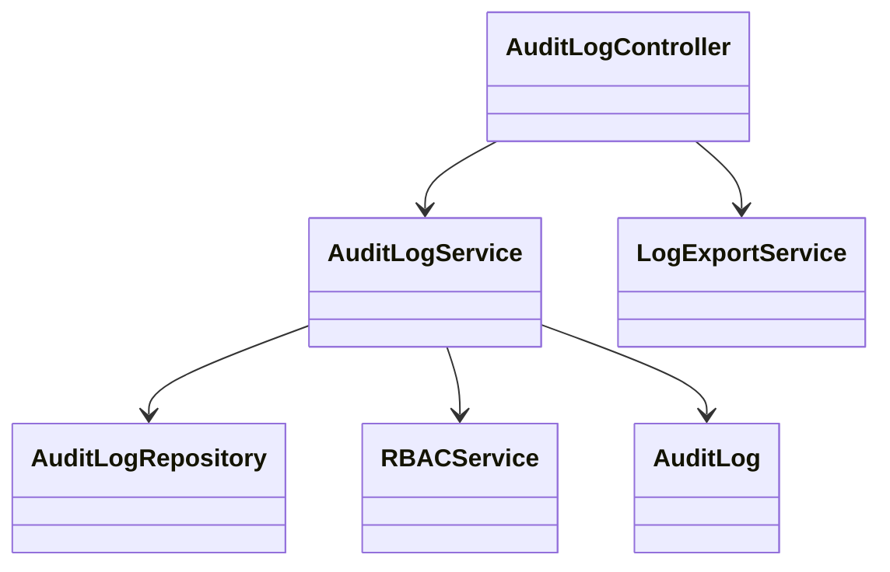
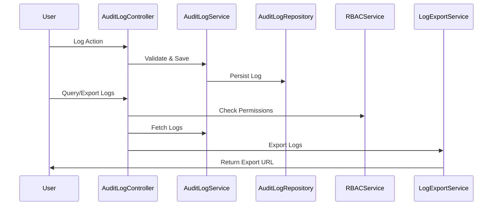
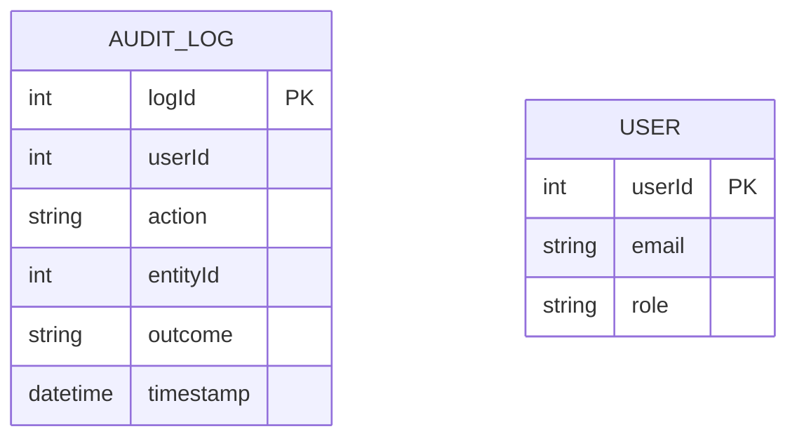

# For User Story Number [3]

1. Objective
This requirement ensures that all scheduled report activities are logged for traceability and accountability. Every scheduling, editing, cancelling, and delivery action is recorded with user, timestamp, action type, and outcome. Authorized users can query and export audit logs for compliance and troubleshooting.

2. API Model
  2.1 Common Components/Services
    - Audit Logging Service
    - Role-based Access Control (RBAC)
    - Log Export Service

  2.2 API Details
| Operation   | REST Method | Type     | URL                                 | Request (Sample)                                                                 | Response (Sample)                                                      |
|-------------|------------|----------|--------------------------------------|----------------------------------------------------------------------------------|------------------------------------------------------------------------|
| Log Action  | POST       | Success  | /api/audit/log                       | {"userId":1,"action":"schedule_create","entityId":101,"outcome":"success"}   | {"logId":301,"status":"Logged"}                                      |
| Query Logs  | GET        | Success  | /api/audit/logs?userId=1&date=2025-10-01|                                                                                | [{"logId":301,"userId":1,"action":"schedule_create",...}]             |
| Export Logs | GET        | Success  | /api/audit/logs/export?format=csv    |                                                                                    | {"exportUrl":"/exports/audit_20251001.csv"}                            |

  2.3 Exceptions
| API                | Exception Type         | Message                                      |
|--------------------|-----------------------|----------------------------------------------|
| Log Action         | ValidationException   | "Missing required log fields."               |
| Query/Export Logs  | AuthorizationException| "User not authorized to access audit logs."  |
| Export Logs        | ExportException       | "Export failed."                             |

3 Functional Design
  3.1 Class Diagram

  3.2 UML Sequence Diagram

  3.3 Components
| Component Name        | Description                                              | Existing/New |
|----------------------|----------------------------------------------------------|--------------|
| AuditLogController    | Handles audit log API endpoints                          | New          |
| AuditLogService       | Business logic for logging and querying audit logs       | New          |
| AuditLogRepository    | Data access for audit logs                              | New          |
| RBACService           | Enforces role-based access control                      | Existing     |
| LogExportService      | Handles export of logs in required format               | New          |
| AuditLog              | Represents audit log entity                             | New          |

  3.4 Service Layer Logic and Validations
| FieldName      | Validation                                 | Error Message                         | ClassUsed         |
|---------------|--------------------------------------------|---------------------------------------|-------------------|
| userId        | Must be present                             | "Missing userId."                     | AuditLogService   |
| action        | Must be valid action type                   | "Invalid action type."                | AuditLogService   |
| entityId      | Must be present                             | "Missing entityId."                   | AuditLogService   |
| outcome       | Must be 'success' or 'failure'              | "Invalid outcome value."              | AuditLogService   |
| timestamp     | Must be present                             | "Missing timestamp."                   | AuditLogService   |

4 Integrations
| SystemToBeIntegrated | IntegratedFor         | IntegrationType |
|----------------------|----------------------|-----------------|
| SQL Server/Azure Table| Audit log storage    | DB              |
| RBAC                 | Permission checks     | API             |
| Log Export           | Export logs           | API             |

5 DB Details
  5.1 ER Model

  5.2 DB Validations
- All fields in AUDIT_LOG must be NOT NULL
- Log retention policy enforced (e.g., 7 years)
- No update/delete on AUDIT_LOG rows (append-only)

6 Non-Functional Requirements
  6.1 Performance
    - Audit logs available for search within 1 minute of event
    - Support for 10 million log entries per year
    - Indexing on timestamp and userId for fast queries

  6.2 Security
    6.2.1 Authentication
      - OAuth2 authentication for all API endpoints
    6.2.2 Authorization
      - Only authorized users can access audit logs
      - RBAC enforced for all audit log operations
      - Logs protected against unauthorized modification

  6.3 Logging
    6.3.1 Application Logging
      - INFO: Audit log entries created
      - ERROR: Log creation/query/export failures
    6.3.2 Audit Log
      - Audit logs are immutable and tamper-evident
      - Log access is monitored

7 Dependencies
- SQL Server/Azure Table Storage for audit logs
- RBAC Service
- Log Export Service

8 Assumptions
- All relevant actions trigger audit log entries
- Audit logs are append-only and immutable
- Log export supports CSV/Excel format
