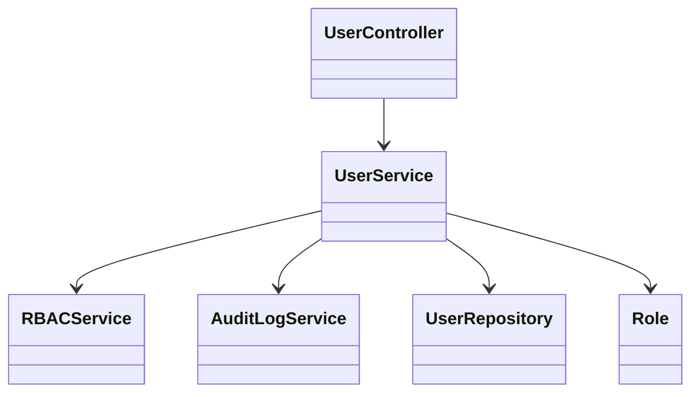
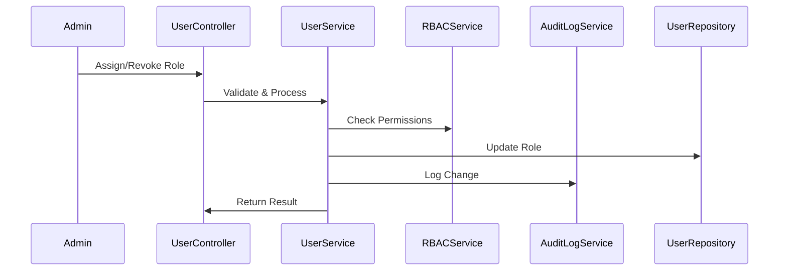
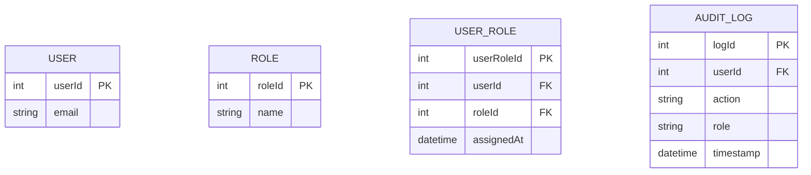

# For User Story Number [4]

1. Objective
This requirement enables administrators to manage user permissions for report scheduling via role-based access control. Only authorized users can schedule, edit, or view reports and their schedules, supporting segregation of duties. All permission changes are logged and take effect immediately for compliance and security.

2. API Model
  2.1 Common Components/Services
    - Role-based Access Control (RBAC) Service
    - Audit Logging Service
    - User Management Service

  2.2 API Details
| Operation   | REST Method | Type     | URL                                 | Request (Sample)                                                                 | Response (Sample)                                                      |
|-------------|------------|----------|--------------------------------------|----------------------------------------------------------------------------------|------------------------------------------------------------------------|
| Assign Role | POST       | Success  | /api/users/{userId}/roles            | {"roles":["scheduler","viewer"]}                                               | {"userId":1,"roles":["scheduler","viewer"],"status":"Assigned"}      |
| Revoke Role | DELETE     | Success  | /api/users/{userId}/roles/{role}     |                                                                                    | {"userId":1,"role":"scheduler","status":"Revoked"}                  |
| List Roles  | GET        | Success  | /api/users/{userId}/roles            |                                                                                    | {"userId":1,"roles":["scheduler","viewer"]}                           |
| List Users  | GET        | Success  | /api/roles/{role}/users              |                                                                                    | [{"userId":1,"email":"user@example.com"},...]                           |

  2.3 Exceptions
| API                | Exception Type         | Message                                      |
|--------------------|-----------------------|----------------------------------------------|
| Assign/Revoke      | AuthorizationException| "User not authorized to manage roles."       |
| Assign/Revoke      | ValidationException   | "Invalid role assignment."                   |
| List Roles/Users   | NotFoundException     | "User or role not found."                    |

3 Functional Design
  3.1 Class Diagram

  3.2 UML Sequence Diagram

  3.3 Components
| Component Name        | Description                                              | Existing/New |
|----------------------|----------------------------------------------------------|--------------|
| UserController        | Handles user/role management API endpoints               | New          |
| UserService           | Business logic for user/role assignment and validation   | New          |
| RBACService           | Enforces role-based access control                      | Existing     |
| AuditLogService       | Logs all permission changes                             | Existing     |
| UserRepository        | Data access for users and roles                         | New          |
| Role                  | Represents role entity                                  | New          |

  3.4 Service Layer Logic and Validations
| FieldName      | Validation                                 | Error Message                         | ClassUsed         |
|---------------|--------------------------------------------|---------------------------------------|-------------------|
| userId        | Must be present and valid                   | "Invalid userId."                     | UserService       |
| role          | Must be one of allowed roles                | "Invalid role value."                 | UserService       |
| roles         | Must not duplicate for user                 | "Role already assigned."              | UserService       |
| permission    | Must match assigned role                    | "Permission denied."                  | RBACService       |

4 Integrations
| SystemToBeIntegrated | IntegratedFor         | IntegrationType |
|----------------------|----------------------|-----------------|
| Azure AD/SQL Server  | User and role storage| DB/API          |
| Audit Logging        | Change tracking       | API/DB          |
| RBAC                 | Permission checks     | API             |

5 DB Details
  5.1 ER Model

  5.2 DB Validations
- Unique constraint on (userId, roleId) in USER_ROLE
- Foreign key constraints for all relationships
- Valid values for ROLE.name ('scheduler', 'viewer', 'admin')

6 Non-Functional Requirements
  6.1 Performance
    - Permission checks add less than 100ms latency to API calls
    - Immediate effect of permission changes
    - Indexing on USER_ROLE for fast lookups

  6.2 Security
    6.2.1 Authentication
      - OAuth2 authentication for all API endpoints
    6.2.2 Authorization
      - Only admins can manage permissions and templates
      - RBAC enforced for all permission operations
      - All permission changes logged and monitored
      - Integration with enterprise identity providers

  6.3 Logging
    6.3.1 Application Logging
      - INFO: Role assigned/revoked
      - ERROR: Permission operation failures
    6.3.2 Audit Log
      - Log all permission changes with user, timestamp, and action

7 Dependencies
- Azure AD/SQL Server for user and role storage
- Audit Logging Service
- RBAC Service

8 Assumptions
- Roles are pre-defined and mapped to features
- Permission changes are logged and auditable
- UI adapts based on user role
