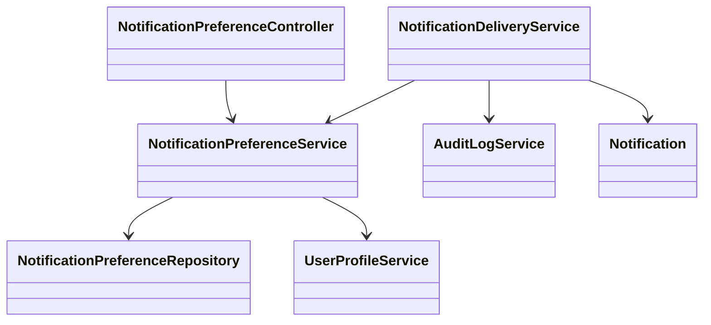
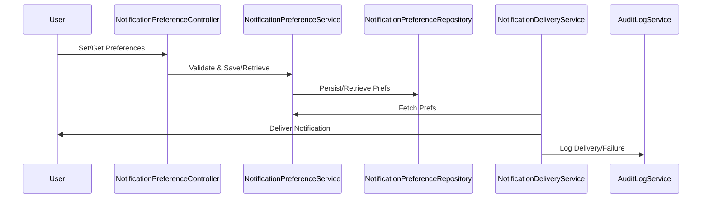
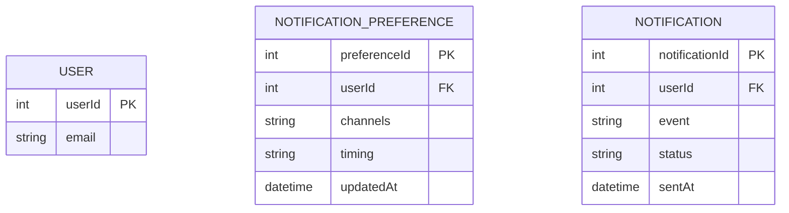

# For User Story Number [5]

1. Objective
This requirement allows business users to customize notification preferences for scheduled reports, ensuring they are informed in their preferred way about deliveries and failures. Users can select notification channels (email, SMS, in-app) and timing (immediate, daily summary), and update preferences at any time. The system delivers notifications as per user settings and logs failures for retry and audit.

2. API Model
  2.1 Common Components/Services
    - Notification Preference Service
    - Notification Delivery Service
    - User Profile Service
    - Audit Logging Service

  2.2 API Details
| Operation   | REST Method | Type     | URL                                 | Request (Sample)                                                                 | Response (Sample)                                                      |
|-------------|------------|----------|--------------------------------------|----------------------------------------------------------------------------------|------------------------------------------------------------------------|
| Set Prefs   | POST       | Success  | /api/users/{userId}/notification-preferences| {"channels":["email","sms"],"timing":"immediate"}                    | {"userId":1,"channels":["email","sms"],"timing":"immediate"}         |
| Get Prefs   | GET        | Success  | /api/users/{userId}/notification-preferences|                                            | {"userId":1,"channels":["email","sms"],"timing":"immediate"}         |
| Notify      | POST       | Success  | /api/notifications                   | {"userId":1,"event":"report_delivered","status":"success"}           | {"notificationId":501,"status":"Sent"}                                   |
| Summary     | POST       | Success  | /api/notifications/summary           | {"userId":1,"events":[...]}                                               | {"notificationId":502,"status":"Sent"}                                   |

  2.3 Exceptions
| API                | Exception Type         | Message                                      |
|--------------------|-----------------------|----------------------------------------------|
| Set/Get Prefs      | ValidationException   | "Invalid notification channel/timing."       |
| Notify/Summary     | DeliveryException     | "Notification delivery failed."              |
| Notify/Summary     | RetryException        | "Notification retry failed."                 |

3 Functional Design
  3.1 Class Diagram

  3.2 UML Sequence Diagram

  3.3 Components
| Component Name                  | Description                                              | Existing/New |
|---------------------------------|----------------------------------------------------------|--------------|
| NotificationPreferenceController| Handles notification preference API endpoints            | New          |
| NotificationPreferenceService   | Business logic for preference management and validation  | New          |
| NotificationDeliveryService     | Delivers notifications as per user preferences           | New          |
| UserProfileService              | Manages user profile and links preferences               | Existing     |
| AuditLogService                 | Logs notification deliveries and failures                | Existing     |
| NotificationPreferenceRepository| Data access for notification preferences                 | New          |
| Notification                    | Represents notification entity                           | Existing     |

  3.4 Service Layer Logic and Validations
| FieldName      | Validation                                 | Error Message                         | ClassUsed         |
|---------------|--------------------------------------------|---------------------------------------|-------------------|
| channels      | Must be valid (email, sms, in-app)          | "Invalid notification channel."        | NotificationPreferenceService |
| timing        | Must be 'immediate' or 'daily summary'      | "Invalid notification timing."         | NotificationPreferenceService |
| userId        | Must be present and valid                   | "Invalid userId."                      | NotificationPreferenceService |
| delivery      | Must succeed or be retried                  | "Notification delivery failed."        | NotificationDeliveryService   |

4 Integrations
| SystemToBeIntegrated | IntegratedFor         | IntegrationType |
|----------------------|----------------------|-----------------|
| SMTP/SendGrid        | Email delivery        | API             |
| Twilio               | SMS delivery          | API             |
| In-app Notification  | In-app delivery       | API             |
| SQL Server           | Preference storage    | DB              |
| Audit Logging        | Delivery/failure logs | API/DB          |

5 DB Details
  5.1 ER Model

  5.2 DB Validations
- Valid values for NOTIFICATION_PREFERENCE.channels ('email', 'sms', 'in-app')
- Valid values for NOTIFICATION_PREFERENCE.timing ('immediate', 'daily summary')
- Foreign key constraints for all relationships

6 Non-Functional Requirements
  6.1 Performance
    - Notifications delivered within 2 minutes of event
    - Support for 10,000 notifications per day
    - Indexing on NOTIFICATION_PREFERENCE for fast lookups

  6.2 Security
    6.2.1 Authentication
      - OAuth2 authentication for all API endpoints
    6.2.2 Authorization
      - Only users can update their preferences
      - All notification data encrypted in transit and at rest

  6.3 Logging
    6.3.1 Application Logging
      - INFO: Notification sent, preference updated
      - ERROR: Notification delivery failures
    6.3.2 Audit Log
      - Log notification deliveries and failures with user, timestamp, and event

7 Dependencies
- SMTP/SendGrid for email delivery
- Twilio for SMS delivery
- SQL Server for preference storage
- Audit Logging Service

8 Assumptions
- Users have valid contact details for selected channels
- Notification failures are logged and retried
- Preferences are linked to user profiles
