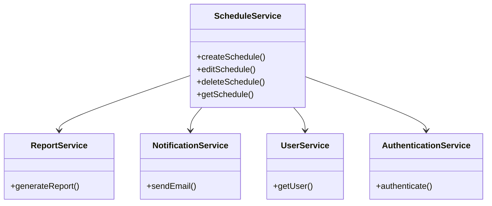
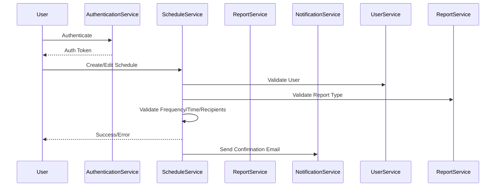
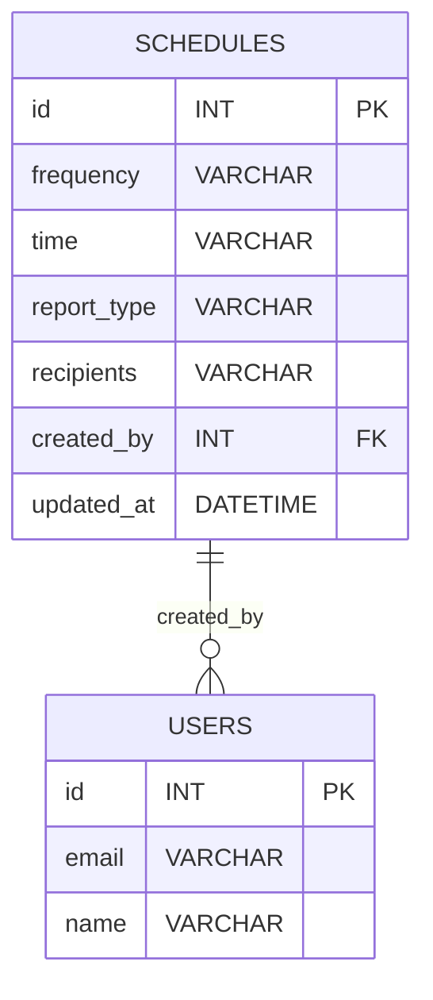

# For User Story Number [1]

1. Objective
The objective is to enable business analysts or administrators to configure automated report scheduling parameters. This includes setting frequency (daily, weekly, monthly), time of generation, report type, and recipients. The goal is to provide flexibility and control over automated reporting to meet business needs.

2. API Model
2.1 Common Components/Services
- AuthenticationService (existing)
- UserService (existing)
- ReportService (existing)
- ScheduleService (new)
- NotificationService (existing)

2.2 API Details
| Operation | REST Method | Type | URL | Request | Response |
|-----------|-------------|------|-----|---------|----------|
| Create Schedule | POST | Success/Failure | /api/schedules | {"frequency":"daily","time":"14:00","reportType":"PDF","recipients":["user1@example.com"]} | {"id":1,"status":"created"} |
| Edit Schedule | PUT | Success/Failure | /api/schedules/{id} | {"frequency":"weekly","time":"09:00","reportType":"Excel","recipients":["user2@example.com"]} | {"id":1,"status":"updated"} |
| Delete Schedule | DELETE | Success/Failure | /api/schedules/{id} | N/A | {"id":1,"status":"deleted"} |
| Get Schedule | GET | Success/Failure | /api/schedules/{id} | N/A | {"id":1,"frequency":"daily","time":"14:00","reportType":"PDF","recipients":["user1@example.com"]} |

2.3 Exceptions
| API | Exception | Description |
|-----|-----------|-------------|
| Create/Edit | InvalidFrequencyException | Frequency not allowed |
| Create/Edit | InvalidTimeFormatException | Time not in 24-hour format |
| Create/Edit | NoRecipientException | No recipient selected |
| Create/Edit | UnsupportedReportTypeException | Report type not supported |
| All | UnauthorizedException | User not authorized |

3 Functional Design
3.1 Class Diagram

3.2 UML Sequence Diagram

3.3 Components
| Component Name | Description | Existing/New |
|----------------|-------------|--------------|
| ScheduleService | Handles scheduling logic | New |
| ReportService | Generates reports | Existing |
| NotificationService | Sends notifications/emails | Existing |
| UserService | Manages user info | Existing |
| AuthenticationService | Handles authentication | Existing |

3.4 Service Layer Logic and Validations
| FieldName | Validation | Error Message | ClassUsed |
|-----------|-----------|--------------|-----------|
| frequency | Must be daily/weekly/monthly | "Invalid frequency" | ScheduleService |
| time | Must be valid 24-hour format | "Invalid time format" | ScheduleService |
| recipients | At least one recipient | "No recipient selected" | ScheduleService |
| reportType | Must be supported | "Unsupported report type" | ReportService |

4 Integrations
| SystemToBeIntegrated | IntegratedFor | IntegrationType |
|----------------------|---------------|-----------------|
| Azure Functions/Logic Apps | Trigger report generation | API |
| SendGrid | Send email notifications | API |
| Azure SQL Database | Persist schedules | API |

5 DB Details
5.1 ER Model

5.2 DB Validations
- Frequency must be in allowed values
- Time must be in valid format
- At least one recipient must exist
- Report type must be supported

6 Non-Functional Requirements
6.1 Performance
- Scheduling should not delay report generation by more than 2 minutes.
- Use caching for frequent schedule queries.

6.2 Security
6.2.1 Authentication
- Only authenticated users can access scheduling features (JWT/OAuth2).
6.2.2 Authorization
- Only users with appropriate roles can create/edit/delete schedules.

6.3 Logging
6.3.1 Application Logging
- Log at INFO: schedule creation, update, deletion
- Log at ERROR: validation failures, unauthorized access
- Log at DEBUG: API request/response payloads
6.3.2 Audit Log
- Log every scheduling action with user ID, timestamp, action type

7 Dependencies
- Azure Functions/Logic Apps
- SendGrid
- Azure SQL Database

8 Assumptions
- All users are authenticated via standard mechanism
- Supported report types are pre-configured in the system
- Email addresses are valid and verified
- Scheduling logic is handled by Azure Functions/Logic Apps
