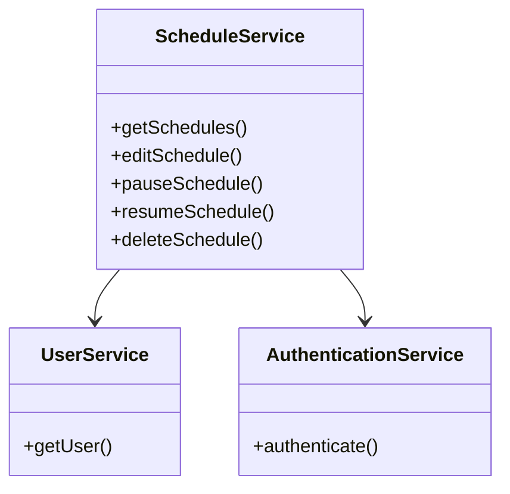
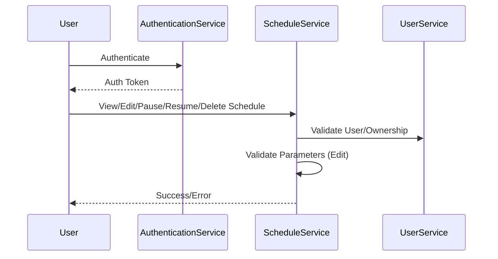
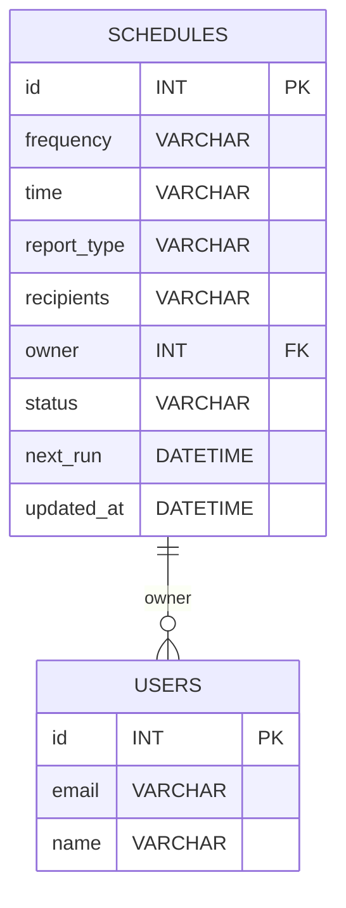

# For User Story Number [2]

1. Objective
Enable end users to view, edit, pause, resume, and delete their scheduled reports from a dashboard. Provide immediate feedback and ensure only authorized users can manage their schedules. The goal is to give users full control and visibility over their automated report schedules.

2. API Model
2.1 Common Components/Services
- AuthenticationService (existing)
- UserService (existing)
- ScheduleService (existing)
- ReportService (existing)

2.2 API Details
| Operation | REST Method | Type | URL | Request | Response |
|-----------|-------------|------|-----|---------|----------|
| View All Schedules | GET | Success/Failure | /api/schedules | N/A | [{"id":1,"frequency":"daily","nextRun":"2024-06-01T14:00","reportType":"PDF","recipients":["user1@example.com"]}] |
| Edit Schedule | PUT | Success/Failure | /api/schedules/{id} | {"frequency":"weekly","time":"09:00","reportType":"Excel","recipients":["user2@example.com"]} | {"id":1,"status":"updated"} |
| Pause Schedule | POST | Success/Failure | /api/schedules/{id}/pause | N/A | {"id":1,"status":"paused"} |
| Resume Schedule | POST | Success/Failure | /api/schedules/{id}/resume | N/A | {"id":1,"status":"resumed"} |
| Delete Schedule | DELETE | Success/Failure | /api/schedules/{id} | N/A | {"id":1,"status":"deleted"} |

2.3 Exceptions
| API | Exception | Description |
|-----|-----------|-------------|
| Edit/Delete/Pause/Resume | UnauthorizedException | User not authorized |
| Edit | InvalidFrequencyException | Frequency not allowed |
| Edit | InvalidTimeFormatException | Time not in 24-hour format |
| Edit | NoRecipientException | No recipient selected |
| Edit | UnsupportedReportTypeException | Report type not supported |

3 Functional Design
3.1 Class Diagram

3.2 UML Sequence Diagram

3.3 Components
| Component Name | Description | Existing/New |
|----------------|-------------|--------------|
| ScheduleService | Handles schedule management | Existing |
| UserService | Manages user info | Existing |
| AuthenticationService | Handles authentication | Existing |

3.4 Service Layer Logic and Validations
| FieldName | Validation | Error Message | ClassUsed |
|-----------|-----------|--------------|-----------|
| owner | Must be owner or authorized | "Unauthorized action" | ScheduleService |
| frequency | Must be daily/weekly/monthly | "Invalid frequency" | ScheduleService |
| time | Must be valid 24-hour format | "Invalid time format" | ScheduleService |
| recipients | At least one recipient | "No recipient selected" | ScheduleService |
| reportType | Must be supported | "Unsupported report type" | ScheduleService |

4 Integrations
| SystemToBeIntegrated | IntegratedFor | IntegrationType |
|----------------------|---------------|-----------------|
| Azure SQL Database | Persist schedules | API |

5 DB Details
5.1 ER Model

5.2 DB Validations
- Only owner or authorized user can modify/delete
- Frequency, time, recipients, report type validations as above

6 Non-Functional Requirements
6.1 Performance
- Dashboard must load all schedules within 2 seconds
- Use pagination and caching for large datasets

6.2 Security
6.2.1 Authentication
- Only authenticated users can access schedules (JWT/OAuth2)
6.2.2 Authorization
- Only owners or authorized users can manage schedules

6.3 Logging
6.3.1 Application Logging
- Log at INFO: schedule view, edit, pause, resume, delete
- Log at ERROR: unauthorized access, validation failures
- Log at DEBUG: API request/response payloads
6.3.2 Audit Log
- Log every schedule change with user ID, timestamp, action type

7 Dependencies
- Azure SQL Database

8 Assumptions
- All users are authenticated via standard mechanism
- Schedule status is tracked in DB
- UI uses Angular dashboard to interact with backend APIs
