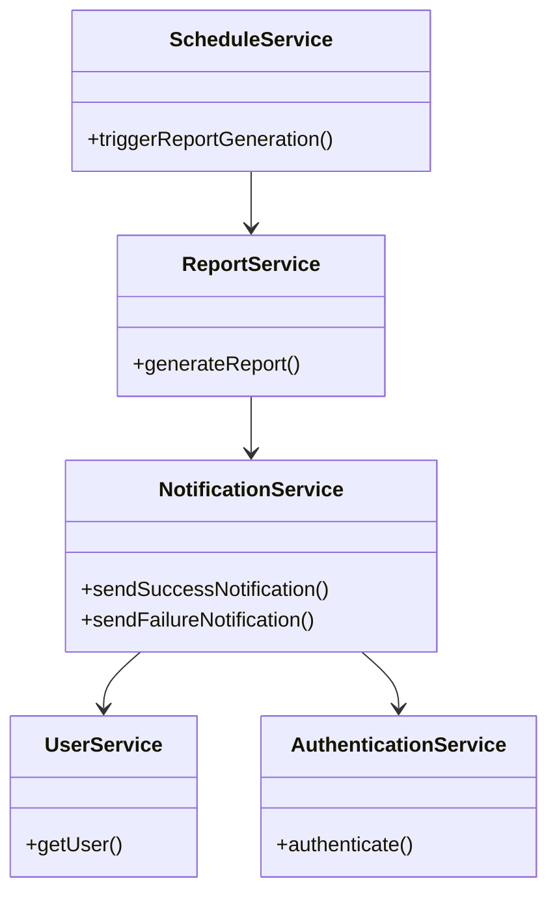
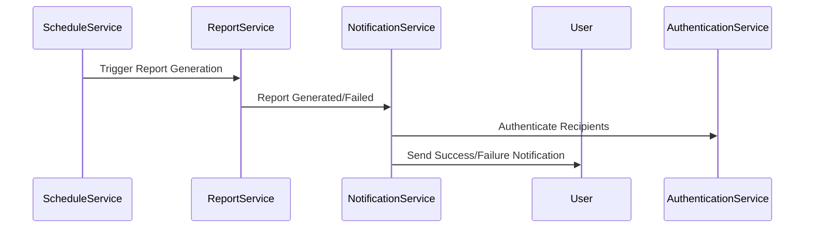
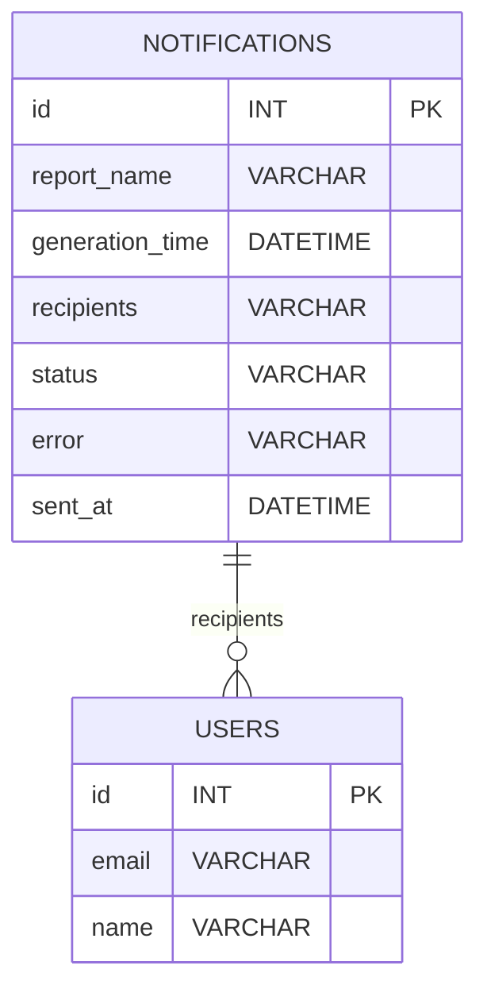

# For User Story Number [3]

1. Objective
Enable users to receive notifications when scheduled reports are generated or if there is a failure, ensuring users are always informed about the status of their reports. Notifications must include relevant details such as report name, generation time, and error information if applicable. The goal is to provide timely and accurate updates to all designated recipients.

2. API Model
2.1 Common Components/Services
- AuthenticationService (existing)
- UserService (existing)
- ScheduleService (existing)
- ReportService (existing)
- NotificationService (new)

2.2 API Details
| Operation | REST Method | Type | URL | Request | Response |
|-----------|-------------|------|-----|---------|----------|
| Send Success Notification | POST | Success/Failure | /api/notifications/success | {"reportName":"SalesReport","generationTime":"2024-06-01T14:00","recipients":["user1@example.com"]} | {"status":"sent"} |
| Send Failure Notification | POST | Success/Failure | /api/notifications/failure | {"reportName":"SalesReport","generationTime":"2024-06-01T14:00","recipients":["user1@example.com"],"error":"Timeout"} | {"status":"sent"} |

2.3 Exceptions
| API | Exception | Description |
|-----|-----------|-------------|
| Send Notification | InvalidEmailException | Email address not valid or verified |
| Send Notification | NotificationTimeoutException | Notification not sent within 1 minute |
| All | UnauthorizedException | User not authorized |

3 Functional Design
3.1 Class Diagram

3.2 UML Sequence Diagram

3.3 Components
| Component Name | Description | Existing/New |
|----------------|-------------|--------------|
| NotificationService | Handles notification logic | New |
| ReportService | Generates reports | Existing |
| ScheduleService | Triggers report generation | Existing |
| UserService | Manages user info | Existing |
| AuthenticationService | Handles authentication | Existing |

3.4 Service Layer Logic and Validations
| FieldName | Validation | Error Message | ClassUsed |
|-----------|-----------|--------------|-----------|
| recipients | Email must be valid and verified | "Invalid email address" | NotificationService |
| generationTime | Notification sent within 1 minute | "Notification timeout" | NotificationService |
| reportName | Must match scheduled report | "Report name mismatch" | NotificationService |

4 Integrations
| SystemToBeIntegrated | IntegratedFor | IntegrationType |
|----------------------|---------------|-----------------|
| SendGrid | Send email notifications | API |
| Azure Functions | Notification workflow | API |
| Azure SQL Database | Persist notification logs | API |

5 DB Details
5.1 ER Model

5.2 DB Validations
- Email addresses must be valid and verified
- Notification sent within 1 minute of report event
- Notification content matches scheduled report details

6 Non-Functional Requirements
6.1 Performance
- Notifications must be sent within 1 minute
- Use asynchronous processing for notification delivery

6.2 Security
6.2.1 Authentication
- Only authenticated users can receive notifications (JWT/OAuth2)
6.2.2 Authorization
- Only designated recipients receive notifications

6.3 Logging
6.3.1 Application Logging
- Log at INFO: notification sent, notification failed
- Log at ERROR: invalid email, notification timeout
- Log at DEBUG: notification payloads
6.3.2 Audit Log
- Log every notification event with user ID, timestamp, report name, status

7 Dependencies
- SendGrid
- Azure Functions
- Azure SQL Database

8 Assumptions
- All recipients have valid and verified email addresses
- Notification workflow is handled by Azure Functions
- Notification logs are persisted for monitoring and audit
