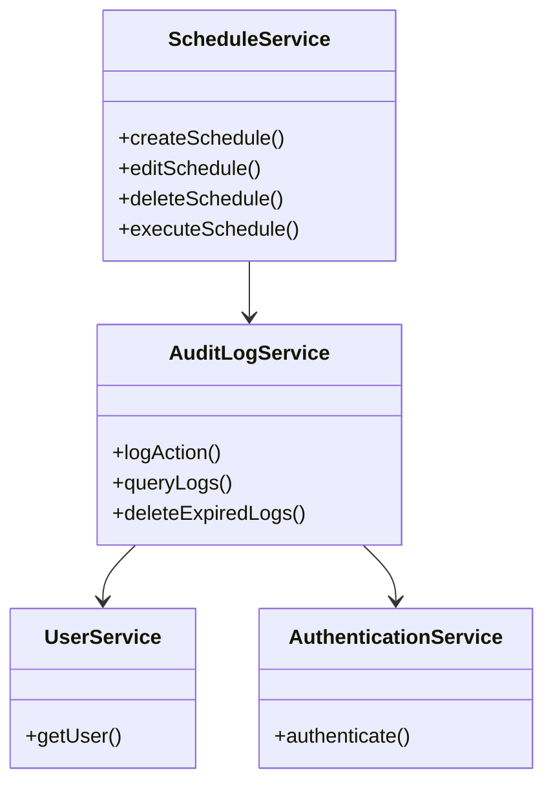
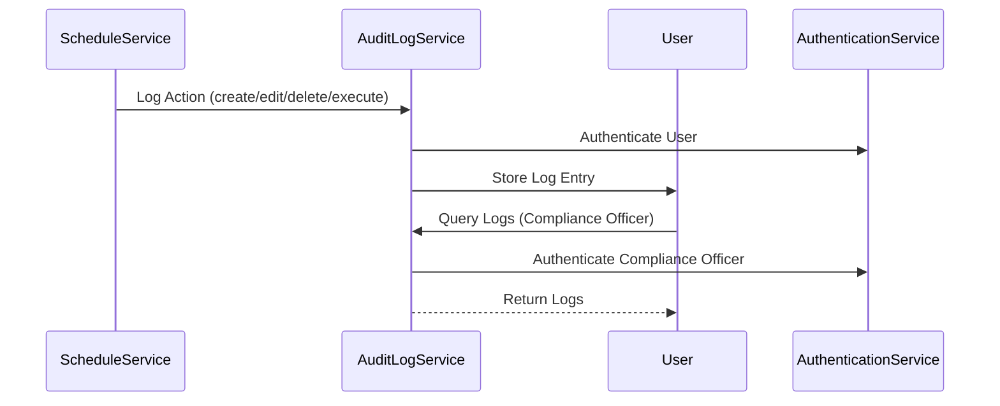
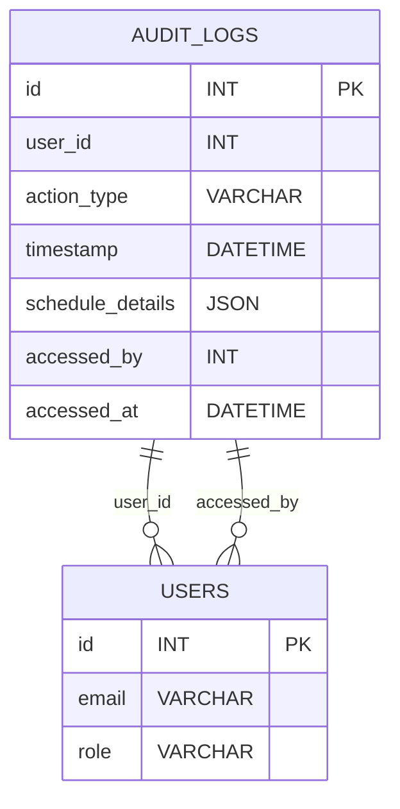

# For User Story Number [4]

1. Objective
Log all report scheduling actions (creation, modification, deletion, execution) to ensure traceability and support regulatory compliance. Provide compliance officers with secure access to audit logs, retaining logs for a configurable period and preventing alteration by end users. The goal is to ensure security, transparency, and auditability of scheduling activities.

2. API Model
2.1 Common Components/Services
- AuthenticationService (existing)
- UserService (existing)
- AuditLogService (new)
- ScheduleService (existing)

2.2 API Details
| Operation | REST Method | Type | URL | Request | Response |
|-----------|-------------|------|-----|---------|----------|
| Log Scheduling Action | POST | Success/Failure | /api/auditlogs | {"userId":123,"actionType":"CREATE","timestamp":"2024-06-01T14:00","scheduleDetails":{...}} | {"status":"logged"} |
| Query Audit Logs | GET | Success/Failure | /api/auditlogs?from=2024-06-01&to=2024-07-01 | N/A | [{"userId":123,"actionType":"CREATE","timestamp":"2024-06-01T14:00","scheduleDetails":{...}}] |
| Delete Expired Logs | DELETE | Success/Failure | /api/auditlogs/expired | N/A | {"status":"deleted"} |

2.3 Exceptions
| API | Exception | Description |
|-----|-----------|-------------|
| Log Scheduling Action | LoggingDelayException | Logging exceeds 500ms |
| Query Audit Logs | UnauthorizedException | User not authorized |
| All | LogRetentionException | Log retention policy violated |

3 Functional Design
3.1 Class Diagram

3.2 UML Sequence Diagram

3.3 Components
| Component Name | Description | Existing/New |
|----------------|-------------|--------------|
| AuditLogService | Handles audit logging and queries | New |
| ScheduleService | Handles scheduling logic | Existing |
| UserService | Manages user info | Existing |
| AuthenticationService | Handles authentication | Existing |

3.4 Service Layer Logic and Validations
| FieldName | Validation | Error Message | ClassUsed |
|-----------|-----------|--------------|-----------|
| userId | Must be present | "User ID missing" | AuditLogService |
| actionType | Must be valid (CREATE, EDIT, DELETE, EXECUTE) | "Invalid action type" | AuditLogService |
| timestamp | Must be present | "Timestamp missing" | AuditLogService |
| scheduleDetails | Must be present | "Schedule details missing" | AuditLogService |
| access | Only compliance officers can query logs | "Unauthorized access" | AuditLogService |
| retention | Logs retained for configured period | "Retention policy violation" | AuditLogService |

4 Integrations
| SystemToBeIntegrated | IntegratedFor | IntegrationType |
|----------------------|---------------|-----------------|
| Azure SQL Database | Persist audit logs | API |
| Angular Compliance UI | Query audit logs | API |

5 DB Details
5.1 ER Model

5.2 DB Validations
- Each log entry must contain user ID, action type, timestamp, schedule details
- Only compliance officers can access logs
- Log retention enforced by scheduled cleanup

6 Non-Functional Requirements
6.1 Performance
- Logging must not delay scheduling actions by more than 500ms
- Use batch writes for high-volume logging

6.2 Security
6.2.1 Authentication
- Only authenticated users can log actions (JWT/OAuth2)
6.2.2 Authorization
- Only compliance officers can query logs
- Logs are encrypted at rest

6.3 Logging
6.3.1 Application Logging
- Log at INFO: audit log created, queried, deleted
- Log at ERROR: unauthorized access, retention violation
- Log at DEBUG: audit log payloads
6.3.2 Audit Log
- Log every access to audit logs with user ID, timestamp, event

7 Dependencies
- Azure SQL Database
- Angular Compliance UI

8 Assumptions
- All users are authenticated via standard mechanism
- Log retention period is configurable (default 1 year)
- Audit logs are encrypted and cannot be altered by end users
