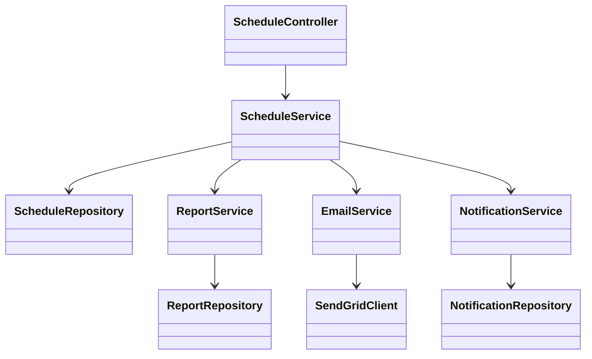
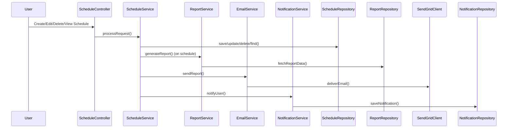
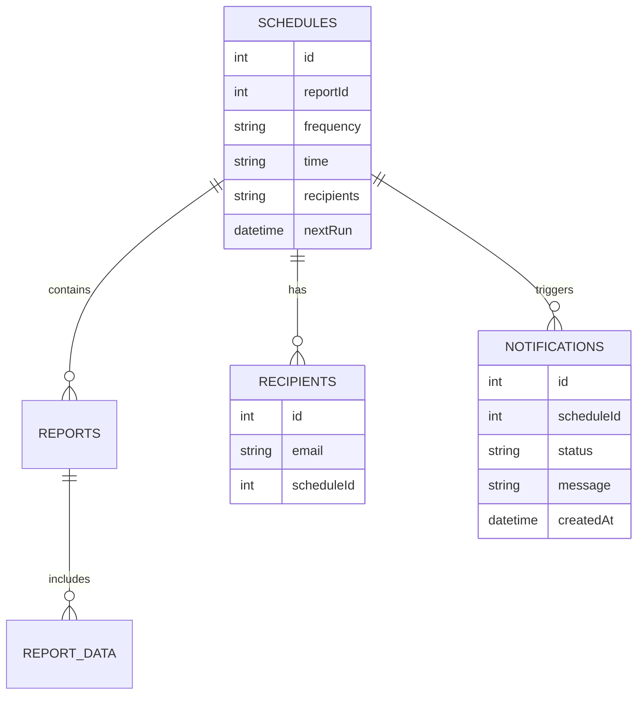

# For User Story Number [1]

1. Objective
This requirement enables business analysts to configure automated report schedules, allowing reports to be generated and delivered at predefined intervals without manual intervention. Users can specify frequency, time, and recipients for each report. The system supports multiple scheduling options and easy management of scheduled reports.

2. API Model
2.1 Common Components/Services
- EmailService (for email delivery)
- ScheduleService (for schedule management)
- ReportService (for report generation)
- NotificationService (for delivery notifications)

2.2 API Details
| Operation      | REST Method | Type           | URL                               | Request (JSON)                                   | Response (JSON)                                   |
|---------------|-------------|----------------|------------------------------------|--------------------------------------------------|----------------------------------------------------|
| Create        | POST        | Success/Failure| /api/schedules                    | {"reportId":1,"frequency":"daily","time":"08:00","recipients":["user@example.com"]} | {"scheduleId":123,"status":"created"}           |
| Edit          | PUT         | Success/Failure| /api/schedules/{id}                | {"frequency":"weekly","time":"09:00","recipients":["user2@example.com"]} | {"scheduleId":123,"status":"updated"}           |
| Delete        | DELETE      | Success/Failure| /api/schedules/{id}                | N/A                                              | {"scheduleId":123,"status":"deleted"}           |
| View          | GET         | Success        | /api/schedules                     | N/A                                              | [{"scheduleId":123,"reportId":1,"frequency":"daily","time":"08:00","recipients":["user@example.com"]}] |
| Trigger Report| POST        | Success/Failure| /api/schedules/{id}/trigger        | N/A                                              | {"deliveryStatus":"success","deliveryTime":"2025-09-25T08:01:00"} |

2.3 Exceptions
| API                | Exception Type         | Error Message                                    |
|--------------------|-----------------------|--------------------------------------------------|
| Create/Edit        | ValidationException    | "Invalid frequency value"                        |
| Create/Edit        | ValidationException    | "Invalid recipient email address"                |
| Create             | DuplicateScheduleException | "Duplicate schedule for this report and recipient"|
| Trigger Report     | ReportGenerationException | "Report generation failed"                     |
| Trigger Report     | DeliveryException      | "Report delivery failed"                         |

3 Functional Design
3.1 Class Diagram

3.2 UML Sequence Diagram

3.3 Components
| Component Name        | Description                                               | Existing/New |
|----------------------|-----------------------------------------------------------|--------------|
| ScheduleController   | REST API controller for schedule management                | New          |
| ScheduleService      | Business logic for scheduling and triggering reports       | New          |
| ScheduleRepository   | Data access for schedules                                 | New          |
| ReportService        | Handles report generation logic                           | Existing     |
| ReportRepository     | Data access for reports                                   | Existing     |
| EmailService         | Handles email delivery                                    | Existing     |
| SendGridClient       | Integrates with SendGrid for email delivery               | Existing     |
| NotificationService  | Handles user notifications                                | New          |
| NotificationRepository| Data access for notifications                            | New          |

3.4 Service Layer Logic & Validations
| FieldName         | Validation                                   | Error Message                             | ClassUsed           |
|-------------------|----------------------------------------------|-------------------------------------------|---------------------|
| frequency         | Must be daily/weekly/monthly/custom           | "Invalid frequency value"                 | ScheduleService     |
| recipients        | Valid email format                            | "Invalid recipient email address"         | ScheduleService     |
| reportId          | Must exist                                   | "Report not found"                        | ScheduleService     |
| schedule          | No duplicate for report+recipient             | "Duplicate schedule for this report and recipient" | ScheduleService |
| report generation | Must succeed before delivery                  | "Report generation failed"                | ReportService       |

4 Integrations
| SystemToBeIntegrated | IntegratedFor           | IntegrationType |
|---------------------|-------------------------|-----------------|
| SendGrid            | Email delivery          | API             |
| Application Insights| Monitoring              | API             |

5 DB Details
5.1 ER Model

5.2 DB Validations
- Unique constraint on (reportId, recipients) in SCHEDULES
- Foreign key constraints for reportId, scheduleId

6 Non-Functional Requirements
6.1 Performance
- Scheduling and delivery must occur within 2 minutes of scheduled time
- Background job queue optimized for concurrency

6.2 Security
6.2.1 Authentication
- OAuth2/JWT authentication for all APIs
- IAM integration for user roles
6.2.2 Authorization
- Role-based access control for schedule management
- Only authorized users can manage schedules

6.3 Logging
6.3.1 Application Logging
- DEBUG: Scheduling logic, job triggers
- INFO: Successful report deliveries
- ERROR: Failed report generation/delivery
- WARN: Duplicate schedule attempts
6.3.2 Audit Log
- All schedule creation, modification, deletion events logged

7 Dependencies
- Hangfire for background job scheduling
- SendGrid for email delivery
- Application Insights for monitoring

8 Assumptions
- All reports are available in PDF/Excel format
- Email delivery is the primary channel; others may be added later
- Schedules are managed only by authorized business analysts
