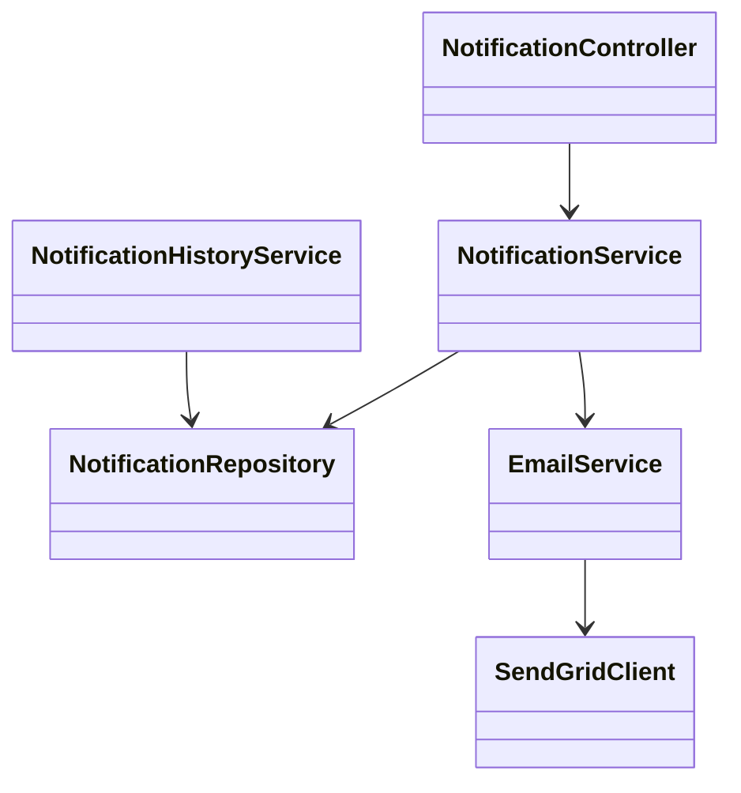
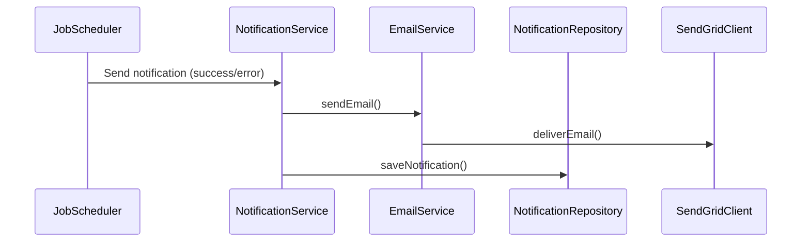
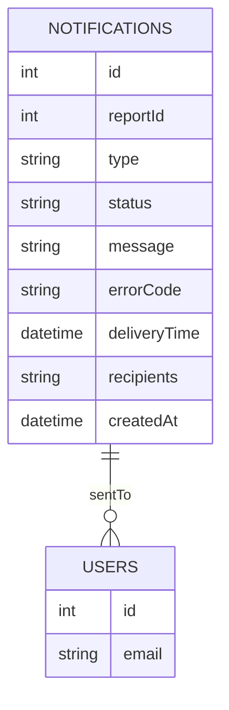

# For User Story Number [2]

1. Objective
This requirement ensures that report recipients are notified of both successful and failed scheduled report deliveries. Notifications must be clear, actionable, and include relevant details to help users address any issues. Users can view their notification history within the application.

2. API Model
2.1 Common Components/Services
- NotificationService (for notification logic)
- EmailService (for email delivery)
- NotificationHistoryService (for notification history retrieval)

2.2 API Details
| Operation      | REST Method | Type           | URL                                   | Request (JSON)                                   | Response (JSON)                                   |
|---------------|-------------|----------------|----------------------------------------|--------------------------------------------------|----------------------------------------------------|
| Send Success  | POST        | Success/Failure| /api/notifications/success             | {"reportId":1,"recipients":["user@example.com"],"deliveryTime":"2025-09-25T08:01:00"} | {"notificationId":456,"status":"sent"}           |
| Send Error    | POST        | Success/Failure| /api/notifications/error               | {"reportId":1,"recipients":["user@example.com"],"errorCode":"GEN_FAIL","errorMessage":"Report generation failed"} | {"notificationId":457,"status":"sent"}           |
| View History  | GET         | Success        | /api/notifications/history             | N/A                                              | [{"notificationId":456,"type":"success","reportId":1,"deliveryTime":"2025-09-25T08:01:00"}] |

2.3 Exceptions
| API                | Exception Type         | Error Message                                    |
|--------------------|-----------------------|--------------------------------------------------|
| Send Success/Error | ValidationException   | "Invalid recipient email address"                |
| Send Success/Error | NotificationException | "Notification delivery failed"                   |
| View History       | AuthorizationException| "User not authorized to view notification history"|

3 Functional Design
3.1 Class Diagram

3.2 UML Sequence Diagram

3.3 Components
| Component Name              | Description                                               | Existing/New |
|----------------------------|-----------------------------------------------------------|--------------|
| NotificationController     | REST API controller for notifications                     | New          |
| NotificationService        | Business logic for notification delivery                  | New          |
| NotificationRepository     | Data access for notifications                            | New          |
| EmailService               | Handles email delivery                                    | Existing     |
| SendGridClient             | Integrates with SendGrid for email delivery               | Existing     |
| NotificationHistoryService | Handles retrieval of notification history                 | New          |

3.4 Service Layer Logic & Validations
| FieldName         | Validation                                   | Error Message                             | ClassUsed                   |
|-------------------|----------------------------------------------|-------------------------------------------|-----------------------------|
| recipients        | Valid email format                            | "Invalid recipient email address"         | NotificationService         |
| errorCode         | Must be present for error notifications       | "Missing error code"                      | NotificationService         |
| notification      | Must be stored for at least 90 days           | "Notification retention failed"           | NotificationRepository      |
| authorization     | Only authorized users can view history        | "User not authorized"                     | NotificationHistoryService  |

4 Integrations
| SystemToBeIntegrated | IntegratedFor           | IntegrationType |
|---------------------|-------------------------|-----------------|
| SendGrid            | Email delivery          | API             |
| Application Insights| Monitoring              | API             |

5 DB Details
5.1 ER Model

5.2 DB Validations
- Email format validation for recipients
- Notification retention policy (90 days)

6 Non-Functional Requirements
6.1 Performance
- Notifications sent within 1 minute of report delivery/failure
- Asynchronous email delivery for scalability

6.2 Security
6.2.1 Authentication
- OAuth2/JWT authentication for all APIs
6.2.2 Authorization
- Only authorized users can view notification history

6.3 Logging
6.3.1 Application Logging
- DEBUG: Notification logic, email triggers
- INFO: Successful notification deliveries
- ERROR: Failed notification deliveries
- WARN: Invalid recipient attempts
6.3.2 Audit Log
- All notification sends and history views logged

7 Dependencies
- Hangfire for job scheduling
- SendGrid for email delivery
- Application Insights for monitoring

8 Assumptions
- Email is the primary notification channel
- Notification history is only accessible to authorized users
- Error codes are standardized across the system
