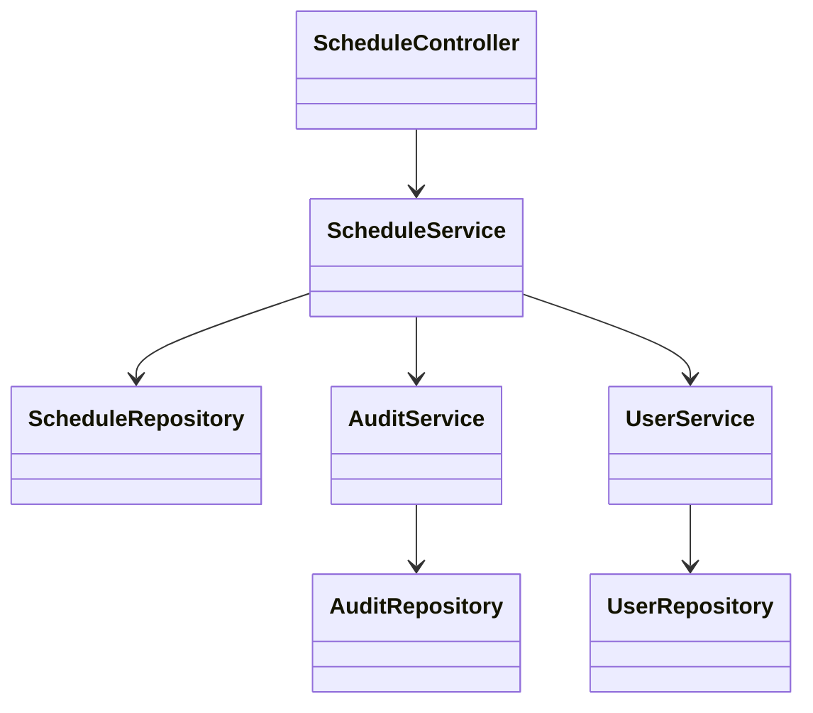
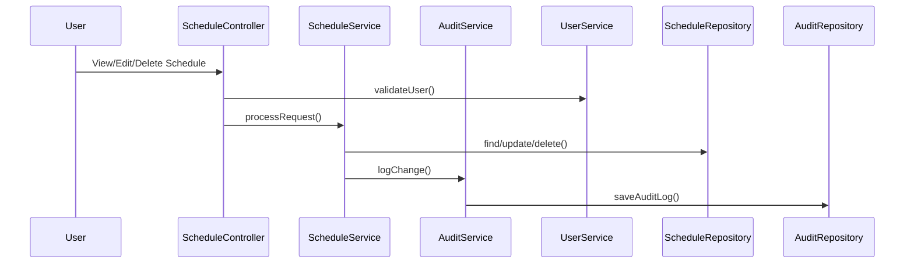
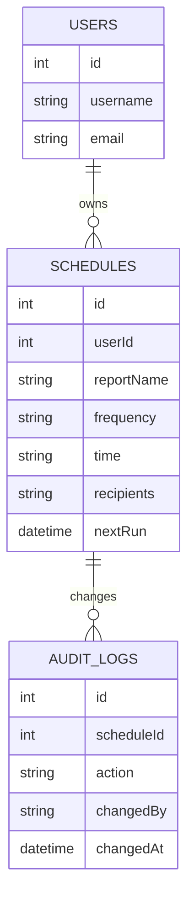

# For User Story Number [3]

1. Objective
This requirement provides users with an intuitive dashboard to view, edit, and delete their scheduled reports. The interface allows users to easily manage report schedules and ensures changes are immediately reflected in the scheduling system.

2. API Model
2.1 Common Components/Services
- ScheduleService (for schedule management)
- AuditService (for logging changes)
- UserService (for authorization)

2.2 API Details
| Operation      | REST Method | Type           | URL                               | Request (JSON)                                   | Response (JSON)                                   |
|---------------|-------------|----------------|------------------------------------|--------------------------------------------------|----------------------------------------------------|
| View Schedules| GET         | Success        | /api/schedules/user                | N/A                                              | [{"scheduleId":123,"reportName":"Sales Report","frequency":"daily","nextRun":"2025-09-26T08:00:00","recipients":["user@example.com"]}] |
| Edit Schedule | PUT         | Success/Failure| /api/schedules/{id}                | {"frequency":"weekly","time":"09:00","recipients":["user2@example.com"]} | {"scheduleId":123,"status":"updated"}           |
| Delete Schedule| DELETE      | Success/Failure| /api/schedules/{id}                | N/A                                              | {"scheduleId":123,"status":"deleted"}           |

2.3 Exceptions
| API                | Exception Type         | Error Message                                    |
|--------------------|-----------------------|--------------------------------------------------|
| View/Edit/Delete   | AuthorizationException| "User not authorized to access/modify schedule"  |
| Edit               | ValidationException   | "Invalid schedule parameters"                    |
| Delete             | NotFoundException     | "Schedule not found"                             |

3 Functional Design
3.1 Class Diagram

3.2 UML Sequence Diagram

3.3 Components
| Component Name        | Description                                               | Existing/New |
|----------------------|-----------------------------------------------------------|--------------|
| ScheduleController   | REST API controller for schedule management                | New          |
| ScheduleService      | Business logic for schedule viewing/editing/deleting       | New          |
| ScheduleRepository   | Data access for schedules                                 | New          |
| AuditService         | Handles audit logging for schedule changes                | New          |
| AuditRepository      | Data access for audit logs                                | New          |
| UserService          | Handles user authentication/authorization                 | Existing     |
| UserRepository       | Data access for users                                     | Existing     |

3.4 Service Layer Logic & Validations
| FieldName         | Validation                                   | Error Message                             | ClassUsed           |
|-------------------|----------------------------------------------|-------------------------------------------|---------------------|
| user              | Must be authorized                           | "User not authorized"                     | UserService         |
| schedule params   | Valid frequency, time, recipients            | "Invalid schedule parameters"             | ScheduleService     |
| scheduleId        | Must exist for edit/delete                   | "Schedule not found"                      | ScheduleService     |
| audit             | All changes must be logged                   | "Audit log failed"                        | AuditService        |

4 Integrations
| SystemToBeIntegrated | IntegratedFor           | IntegrationType |
|---------------------|-------------------------|-----------------|
| Application Insights| Monitoring              | API             |

5 DB Details
5.1 ER Model

5.2 DB Validations
- Foreign key constraints for userId, scheduleId
- Audit logs must be created for every schedule change

6 Non-Functional Requirements
6.1 Performance
- Dashboard loads all schedules within 2 seconds
- Efficient queries for large schedule datasets

6.2 Security
6.2.1 Authentication
- OAuth2/JWT authentication for all APIs
6.2.2 Authorization
- Role-based access control for schedule management
- Audit logs for all changes

6.3 Logging
6.3.1 Application Logging
- DEBUG: Dashboard data retrieval
- INFO: Schedule edits/deletions
- ERROR: Unauthorized access attempts
- WARN: Invalid schedule parameters
6.3.2 Audit Log
- All schedule changes logged with user and timestamp

7 Dependencies
- Application Insights for monitoring

8 Assumptions
- Only authorized users can view/edit/delete their schedules
- Audit logs are retained for compliance and troubleshooting
- Dashboard supports up to 1,000 schedules per user
