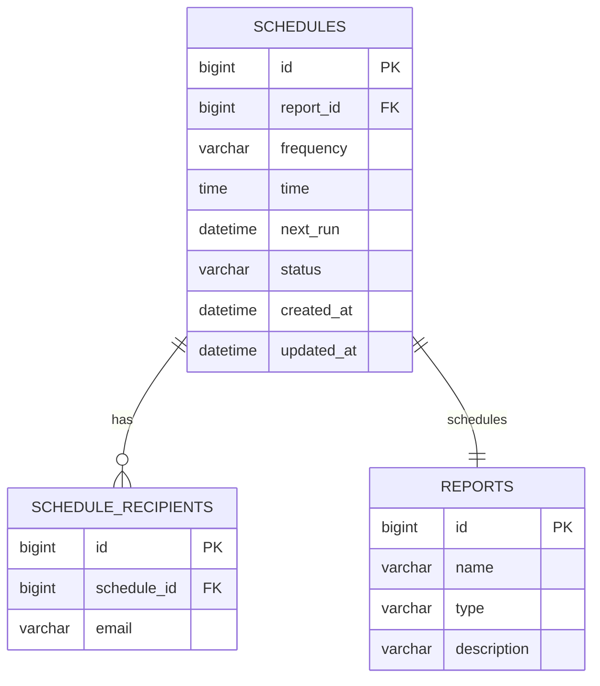

# For User Story Number 1

1. Objective
This requirement enables business users to schedule automated report generation and delivery at configurable intervals (daily, weekly, monthly, custom). Users can select reports, define schedules, and specify recipients, ensuring timely insights without manual intervention. The system must handle report scheduling, generation, delivery, and provide management capabilities for scheduled jobs.

2. API Model
  2.1 Common Components/Services
  - EmailService (for sending emails)
  - ReportService (for report generation)
  - SchedulerService (for managing scheduled tasks)
  - NotificationService (for confirmations/alerts)
  - UserService (for user and recipient validation)

  2.2 API Details
| Operation      | REST Method | Type    | URL                                  | Request (JSON)                                                                                       | Response (JSON)                                                                                 |
|---------------|-------------|---------|--------------------------------------|------------------------------------------------------------------------------------------------------|--------------------------------------------------------------------------------------------------|
| Create        | POST        | Success | /api/schedules                       | {"reportId":1,"frequency":"WEEKLY","time":"09:00","recipients":["user1@abc.com"]}            | {"scheduleId":101, "status":"CREATED"}                                                         |
| Edit          | PUT         | Success | /api/schedules/{scheduleId}          | {"frequency":"DAILY","time":"08:00","recipients":["user2@abc.com"]}                           | {"scheduleId":101, "status":"UPDATED"}                                                         |
| Delete        | DELETE      | Success | /api/schedules/{scheduleId}          | N/A                                                                                                  | {"scheduleId":101, "status":"DELETED"}                                                         |
| List          | GET         | Success | /api/schedules?userId=123            | N/A                                                                                                  | [{"scheduleId":101,"reportId":1,"frequency":"WEEKLY","time":"09:00","recipients":[...]}] |
| Trigger (internal) | POST   | Success | /api/schedules/{scheduleId}/trigger  | N/A                                                                                                  | {"status":"TRIGGERED", "deliveryStatus":"SENT"}                                               |
| Notify        | POST        | Success | /api/notifications                   | {"userId":123, "message":"Report delivered"}                                                     | {"status":"NOTIFIED"}                                                                           |

  2.3 Exceptions
| API                    | Exception Type           | Error Message                                 |
|------------------------|-------------------------|------------------------------------------------|
| Create/Edit Schedule   | ValidationException     | Invalid email/frequency/time/duplicate schedule|
| Delete Schedule        | NotFoundException       | Schedule not found                             |
| Trigger                | ReportGenerationException| Report generation failed                       |
| Notify                 | NotificationException   | Notification delivery failed                   |

3 Functional Design
  3.1 Class Diagram

  3.2 UML Sequence Diagram

  3.3 Components
| Component Name        | Description                                      | Existing/New |
|----------------------|--------------------------------------------------|--------------|
| ScheduleController   | REST API controller for schedule management       | New          |
| ScheduleService      | Business logic for scheduling and execution       | New          |
| ReportService        | Handles report generation                        | Existing     |
| EmailService         | Sends emails with reports                        | Existing     |
| NotificationService  | Sends notifications to users                     | Existing     |
| ScheduleRepository   | JPA repository for schedules                     | New          |
| ReportRepository     | JPA repository for reports                       | Existing     |
| UserService          | Handles user validation and lookup               | Existing     |
| UserRepository       | JPA repository for users                         | Existing     |

  3.4 Service Layer Logic and Validations
| FieldName      | Validation                                  | Error Message                        | ClassUsed         |
|---------------|---------------------------------------------|--------------------------------------|-------------------|
| recipients    | Must be valid email(s)                      | Invalid email address                | ScheduleService   |
| frequency     | Must be DAILY, WEEKLY, MONTHLY, CUSTOM      | Invalid frequency                    | ScheduleService   |
| time          | Must be valid HH:mm, future time            | Invalid or past time                 | ScheduleService   |
| schedule      | No duplicate for same report+recipients     | Duplicate schedule                   | ScheduleService   |

4 Integrations
| SystemToBeIntegrated | IntegratedFor           | IntegrationType |
|---------------------|------------------------|-----------------|
| Email Gateway       | Report delivery         | API (SMTP/REST) |
| Report Engine       | Report generation       | API             |
| Notification System | Confirmation/alerts     | API             |

5 DB Details
  5.1 ER Model

  5.2 DB Validations
- Unique constraint on (report_id, frequency, time, recipients)
- Email format check on SCHEDULE_RECIPIENTS.email
- next_run must be in the future

6 Non-Functional Requirements
  6.1 Performance
  - Scheduled reports must be generated and delivered within 5 minutes of scheduled time.
  - Use async processing for report generation and email delivery.

  6.2 Security
    6.2.1 Authentication
    - OAuth2/JWT-based authentication for all APIs.
    6.2.2 Authorization
    - Role-based access (only users with REPORT_SCHEDULER role can schedule reports).
    - Users can only manage their own schedules.

  6.3 Logging
    6.3.1 Application Logging
    - DEBUG: Scheduling logic, API request/response payloads (excluding sensitive data)
    - INFO: Schedule creation, execution, delivery status
    - WARN: Validation failures, retry attempts
    - ERROR: Report generation or email delivery failures
    6.3.2 Audit Log
    - Log all schedule creations, modifications, deletions, executions with user and timestamp.

7 Dependencies
- Email gateway (e.g., SMTP, SendGrid)
- Report engine/service
- Notification service/system

8 Assumptions
- Reports are pre-defined and available for scheduling.
- Email gateway is configured and available.
- All times are in the user's local timezone or UTC.
- System clock is reliable and synchronized.