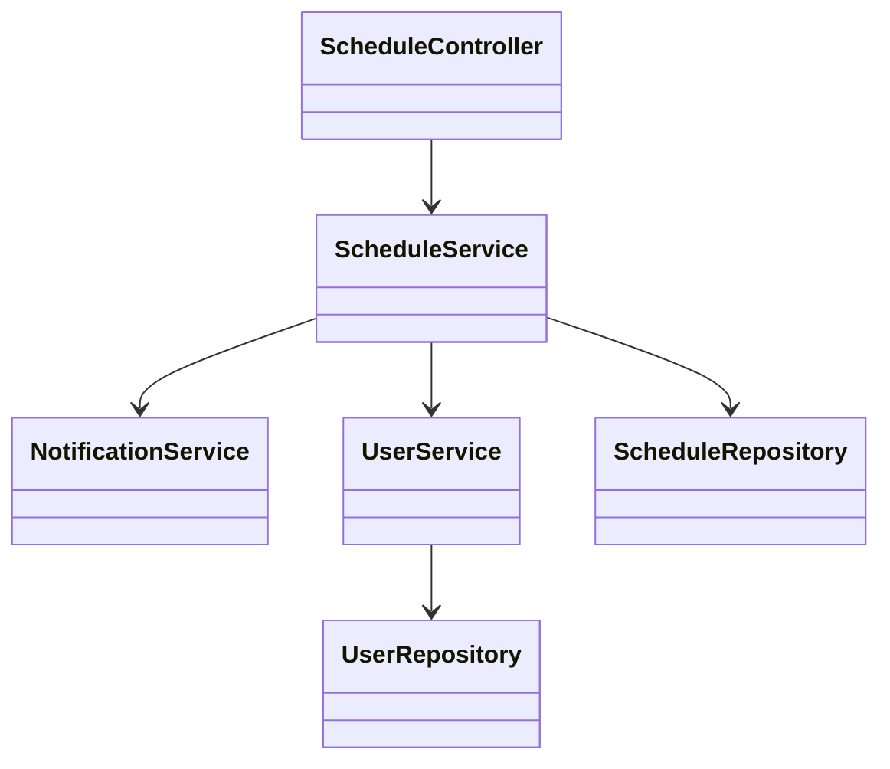
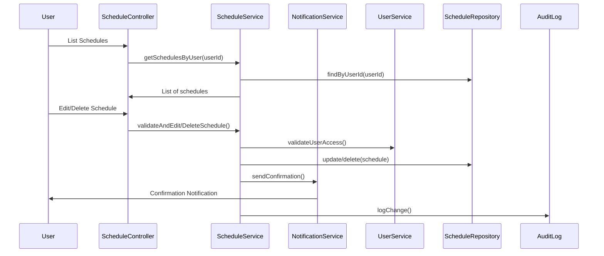
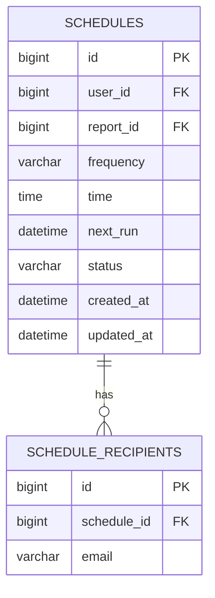

# For User Story Number 2

1. Objective
This requirement enables business users to manage their scheduled reports, allowing them to view, update, or delete report schedules as their needs change. Users can see all their scheduled reports, modify scheduling parameters or recipients, and remove schedules in real time. The system must enforce access control and maintain an audit trail for all changes.

2. API Model
  2.1 Common Components/Services
  - ScheduleService (for schedule management)
  - NotificationService (for confirmation/alerts)
  - UserService (for user validation and access control)

  2.2 API Details
| Operation      | REST Method | Type    | URL                                  | Request (JSON)                                                                                       | Response (JSON)                                                                                 |
|---------------|-------------|---------|--------------------------------------|------------------------------------------------------------------------------------------------------|--------------------------------------------------------------------------------------------------|
| List          | GET         | Success | /api/schedules?userId=123            | N/A                                                                                                  | [{"scheduleId":101,"reportId":1,"frequency":"WEEKLY","time":"09:00","recipients":[...]}] |
| Edit          | PUT         | Success | /api/schedules/{scheduleId}          | {"frequency":"DAILY","time":"08:00","recipients":["user2@abc.com"]}                           | {"scheduleId":101, "status":"UPDATED"}                                                         |
| Delete        | DELETE      | Success | /api/schedules/{scheduleId}          | N/A                                                                                                  | {"scheduleId":101, "status":"DELETED"}                                                         |
| Notify        | POST        | Success | /api/notifications                   | {"userId":123, "message":"Schedule updated/deleted"}                                             | {"status":"NOTIFIED"}                                                                           |

  2.3 Exceptions
| API                    | Exception Type           | Error Message                                 |
|------------------------|-------------------------|------------------------------------------------|
| Edit/Delete Schedule   | AccessDeniedException   | User not authorized to modify/delete schedule  |
| Edit Schedule          | ValidationException     | Invalid frequency/time/recipients              |
| Delete Schedule        | NotFoundException       | Schedule not found                             |
| Notify                 | NotificationException   | Notification delivery failed                   |

3 Functional Design
  3.1 Class Diagram

  3.2 UML Sequence Diagram

  3.3 Components
| Component Name        | Description                                      | Existing/New |
|----------------------|--------------------------------------------------|--------------|
| ScheduleController   | REST API controller for schedule management       | New          |
| ScheduleService      | Business logic for schedule modification/deletion | New          |
| NotificationService  | Sends notifications to users                     | Existing     |
| ScheduleRepository   | JPA repository for schedules                     | Existing     |
| UserService          | Handles user validation and lookup               | Existing     |
| UserRepository       | JPA repository for users                         | Existing     |

  3.4 Service Layer Logic and Validations
| FieldName      | Validation                                  | Error Message                        | ClassUsed         |
|---------------|---------------------------------------------|--------------------------------------|-------------------|
| userId        | Must match schedule owner                    | User not authorized                  | ScheduleService   |
| frequency     | Must be DAILY, WEEKLY, MONTHLY, CUSTOM      | Invalid frequency                    | ScheduleService   |
| time          | Must be valid HH:mm, future time            | Invalid or past time                 | ScheduleService   |
| recipients    | Must be valid email(s)                      | Invalid email address                | ScheduleService   |

4 Integrations
| SystemToBeIntegrated | IntegratedFor           | IntegrationType |
|---------------------|------------------------|-----------------|
| Notification System | Confirmation/alerts     | API             |

5 DB Details
  5.1 ER Model

  5.2 DB Validations
- Only schedule owner can update/delete
- Email format check on SCHEDULE_RECIPIENTS.email
- next_run must be in the future

6 Non-Functional Requirements
  6.1 Performance
  - Schedule changes should reflect in the system within 2 seconds.

  6.2 Security
    6.2.1 Authentication
    - OAuth2/JWT-based authentication for all APIs.
    6.2.2 Authorization
    - User-level access: only schedule owner can modify/delete.

  6.3 Logging
    6.3.1 Application Logging
    - INFO: Schedule updates, deletions
    - WARN: Unauthorized access attempts
    - ERROR: Update/delete failures
    6.3.2 Audit Log
    - Log all schedule modifications and deletions with user, timestamp, and action.

7 Dependencies
- Notification service/system

8 Assumptions
- Users can only manage schedules they created.
- Notification system is available for confirmations.
- All times are in the user's local timezone or UTC.
- System clock is reliable and synchronized.