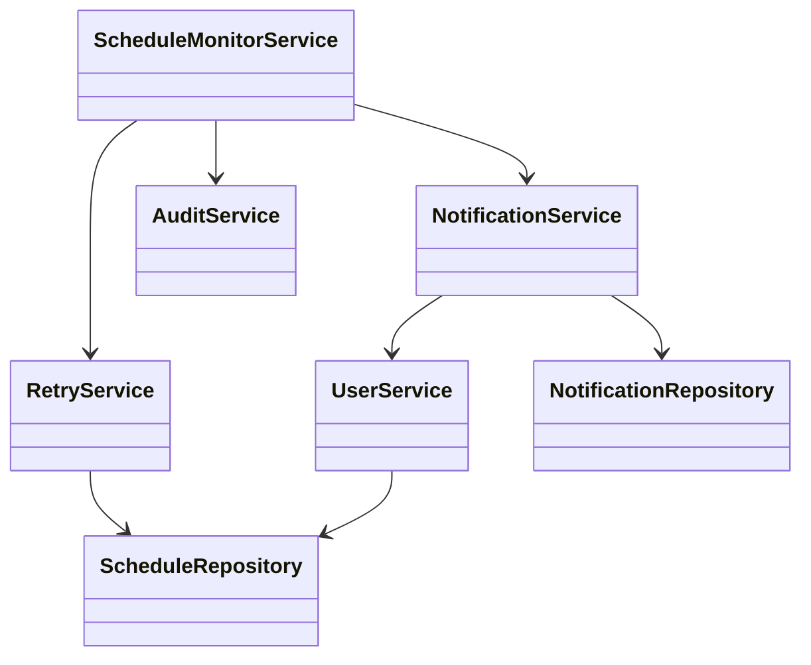
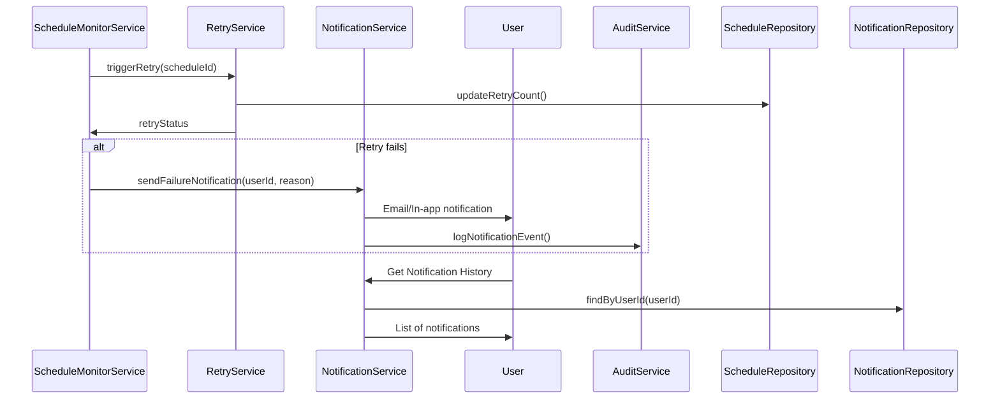
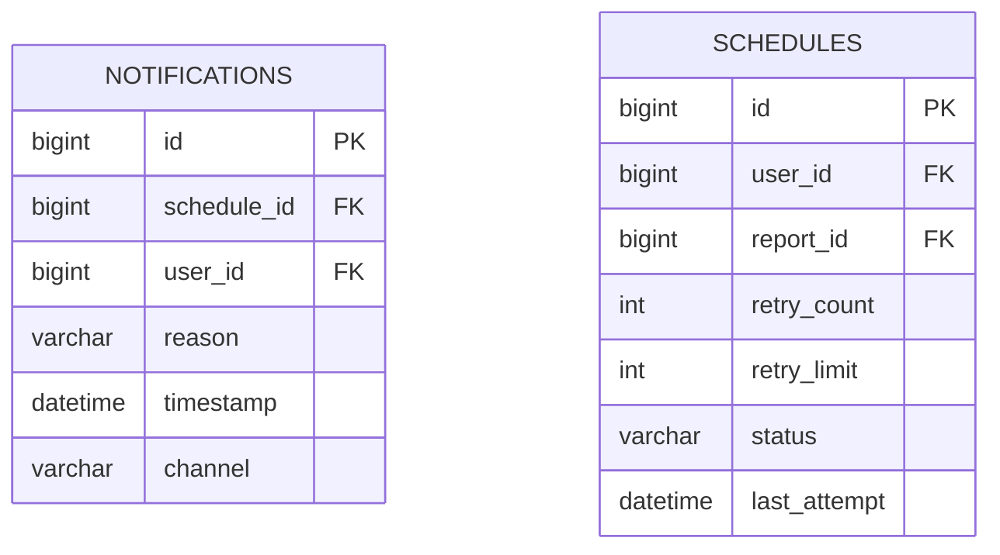

# For User Story Number 3

1. Objective
This requirement ensures that business users receive timely notifications if a scheduled report fails to generate or deliver, or if a schedule is missed due to system issues. Notifications must include the failure reason and suggested next steps, and users should be able to view a history of failed/missed schedules. The system must implement retry logic and audit all notification events.

2. API Model
  2.1 Common Components/Services
  - NotificationService (for sending notifications)
  - ScheduleMonitorService (for monitoring executions)
  - RetryService (for managing retries)
  - UserService (for user lookup and validation)
  - AuditService (for logging notification events)

  2.2 API Details
| Operation      | REST Method | Type    | URL                                         | Request (JSON)                                                                                       | Response (JSON)                                                                                 |
|---------------|-------------|---------|---------------------------------------------|------------------------------------------------------------------------------------------------------|--------------------------------------------------------------------------------------------------|
| Notify Failure| POST        | Success | /api/notifications/failure                  | {"scheduleId":101,"userId":123,"reason":"Report generation failed"}                             | {"status":"NOTIFIED"}                                                                           |
| Notification History | GET   | Success | /api/notifications/history?userId=123       | N/A                                                                                                  | [{"notificationId":201,"scheduleId":101,"reason":"Delivery failed","timestamp":"..."}]    |
| Retry Trigger | POST        | Success | /api/schedules/{scheduleId}/retry           | N/A                                                                                                  | {"status":"RETRY_TRIGGERED"}                                                                    |

  2.3 Exceptions
| API                    | Exception Type           | Error Message                                 |
|------------------------|-------------------------|------------------------------------------------|
| Notify Failure         | NotificationException   | Notification delivery failed                   |
| Notification History   | AccessDeniedException   | User not authorized to view history            |
| Retry Trigger          | RetryLimitExceededException | Retry limit exceeded                       |

3 Functional Design
  3.1 Class Diagram

  3.2 UML Sequence Diagram

  3.3 Components
| Component Name        | Description                                      | Existing/New |
|----------------------|--------------------------------------------------|--------------|
| ScheduleMonitorService| Monitors executions and detects failures/misses  | New          |
| NotificationService  | Sends email/in-app notifications                  | Existing     |
| RetryService         | Handles retry logic for failed schedules          | New          |
| UserService          | Handles user lookup and validation                | Existing     |
| AuditService         | Logs notification events for audit                | New          |
| NotificationRepository| JPA repository for notifications                 | New          |
| ScheduleRepository   | JPA repository for schedules                      | Existing     |

  3.4 Service Layer Logic and Validations
| FieldName      | Validation                                  | Error Message                        | ClassUsed         |
|---------------|---------------------------------------------|--------------------------------------|-------------------|
| userId        | Must be associated with schedule             | Unauthorized notification            | NotificationService|
| reason        | Must be clear, actionable, no sensitive info | Invalid notification content         | NotificationService|
| retryCount    | Must not exceed configured limit             | Retry limit exceeded                 | RetryService      |

4 Integrations
| SystemToBeIntegrated | IntegratedFor           | IntegrationType |
|---------------------|------------------------|-----------------|
| Email Gateway       | Failure notifications   | API (SMTP/REST) |
| In-app Notification | Failure notifications   | API (WebSocket) |
| Audit System        | Notification events     | API             |

5 DB Details
  5.1 ER Model

  5.2 DB Validations
- Only associated users can access notification records
- retry_count <= retry_limit
- reason must not contain sensitive data

6 Non-Functional Requirements
  6.1 Performance
  - Notifications must be sent within 1 minute of failure detection.
  - Retry logic should use exponential backoff.

  6.2 Security
    6.2.1 Authentication
    - OAuth2/JWT-based authentication for all APIs.
    6.2.2 Authorization
    - Role-based access: only users associated with the schedule can view notifications.

  6.3 Logging
    6.3.1 Application Logging
    - INFO: Notification sent, retry triggered
    - WARN: Retry attempts, notification delivery issues
    - ERROR: Notification or retry failures
    6.3.2 Audit Log
    - Log all notification events with user, schedule, timestamp, and reason.

7 Dependencies
- Email gateway (e.g., SMTP, SendGrid)
- In-app notification system (e.g., WebSocket/SignalR)
- Audit system/service

8 Assumptions
- Notification channels are available and reliable.
- Retry limits are configurable per schedule.
- All times are in the user's local timezone or UTC.
- System clock is reliable and synchronized.