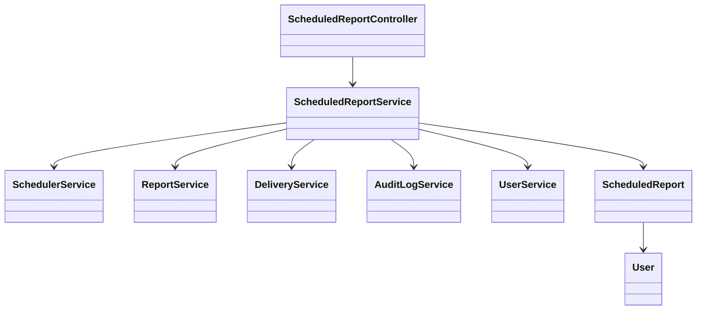
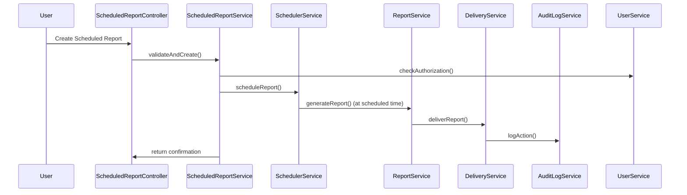
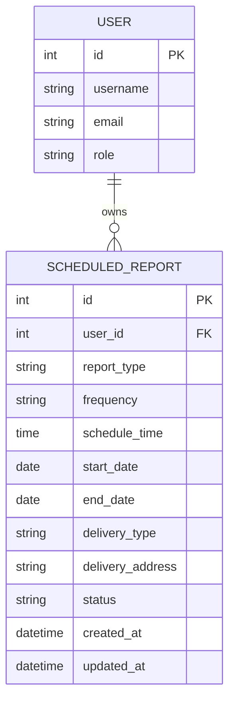

# For User Story Number [1]

1. Objective
This requirement enables business users to configure and schedule recurring reports, automating report generation and delivery at specified intervals. Users can select report types, scheduling parameters, and delivery methods such as email or download link. The system ensures timely, automated insights without manual intervention.

2. API Model
2.1 Common Components/Services
- SchedulerService (leveraging Spring's @Scheduled or Quartz Scheduler)
- ReportService (for report generation)
- DeliveryService (for sending emails or notifications)
- AuditLogService (for logging actions)
- UserService (for authorization and user management)

2.2 API Details
| Operation   | REST Method | Type     | URL                              | Request (JSON)                                                                                           | Response (JSON)                                                                                      |
|-------------|-------------|----------|----------------------------------|----------------------------------------------------------------------------------------------------------|------------------------------------------------------------------------------------------------------|
| Create      | POST        | Success  | /api/scheduled-reports           | {"reportType":"SALES","schedule":{"frequency":"DAILY","time":"08:00","startDate":"2024-07-01","endDate":"2024-07-31"},"delivery":{"type":"EMAIL","email":"user@company.com"}} | {"id":123,"status":"SCHEDULED","message":"Report scheduled successfully"}                        |
| Create      | POST        | Failure  | /api/scheduled-reports           | {invalid request}                                                                                        | {"errorCode":"VALIDATION_ERROR","message":"Invalid email address"}                               |
| Update      | PUT         | Success  | /api/scheduled-reports/{id}      | {"schedule":{"frequency":"WEEKLY","time":"09:00"}}                                                 | {"id":123,"status":"UPDATED","message":"Schedule updated"}                                     |
| Delete      | DELETE      | Success  | /api/scheduled-reports/{id}      | -                                                                                                        | {"id":123,"status":"DELETED","message":"Schedule deleted"}                                     |
| Get         | GET         | Success  | /api/scheduled-reports           | -                                                                                                        | [{"id":123,"reportType":"SALES","status":"SCHEDULED",...}]                                    |

2.3 Exceptions
- ValidationException: For invalid schedule or email
- AuthorizationException: For unauthorized access
- ScheduleConflictException: For overlapping schedules
- ReportGenerationException: For failures in report generation
- DeliveryException: For failures in report delivery

3. Functional Design
3.1 Class Diagram

3.2 UML Sequence Diagram

3.3 Components
| Component Name             | Description                                              | Existing/New |
|---------------------------|----------------------------------------------------------|--------------|
| ScheduledReportController  | REST API controller for scheduled reports                | New          |
| ScheduledReportService     | Business logic for scheduling and managing reports       | New          |
| SchedulerService           | Handles scheduling logic (Quartz/Spring Scheduler)       | New          |
| ReportService              | Generates reports in PDF/Excel                           | Existing     |
| DeliveryService            | Sends reports via email/notification                     | Existing     |
| AuditLogService            | Logs all scheduling actions                              | Existing     |
| UserService                | User management and authorization                        | Existing     |
| ScheduledReport            | Entity/model for scheduled report                        | New          |
| User                       | Entity/model for user                                    | Existing     |

3.4 Service Layer Logic and Validations
| FieldName      | Validation                                              | Error Message                        | ClassUsed                |
|----------------|--------------------------------------------------------|--------------------------------------|--------------------------|
| schedule       | No overlap for same report and user                    | "Schedule overlaps with existing"    | ScheduledReportService   |
| email          | Valid email if delivery is email                       | "Invalid email address"              | DeliveryService          |
| user           | Only authorized users can schedule                     | "Unauthorized to schedule report"    | UserService              |

4. Integrations
| SystemToBeIntegrated | IntegratedFor         | IntegrationType |
|----------------------|----------------------|-----------------|
| Email Service        | Report delivery      | API             |
| Notification Service | In-app notification  | API             |
| Audit Log Service    | Logging actions      | API             |

5. DB Details
5.1 ER Model

5.2 DB Validations
- Unique constraint on (user_id, report_type, schedule_time) to prevent overlap
- Email format validation on delivery_address if delivery_type is EMAIL
- Foreign key constraint on user_id

6. Non-Functional Requirements
6.1 Performance
- Reports generated within 2 minutes of scheduled time
- Use of async processing and caching for frequent reports

6.2 Security
6.2.1 Authentication
- OAuth2/JWT authentication for all endpoints
6.2.2 Authorization
- Role-based access control: Only authorized users can schedule reports

6.3 Logging
6.3.1 Application Logging
- DEBUG: Scheduling logic, API requests/responses
- INFO: Report scheduled, delivered, deleted
- WARN: Schedule conflict, validation failures
- ERROR: Report generation/delivery failures
6.3.2 Audit Log
- Log all create, update, delete, and delivery actions with user, timestamp, action type

7. Dependencies
- Quartz Scheduler or Spring @Scheduled for scheduling
- Email/SMS/Notification services for delivery
- Centralized logging infrastructure

8. Assumptions
- Users and reports already exist in the system
- Email/SMS/Notification services are available and configured
- Timezone handling is managed at the user or system level
