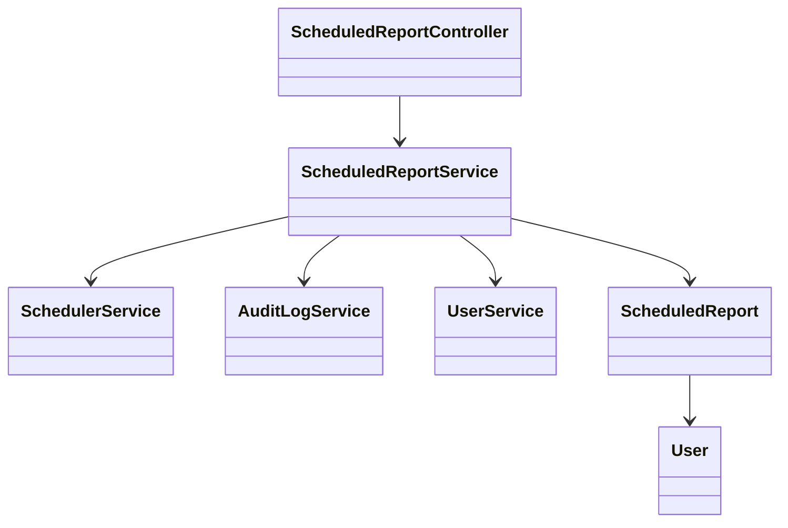
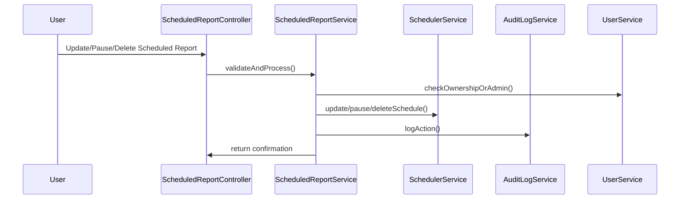
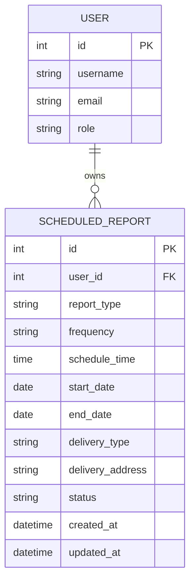

# For User Story Number [2]

1. Objective
This requirement enables business users to manage their scheduled reports, allowing them to view, update, pause, or cancel automated report deliveries. The system provides clear options for these actions and ensures changes are reflected immediately and logged for audit purposes. This enhances user control and flexibility over report automation.

2. API Model
2.1 Common Components/Services
- ScheduledReportService (handles business logic for managing schedules)
- SchedulerService (integrates with scheduling engine)
- AuditLogService (logs all actions)
- UserService (authorization and user management)

2.2 API Details
| Operation   | REST Method | Type     | URL                              | Request (JSON)                                                                                           | Response (JSON)                                                                                      |
|-------------|-------------|----------|----------------------------------|----------------------------------------------------------------------------------------------------------|------------------------------------------------------------------------------------------------------|
| Get         | GET         | Success  | /api/scheduled-reports           | -                                                                                                        | [{"id":123,"reportType":"SALES","status":"SCHEDULED",...}]                                    |
| Update      | PUT         | Success  | /api/scheduled-reports/{id}      | {"schedule":{"frequency":"WEEKLY","time":"09:00"}, "delivery":{"type":"EMAIL"}}                | {"id":123,"status":"UPDATED","message":"Schedule updated"}                                     |
| Update      | PUT         | Failure  | /api/scheduled-reports/{id}      | {invalid request}                                                                                        | {"errorCode":"VALIDATION_ERROR","message":"Schedule conflict"}                                  |
| Pause       | PATCH       | Success  | /api/scheduled-reports/{id}/pause| -                                                                                                        | {"id":123,"status":"PAUSED","message":"Schedule paused"}                                      |
| Resume      | PATCH       | Success  | /api/scheduled-reports/{id}/resume| -                                                                                                       | {"id":123,"status":"SCHEDULED","message":"Schedule resumed"}                                  |
| Delete      | DELETE      | Success  | /api/scheduled-reports/{id}      | -                                                                                                        | {"id":123,"status":"DELETED","message":"Schedule deleted"}                                     |

2.3 Exceptions
- AuthorizationException: For unauthorized modifications
- ValidationException: For invalid or conflicting updates
- NotFoundException: For non-existent schedule
- AuditLogException: For failures in logging actions

3. Functional Design
3.1 Class Diagram

3.2 UML Sequence Diagram

3.3 Components
| Component Name             | Description                                              | Existing/New |
|---------------------------|----------------------------------------------------------|--------------|
| ScheduledReportController  | REST API controller for schedule management              | New          |
| ScheduledReportService     | Business logic for managing scheduled reports            | New          |
| SchedulerService           | Handles scheduling engine integration                    | Existing     |
| AuditLogService            | Logs all schedule management actions                     | Existing     |
| UserService                | User management and authorization                        | Existing     |
| ScheduledReport            | Entity/model for scheduled report                        | Existing     |
| User                       | Entity/model for user                                    | Existing     |

3.4 Service Layer Logic and Validations
| FieldName      | Validation                                              | Error Message                        | ClassUsed                |
|----------------|--------------------------------------------------------|--------------------------------------|--------------------------|
| user           | Only owner/admin can modify scheduled report           | "Unauthorized modification"          | UserService              |
| schedule       | No conflict with existing schedules                    | "Schedule conflict"                  | ScheduledReportService   |
| schedule_id    | Must exist before update/delete                        | "Schedule not found"                 | ScheduledReportService   |

4. Integrations
| SystemToBeIntegrated | IntegratedFor         | IntegrationType |
|----------------------|----------------------|-----------------|
| Scheduler Engine     | Update/pause/delete  | API             |
| Audit Log Service    | Logging actions      | API             |

5. DB Details
5.1 ER Model

5.2 DB Validations
- Foreign key constraint on user_id
- Unique constraint on (user_id, report_type, schedule_time) for active schedules
- Cascade delete for scheduled reports when user is deleted

6. Non-Functional Requirements
6.1 Performance
- Schedule updates reflected within 5 seconds
- Optimistic locking to handle concurrent modifications

6.2 Security
6.2.1 Authentication
- OAuth2/JWT authentication for all endpoints
6.2.2 Authorization
- RBAC: Only owner or admin can modify/delete schedules

6.3 Logging
6.3.1 Application Logging
- INFO: Schedule updated, paused, resumed, deleted
- WARN: Unauthorized modification attempts
- ERROR: Update/delete failures
6.3.2 Audit Log
- Log all changes with user, timestamp, action type

7. Dependencies
- Scheduler engine (Quartz/Spring)
- Audit log infrastructure

8. Assumptions
- Users and scheduled reports already exist in the system
- Audit log and scheduler engine are reliable and available
