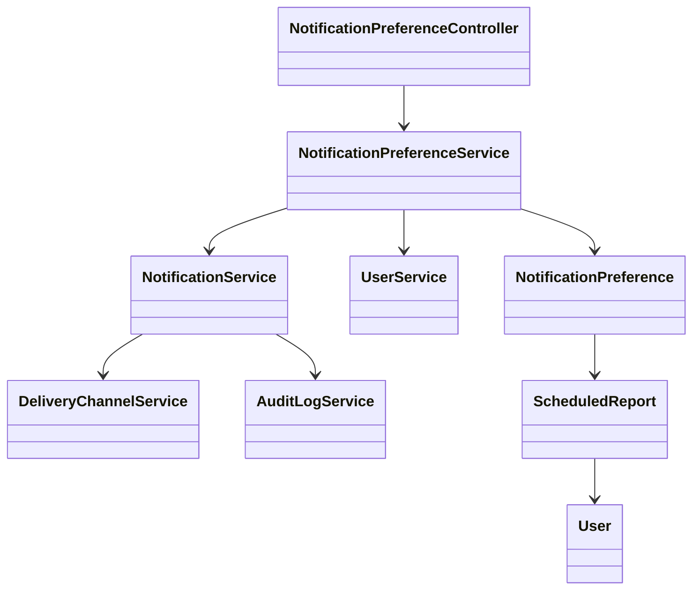
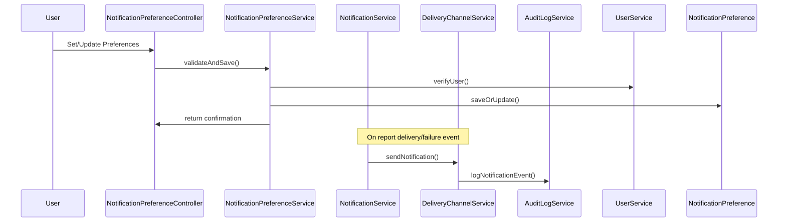

# For User Story Number [3]

1. Objective
This requirement enables business users to configure notification preferences for scheduled reports, allowing them to select preferred channels (email, SMS, in-app) for delivery and failure alerts. Users can update preferences at any time and ensure they are promptly informed of report delivery status. All notification events are logged for reference and audit.

2. API Model
2.1 Common Components/Services
- NotificationPreferenceService (manages user preferences)
- NotificationService (handles notification delivery)
- DeliveryChannelService (integrates with email/SMS/in-app)
- AuditLogService (logs notification events)
- UserService (user management and verification)

2.2 API Details
| Operation   | REST Method | Type     | URL                                         | Request (JSON)                                                                                                  | Response (JSON)                                                                                      |
|-------------|-------------|----------|---------------------------------------------|-----------------------------------------------------------------------------------------------------------------|------------------------------------------------------------------------------------------------------|
| Create      | POST        | Success  | /api/notification-preferences               | {"scheduledReportId":123,"channels":[{"type":"EMAIL","address":"user@company.com"},{"type":"SMS","number":"+1234567890"}],"alerts":["DELIVERY_SUCCESS","DELIVERY_FAILURE"]} | {"id":101,"status":"CREATED","message":"Preferences saved"}                                 |
| Update      | PUT         | Success  | /api/notification-preferences/{id}          | {"channels":[{"type":"IN_APP"}],"alerts":["DELIVERY_FAILURE"]}                                          | {"id":101,"status":"UPDATED","message":"Preferences updated"}                                |
| Get         | GET         | Success  | /api/notification-preferences/{scheduledReportId} | -                                                                                                              | {"id":101,"channels":[...],"alerts":[...]}                                                      |
| Delete      | DELETE      | Success  | /api/notification-preferences/{id}          | -                                                                                                               | {"id":101,"status":"DELETED","message":"Preferences deleted"}                                |

2.3 Exceptions
- ValidationException: For invalid/duplicate channels or addresses
- AuthorizationException: For unauthorized access
- NotificationDeliveryException: For failure in sending notification
- AuditLogException: For failures in logging events

3. Functional Design
3.1 Class Diagram


3.2 UML Sequence Diagram


3.3 Components
| Component Name                   | Description                                              | Existing/New |
|----------------------------------|----------------------------------------------------------|--------------|
| NotificationPreferenceController | REST API controller for notification preferences         | New          |
| NotificationPreferenceService    | Business logic for managing preferences                  | New          |
| NotificationService              | Handles notification delivery logic                      | Existing     |
| DeliveryChannelService           | Integrates with email/SMS/in-app channels                | Existing     |
| AuditLogService                  | Logs all notification events                             | Existing     |
| UserService                      | User management and verification                         | Existing     |
| NotificationPreference           | Entity/model for notification preferences                | New          |
| ScheduledReport                  | Entity/model for scheduled report                        | Existing     |
| User                             | Entity/model for user                                    | Existing     |

3.4 Service Layer Logic and Validations
| FieldName      | Validation                                              | Error Message                        | ClassUsed                    |
|----------------|--------------------------------------------------------|--------------------------------------|------------------------------|
| channels       | Valid and verified (email/phone)                       | "Invalid or unverified channel"      | NotificationPreferenceService |
| alerts         | Opt-in/opt-out allowed                                 | "Invalid alert preference"           | NotificationPreferenceService |
| eventId        | No duplicate notifications per event                   | "Duplicate notification"             | NotificationService           |

4. Integrations
| SystemToBeIntegrated | IntegratedFor         | IntegrationType |
|----------------------|----------------------|-----------------|
| Email Service        | Email notifications  | API             |
| SMS Service          | SMS notifications    | API             |
| In-App Notification  | In-app alerts        | API             |
| Audit Log Service    | Logging events       | API             |

5. DB Details
5.1 ER Model
```mermaid
erDiagram
    USER ||--o{ SCHEDULED_REPORT : owns
    SCHEDULED_REPORT ||--o{ NOTIFICATION_PREFERENCE : has
    NOTIFICATION_PREFERENCE {
      int id PK
      int scheduled_report_id FK
      string channel_type
      string channel_address
      string alert_type
      boolean verified
      datetime created_at
      datetime updated_at
    }
    USER {
      int id PK
      string username
      string email
      string role
    }
    SCHEDULED_REPORT {
      int id PK
      int user_id FK
      string report_type
      ...
    }
```

5.2 DB Validations
- Foreign key constraint on scheduled_report_id
- Unique constraint on (scheduled_report_id, channel_type, channel_address, alert_type)
- Boolean verified must be true for active channels

6. Non-Functional Requirements
6.1 Performance
- Notifications sent within 30 seconds of event
- Asynchronous delivery and retry logic for failures

6.2 Security
6.2.1 Authentication
- OAuth2/JWT authentication for all endpoints
6.2.2 Authorization
- Only owner or admin can configure preferences
- Secure storage of preferences (encrypted at rest)

6.3 Logging
6.3.1 Application Logging
- INFO: Preferences created/updated/deleted
- WARN: Unverified channels, duplicate notifications
- ERROR: Notification delivery failures
6.3.2 Audit Log
- Log all notification events with user, timestamp, event type, channel

7. Dependencies
- Email/SMS/In-app notification services
- Audit log infrastructure

8. Assumptions
- Users and scheduled reports already exist in the system
- All notification channels are available and integrated
- Verification process exists for email/phone
