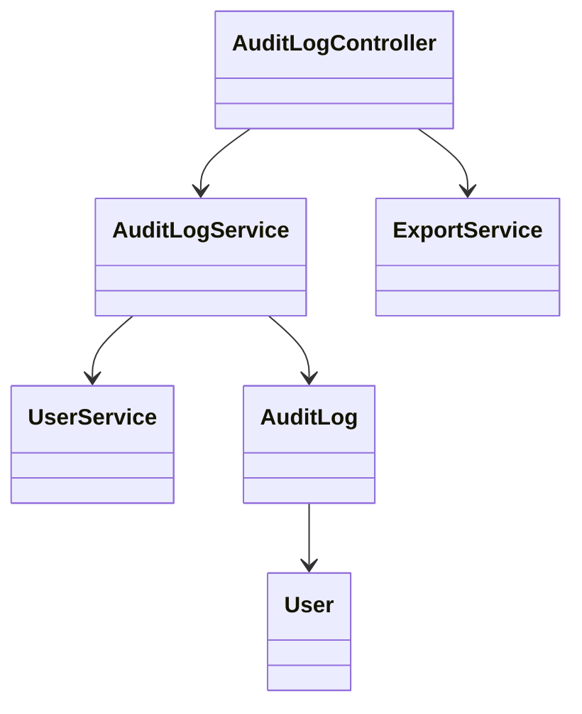
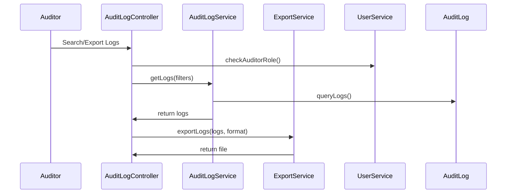
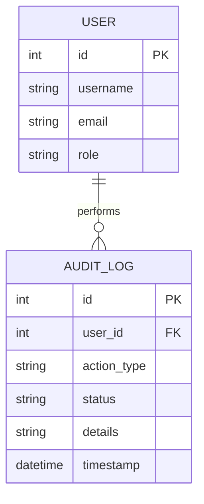

# For User Story Number [4]

1. Objective
This requirement enables authorized auditors to access detailed, searchable, and exportable logs of all scheduled report activities, including creation, modification, deletion, and delivery attempts. The logs provide compliance and traceability for automated report scheduling. Access is restricted to users with appropriate roles, ensuring data security and audit integrity.

2. API Model
2.1 Common Components/Services
- AuditLogService (handles log storage, retrieval, and export)
- UserService (authorization and user management)
- ExportService (generates CSV/PDF exports)

2.2 API Details
| Operation   | REST Method | Type     | URL                                 | Request (JSON)                                                                                  | Response (JSON/CSV/PDF)                                                                           |
|-------------|-------------|----------|-------------------------------------|--------------------------------------------------------------------------------------------------|---------------------------------------------------------------------------------------------------|
| Get         | GET         | Success  | /api/audit-logs                     | {"filters":{"dateRange":{"from":"2024-07-01","to":"2024-07-31"},"userId":42,"actionType":"CREATE","status":"SUCCESS"}} | [{"id":1,"timestamp":"2024-07-01T08:00:00Z","userId":42,"actionType":"CREATE","status":"SUCCESS",...}] |
| Export      | POST        | Success  | /api/audit-logs/export              | {"filters":{...},"format":"CSV"}                                                            | CSV/PDF file                                                                                      |
| Get         | GET         | Failure  | /api/audit-logs                     | {unauthorized request}                                                                           | {"errorCode":"AUTH_ERROR","message":"Access denied"}                                         |

2.3 Exceptions
- AuthorizationException: For unauthorized access
- ExportException: For failures in export generation
- ValidationException: For invalid filters
- NotFoundException: For missing logs

3. Functional Design
3.1 Class Diagram

3.2 UML Sequence Diagram

3.3 Components
| Component Name      | Description                                              | Existing/New |
|--------------------|----------------------------------------------------------|--------------|
| AuditLogController | REST API controller for audit log access and export      | New          |
| AuditLogService    | Handles log retrieval, filtering, and storage            | New          |
| ExportService      | Generates CSV/PDF exports                                | New          |
| UserService        | User management and authorization                        | Existing     |
| AuditLog           | Entity/model for audit log entries                       | New          |
| User               | Entity/model for user                                    | Existing     |

3.4 Service Layer Logic and Validations
| FieldName      | Validation                                              | Error Message                        | ClassUsed                |
|----------------|--------------------------------------------------------|--------------------------------------|--------------------------|
| user           | Only auditor/admin can access logs                     | "Access denied"                     | UserService              |
| filters        | Must be valid and match data format                    | "Invalid filter criteria"           | AuditLogService          |
| exportFormat   | Must be CSV or PDF                                     | "Unsupported export format"         | ExportService            |

4. Integrations
| SystemToBeIntegrated | IntegratedFor         | IntegrationType |
|----------------------|----------------------|-----------------|
| Audit Log DB         | Log storage/retrieval| DB              |
| Export Service       | CSV/PDF generation   | API             |

5. DB Details
5.1 ER Model

5.2 DB Validations
- Foreign key constraint on user_id
- Indexes on timestamp, action_type, status for fast search/filter
- Data retention policy as per compliance

6. Non-Functional Requirements
6.1 Performance
- Retrieval of 1,000,000+ records within 5 seconds (indexed queries, pagination)
- Asynchronous export generation for large datasets

6.2 Security
6.2.1 Authentication
- OAuth2/JWT authentication for all endpoints
6.2.2 Authorization
- Only auditor/admin roles can access/export logs
- Immutable logs (append-only, no update/delete)
- Access logging for audit log views

6.3 Logging
6.3.1 Application Logging
- INFO: Log access, export requests
- WARN: Unauthorized access attempts
- ERROR: Export failures
6.3.2 Audit Log
- Log all access to audit logs with user, timestamp, action

7. Dependencies
- Audit log database (SQL with append-only tables)
- Export service for CSV/PDF generation
- Centralized logging infrastructure

8. Assumptions
- Audit log data is immutable and retained as per compliance
- Export service supports required formats and scales for large datasets
