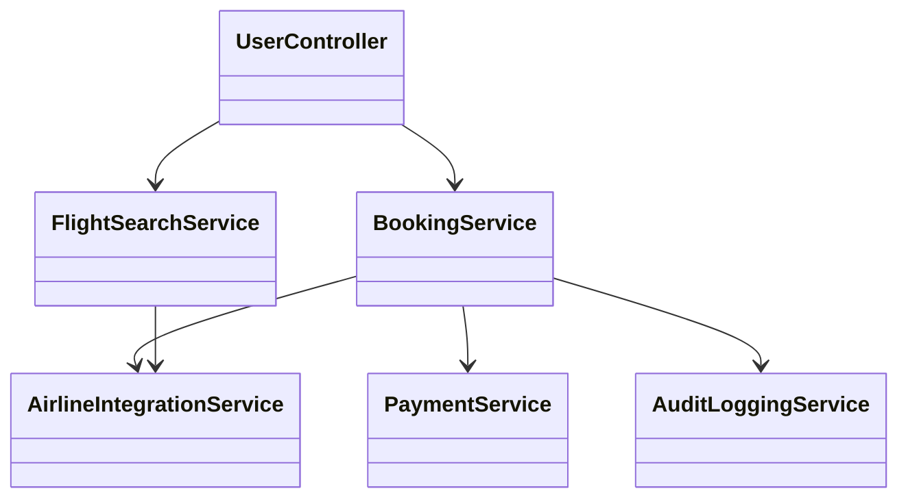
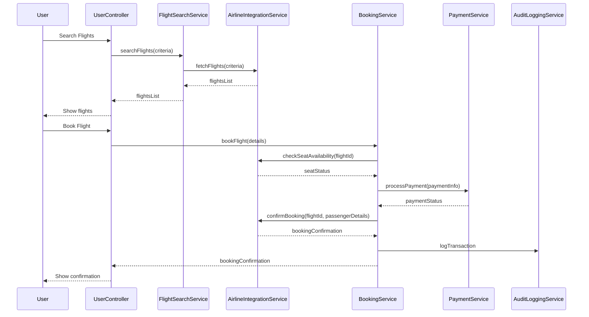
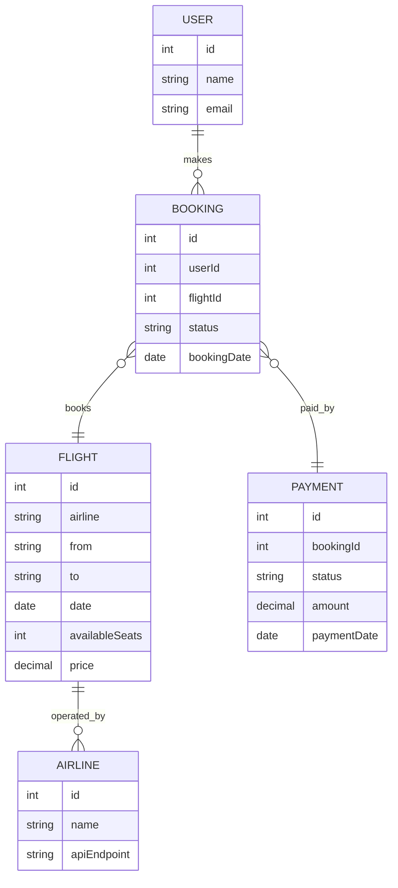

# For User Story Number [1]

1. Objective
This requirement enables travelers to search, compare, and book air transport tickets online, supporting multiple airlines and real-time availability/pricing. The goal is to provide a seamless booking experience with secure payment processing. The system must ensure up-to-date information and reliable booking confirmation.

2. API Model
  2.1 Common Components/Services
  - AuthenticationService (OAuth2 based authentication)
  - PaymentService (PCI DSS compliant payment processing)
  - AirlineIntegrationService (RESTful integration with airline APIs)
  - AuditLoggingService

  2.2 API Details
| Operation | REST Method | Type | URL | Request | Response |
|-----------|-------------|------|-----|---------|----------|
| Search Flights | GET | Success | /api/flights/search | {"from":"JFK","to":"LAX","date":"2025-10-01","passengers":2} | [{"flightId":123,"airline":"Delta","price":350.00,"availableSeats":5}] |
| Book Flight | POST | Success | /api/flights/book | {"flightId":123,"userId":456,"passengerDetails":[...],"paymentInfo":{...}} | {"bookingId":789,"status":"CONFIRMED","details":{...}} |
| Book Flight | POST | Failure | /api/flights/book | {"flightId":123,"userId":456,"passengerDetails":[...],"paymentInfo":{...}} | {"errorCode":"NO_SEATS","message":"Selected flight has no available seats."} |

  2.3 Exceptions
| API | Exception | Description |
|-----|-----------|-------------|
| /api/flights/search | InvalidInputException | Required fields missing or invalid |
| /api/flights/book | PaymentFailedException | Payment processing failed |
| /api/flights/book | NoSeatsAvailableException | No seats available for selected flight |
| /api/flights/book | AirlineApiException | Error communicating with airline API |

3 Functional Design
  3.1 Class Diagram

  3.2 UML Sequence Diagram

  3.3 Components
| Component Name | Description | Existing/New |
|----------------|-------------|--------------|
| UserController | Handles user requests for search and booking | New |
| FlightSearchService | Business logic for searching flights | New |
| BookingService | Handles booking, seat validation, payment, confirmation | New |
| PaymentService | Processes payments securely | Existing (PCI DSS) |
| AirlineIntegrationService | Integrates with airline APIs | New |
| AuditLoggingService | Logs all booking transactions | Existing |

  3.4 Service Layer Logic and Validations
| FieldName | Validation | Error Message | ClassUsed |
|-----------|-----------|--------------|-----------|
| from, to, date, passengers | Required, valid values | "All search fields are required." | FlightSearchService |
| paymentInfo | Valid payment details | "Invalid payment information." | PaymentService |
| flightId | Seat availability | "No seats available for selected flight." | AirlineIntegrationService |

4 Integrations
| SystemToBeIntegrated | IntegratedFor | IntegrationType |
|----------------------|---------------|-----------------|
| Airline APIs | Real-time flight data, seat availability, booking confirmation | API |
| Payment Gateway | Payment processing | API |
| Audit Logging System | Transaction audit | API |

5 DB Details
  5.1 ER Model

  5.2 DB Validations
- Ensure booking only created if seats are available (constraint or trigger).
- Payment status must be CONFIRMED before booking status is set to CONFIRMED.

6 Non-Functional Requirements
  6.1 Performance
  - API response time for search <2s.
  - Caching of frequent search queries at API layer.
  - Asynchronous processing for payment and booking confirmation.

  6.2 Security
    6.2.1 Authentication
    - OAuth2-based authentication for all APIs.
    6.2.2 Authorization
    - Role-based access (traveler, admin) for booking and management APIs.

  6.3 Logging
    6.3.1 Application Logging
    - DEBUG: API request/response payloads (excluding sensitive data)
    - INFO: Successful searches, bookings
    - ERROR: Failed payments, booking errors
    - WARN: Airline API timeouts/errors
    6.3.2 Audit Log
    - Log all booking and payment transactions with user, timestamp, and status

7 Dependencies
- Airline APIs must be available and provide real-time data.
- Payment gateway must be PCI DSS compliant and available.
- Audit logging system must be accessible.

8 Assumptions
- All airlines expose REST APIs for search and booking.
- Payment gateway supports required card types and currencies.
- User authentication is handled via OAuth2 and is already implemented.
