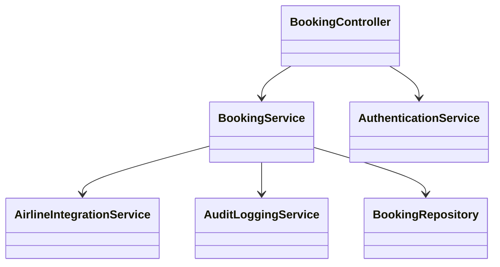
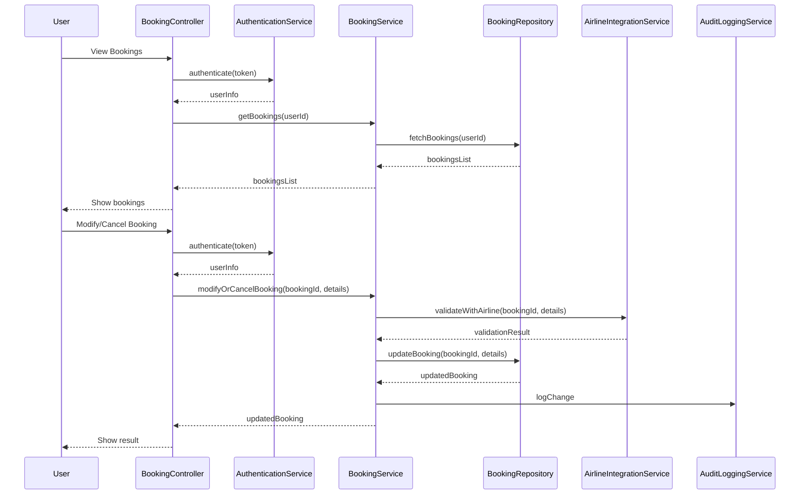
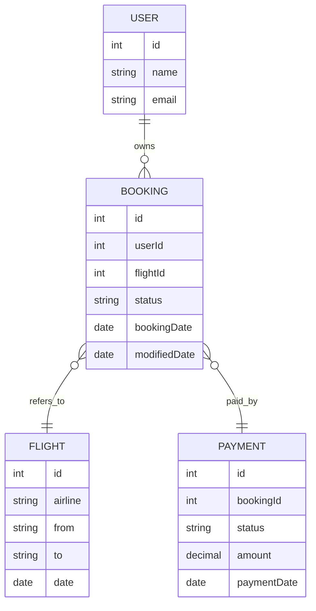

# For User Story Number [2]

1. Objective
This requirement enables travelers to view, manage, and modify their air transport bookings. It provides users with the ability to see upcoming and past bookings, update booking details, or cancel bookings as per airline policy. The system ensures secure access and real-time synchronization with airline systems for all updates.

2. API Model
  2.1 Common Components/Services
  - AuthenticationService (JWT-based authentication)
  - BookingService (fetch, modify, cancel bookings)
  - AirlineIntegrationService (RESTful integration with airline APIs)
  - AuditLoggingService

  2.2 API Details
| Operation | REST Method | Type | URL | Request | Response |
|-----------|-------------|------|-----|---------|----------|
| View Bookings | GET | Success | /api/bookings | {"userId":456} | [{"bookingId":789,"flightId":123,"status":"CONFIRMED","details":{...}}] |
| View Booking Details | GET | Success | /api/bookings/{bookingId} |  | {"bookingId":789,"flightId":123,"status":"CONFIRMED","details":{...}} |
| Modify Booking | PUT | Success | /api/bookings/{bookingId} | {"newDate":"2025-10-05","passengerInfo":{...}} | {"bookingId":789,"status":"MODIFIED","details":{...}} |
| Cancel Booking | DELETE | Success | /api/bookings/{bookingId} |  | {"bookingId":789,"status":"CANCELLED","refundAmount":100.00} |
| Modify/Cancel Booking | PUT/DELETE | Failure | /api/bookings/{bookingId} |  | {"errorCode":"NOT_ALLOWED","message":"Modification/cancellation not allowed as per airline policy."} |

  2.3 Exceptions
| API | Exception | Description |
|-----|-----------|-------------|
| /api/bookings | AuthenticationException | User not authenticated |
| /api/bookings/{bookingId} | NotFoundException | Booking not found |
| /api/bookings/{bookingId} | ModificationNotAllowedException | Modification not allowed by airline policy |
| /api/bookings/{bookingId} | CancellationNotAllowedException | Cancellation/refund not allowed |
| /api/bookings/{bookingId} | AirlineApiException | Error communicating with airline API |

3 Functional Design
  3.1 Class Diagram

  3.2 UML Sequence Diagram

  3.3 Components
| Component Name | Description | Existing/New |
|----------------|-------------|--------------|
| BookingController | Handles user requests for viewing, modifying, and cancelling bookings | New |
| BookingService | Business logic for booking management | New |
| AirlineIntegrationService | Integrates with airline APIs for validation and updates | New |
| AuditLoggingService | Logs all booking changes | Existing |
| BookingRepository | Data access for bookings | New |
| AuthenticationService | JWT-based authentication | Existing |

  3.4 Service Layer Logic and Validations
| FieldName | Validation | Error Message | ClassUsed |
|-----------|-----------|--------------|-----------|
| token | Valid JWT, user authenticated | "User authentication required." | AuthenticationService |
| bookingId | Exists, belongs to user | "Booking not found or access denied." | BookingService |
| modification/cancellation | Allowed by airline policy | "Modification/cancellation not allowed." | AirlineIntegrationService |
| refundEligibility | Eligible for refund | "No refund available for this booking." | BookingService |

4 Integrations
| SystemToBeIntegrated | IntegratedFor | IntegrationType |
|----------------------|---------------|-----------------|
| Airline APIs | Validate/modify/cancel bookings | API |
| Audit Logging System | Booking change audit | API |

5 DB Details
  5.1 ER Model

  5.2 DB Validations
- Only allow modification/cancellation if status is CONFIRMED and within allowed timeframe.
- Ensure userId matches authenticated user for all booking operations.

6 Non-Functional Requirements
  6.1 Performance
  - API response time for viewing bookings <2s.
  - Caching of booking lists for frequent access.
  - Asynchronous updates for airline synchronization.

  6.2 Security
    6.2.1 Authentication
    - JWT-based authentication for all APIs.
    6.2.2 Authorization
    - Only booking owner can view/modify/cancel their bookings.

  6.3 Logging
    6.3.1 Application Logging
    - DEBUG: API request/response payloads (excluding sensitive data)
    - INFO: Booking modifications/cancellations
    - ERROR: Failed modifications, airline API errors
    - WARN: Unauthorized access attempts
    6.3.2 Audit Log
    - Log all booking modifications/cancellations with user, timestamp, and status

7 Dependencies
- Airline APIs must be available for validation and updates.
- Audit logging system must be accessible.

8 Assumptions
- Airline policies for modification/cancellation are available via API.
- JWT authentication is already implemented and enforced.
- Refund processing is handled as part of booking cancellation.
