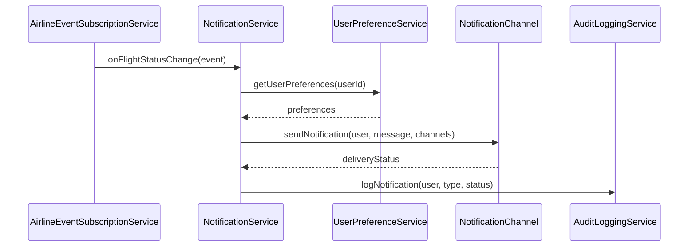
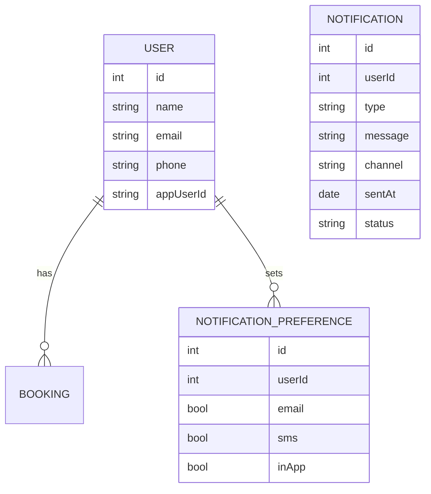

# For User Story Number [3]

1. Objective
This requirement enables travelers to receive timely notifications and travel updates about their air transport bookings. The system will inform users about flight status changes, delays, cancellations, and send reminders for check-in and boarding via email, SMS, and in-app alerts. Notification preferences and delivery reliability are key aspects.

2. API Model
  2.1 Common Components/Services
  - NotificationService (handles notification logic and delivery)
  - AirlineEventSubscriptionService (subscribes to airline event feeds)
  - UserPreferenceService (stores and manages notification preferences)
  - AuditLoggingService

  2.2 API Details
| Operation | REST Method | Type | URL | Request | Response |
|-----------|-------------|------|-----|---------|----------|
| Update Notification Preferences | PUT | Success | /api/notifications/preferences | {"userId":456,"preferences":{"email":true,"sms":false,"inApp":true}} | {"status":"UPDATED"} |
| Send Notification (internal) | POST | Success | /api/notifications/send | {"userId":456,"type":"DELAY","message":"Your flight is delayed by 30 min."} | {"status":"SENT","deliveryChannels":["email","inApp"]} |
| Send Notification (internal) | POST | Failure | /api/notifications/send | {"userId":456,"type":"DELAY","message":"Your flight is delayed by 30 min."} | {"status":"FAILED","error":"Invalid contact info"} |

  2.3 Exceptions
| API | Exception | Description |
|-----|-----------|-------------|
| /api/notifications/preferences | InvalidInputException | Invalid or missing preferences |
| /api/notifications/send | NotificationDeliveryException | Failure in sending notification |
| /api/notifications/send | ContactInfoMissingException | User contact info not available |

3 Functional Design
  3.1 Class Diagram
```mermaid
classDiagram
    AirlineEventSubscriptionService --> NotificationService
    NotificationService --> UserPreferenceService
    NotificationService --> NotificationChannel (email, sms, inApp)
    NotificationService --> AuditLoggingService
    UserPreferenceService --> UserRepository
    class AirlineEventSubscriptionService
    class NotificationService
    class NotificationChannel
    class UserPreferenceService
    class AuditLoggingService
    class UserRepository
```

  3.2 UML Sequence Diagram


  3.3 Components
| Component Name | Description | Existing/New |
|----------------|-------------|--------------|
| AirlineEventSubscriptionService | Subscribes to airline event feeds and triggers notifications | New |
| NotificationService | Handles notification logic and delivery | New |
| NotificationChannel | Abstracts delivery via email, SMS, in-app | New |
| UserPreferenceService | Manages user notification preferences | New |
| AuditLoggingService | Logs all notifications sent | Existing |
| UserRepository | Stores user contact and preference data | Existing |

  3.4 Service Layer Logic and Validations
| FieldName | Validation | Error Message | ClassUsed |
|-----------|-----------|--------------|-----------|
| userId | Exists, valid user | "User not found." | UserRepository |
| contactInfo | Valid email/SMS/app ID | "Invalid contact information." | UserRepository |
| preferences | Valid notification preferences | "Invalid notification preferences." | UserPreferenceService |
| bookingId | Notification only for relevant bookings | "No active booking found." | NotificationService |

4 Integrations
| SystemToBeIntegrated | IntegratedFor | IntegrationType |
|----------------------|---------------|-----------------|
| Airline APIs/Event Feeds | Flight status updates | API |
| Twilio | SMS delivery | API |
| SendGrid | Email delivery | API |
| Audit Logging System | Notification audit | API |

5 DB Details
  5.1 ER Model


  5.2 DB Validations
- Ensure notification is sent only if user has valid contact info for selected channel.
- Notification preferences must be present for all users.

6 Non-Functional Requirements
  6.1 Performance
  - Notification delivery within 1 minute of event.
  - Asynchronous notification processing and retry on failure.
  - Monitoring and analytics for delivery success rates.

  6.2 Security
    6.2.1 Authentication
    - All notification preference APIs require user authentication.
    6.2.2 Authorization
    - Users can update only their own preferences.
    - Sensitive contact info must be encrypted at rest and in transit.

  6.3 Logging
    6.3.1 Application Logging
    - DEBUG: Notification payloads (excluding sensitive data)
    - INFO: Successful notification deliveries
    - ERROR: Notification delivery failures
    - WARN: Invalid contact info or preference issues
    6.3.2 Audit Log
    - Log all notifications sent, including user, channel, type, and status

7 Dependencies
- Airline event feeds must be available and reliable.
- Third-party notification services (Twilio, SendGrid) must be accessible.
- Audit logging system must be accessible.

8 Assumptions
- All users have at least one valid contact method (email, SMS, or app ID).
- Airline event feeds provide real-time updates for all relevant flights.
- Notification preferences are set up during user registration or first login.
