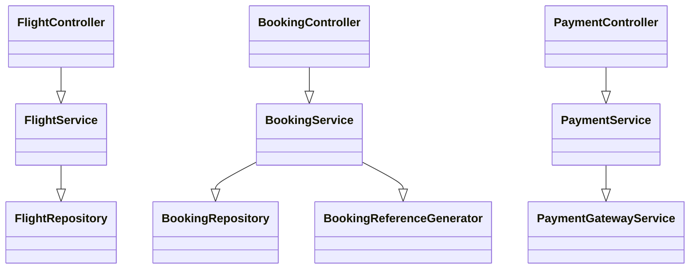
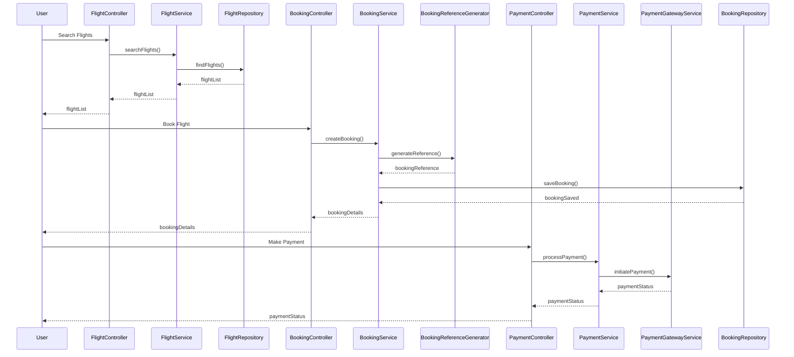
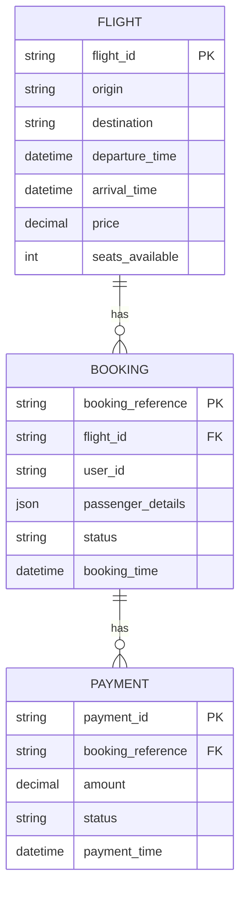

# For User Story Number [1]

1. Objective
The objective of this requirement is to enable travelers to search, select, and book air transport tickets online via a secure and user-friendly platform. The system should allow searching by origin, destination, and travel dates, and support secure payment and booking confirmation. This will streamline the booking process, improve user convenience, and ensure secure handling of sensitive data.

2. API Model
  2.1 Common Components/Services
  - AuthenticationService (existing): Handles user authentication and session management.
  - PaymentGatewayService (integration): Handles secure payment processing with third-party gateways.
  - FlightDataProviderService (integration): Fetches real-time flight data from third-party providers.
  - BookingReferenceGenerator (new): Generates unique booking references.

  2.2 API Details
| Operation   | REST Method | Type     | URL                              | Request (Sample JSON)                                                                                      | Response (Sample JSON)                                                                                   |
|-------------|-------------|----------|-----------------------------------|------------------------------------------------------------------------------------------------------------|----------------------------------------------------------------------------------------------------------|
| Search      | GET         | Success  | /api/flights/search               | {"origin":"JFK","destination":"LAX","departureDate":"2025-10-01","returnDate":"2025-10-10","passengers":2} | [{"flightId":"F123","departureTime":"10:00","arrivalTime":"13:00","duration":"3h","price":300.00}] |
| Book        | POST        | Success  | /api/flights/book                 | {"flightId":"F123","passengerDetails":[{"name":"John Doe","age":30}],"paymentInfo":{"cardNumber":"****"}} | {"bookingReference":"BR123456","status":"CONFIRMED","details":{...}}                                 |
| Payment     | POST        | Success  | /api/payments/process             | {"bookingReference":"BR123456","paymentInfo":{"cardNumber":"****","amount":300.00}}                       | {"paymentId":"P123","status":"SUCCESS","timestamp":"2025-09-26T12:00:00Z"}                        |
| BookingInfo | GET         | Success  | /api/flights/booking/{reference}  | N/A                                                                                                        | {"bookingReference":"BR123456","flightDetails":{...},"passengerDetails":{...},"status":"CONFIRMED"} |

  2.3 Exceptions
| API                  | Exception Type         | HTTP Status | Error Message                                    |
|----------------------|-----------------------|-------------|--------------------------------------------------|
| /api/flights/search  | InvalidInputException | 400         | Invalid origin, destination, or date              |
| /api/flights/book    | SeatUnavailable       | 409         | Selected seat is no longer available              |
| /api/payments/process| PaymentFailed         | 402         | Payment could not be processed                    |
| /api/flights/booking | NotFoundException     | 404         | Booking reference not found                       |

3 Functional Design
  3.1 Class Diagram

  3.2 UML Sequence Diagram

  3.3 Components
| Component Name             | Description                                                      | Existing/New |
|---------------------------|------------------------------------------------------------------|--------------|
| FlightController          | Handles flight search API endpoints                               | New          |
| BookingController         | Handles booking creation and retrieval endpoints                  | New          |
| PaymentController         | Handles payment processing endpoints                             | New          |
| FlightService             | Business logic for searching flights                             | New          |
| BookingService            | Business logic for booking flights and generating references      | New          |
| PaymentService            | Business logic for payment processing                            | New          |
| FlightRepository          | Data access for flights                                          | New          |
| BookingRepository         | Data access for bookings                                         | New          |
| PaymentGatewayService     | Integration with third-party payment gateways                    | Existing     |
| BookingReferenceGenerator | Generates unique booking references                              | New          |

  3.4 Service Layer Logic and Validations
| FieldName        | Validation                                               | Error Message                        | ClassUsed                |
|------------------|---------------------------------------------------------|--------------------------------------|--------------------------|
| origin           | Not empty, valid IATA code                              | Invalid origin airport code           | FlightService            |
| destination      | Not empty, valid IATA code                              | Invalid destination airport code      | FlightService            |
| departureDate    | Not in the past, valid date                             | Invalid departure date                | FlightService            |
| returnDate       | Not in the past, valid date                             | Invalid return date                   | FlightService            |
| passengerDetails | Not empty, valid passenger info                         | Invalid passenger details             | BookingService           |
| paymentInfo      | Valid card, PCI DSS compliant, not expired              | Invalid payment information           | PaymentService           |

4 Integrations
| SystemToBeIntegrated   | IntegratedFor     | IntegrationType |
|-----------------------|-------------------|----------------|
| FlightDataProvider    | Flight search     | API            |
| PaymentGateway        | Payment processing| API            |

5 DB Details
  5.1 ER Model

  5.2 DB Validations
- Unique constraint on booking_reference
- Foreign key constraints between booking and flight, payment and booking
- Not null constraints on all required fields

6 Non-Functional Requirements
  6.1 Performance
  - System must handle at least 1000 concurrent users.
  - Booking confirmation should be delivered within 5 seconds of payment.
  - Caching of frequent flight search queries at API layer.

  6.2 Security
    6.2.1 Authentication
    - User authentication required for booking and payment APIs (JWT/OAuth2).
    6.2.2 Authorization
    - Only authenticated users can book and view their bookings.
    - Role-based access for admin APIs (if any).

  6.3 Logging
    6.3.1 Application Logging
    - DEBUG: API request/response payloads (excluding sensitive data)
    - INFO: Successful bookings, payments
    - ERROR: Failed payments, booking errors
    - WARN: Suspicious activities, repeated failures
    6.3.2 Audit Log
    - Log all booking and payment activities with user, timestamp, and action details

7 Dependencies
- Third-party flight data providers for real-time flight information
- Payment gateway for processing online payments
- Email/SMS service for booking confirmation (if applicable)

8 Assumptions
- All users are registered and authenticated before booking
- Payment gateway is PCI DSS compliant
- Flight data is updated in near real-time from providers
