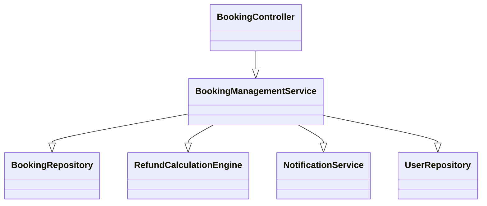
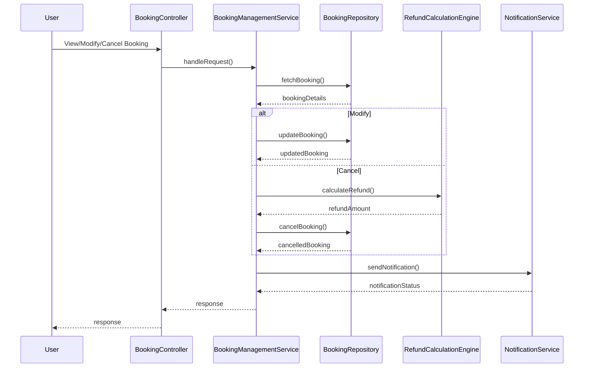
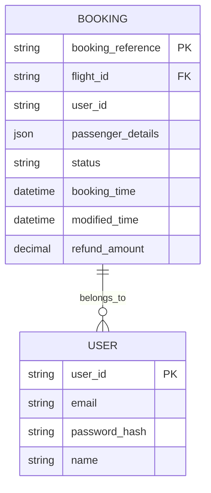

# For User Story Number [2]

1. Objective
The objective of this requirement is to allow travelers to manage their air transport bookings online, including viewing, modifying, or canceling reservations. The system must enforce airline policies, display applicable fees and refund amounts, and ensure secure, authenticated access. This will empower users to self-serve their booking management needs efficiently and securely.

2. API Model
  2.1 Common Components/Services
  - AuthenticationService (existing): Handles user authentication and session management.
  - BookingManagementService (new): Manages booking modifications and cancellations.
  - RefundCalculationEngine (new): Calculates refund amounts based on airline policy.
  - NotificationService (existing): Sends notifications for changes, confirmations, and refunds.

  2.2 API Details
| Operation   | REST Method | Type     | URL                                      | Request (Sample JSON)                                                                 | Response (Sample JSON)                                                                 |
|-------------|-------------|----------|-------------------------------------------|---------------------------------------------------------------------------------------|----------------------------------------------------------------------------------------|
| View        | GET         | Success  | /api/bookings                            | N/A                                                                                   | [{"bookingReference":"BR123456","flightDetails":{...},"status":"CONFIRMED"}]    |
| Modify      | PUT         | Success  | /api/bookings/{reference}/modify          | {"newDate":"2025-10-05","passengerInfo":{"name":"Jane Doe"}}                   | {"bookingReference":"BR123456","status":"MODIFIED","details":{...}}            |
| Cancel      | POST        | Success  | /api/bookings/{reference}/cancel          | {"reason":"Personal"}                                                              | {"bookingReference":"BR123456","status":"CANCELLED","refundAmount":100.00}     |
| Fees/Refund | GET         | Success  | /api/bookings/{reference}/refund-details  | N/A                                                                                   | {"fees":50.00,"refundAmount":100.00,"restrictions":"Non-refundable after 24h"}   |

  2.3 Exceptions
| API                        | Exception Type           | HTTP Status | Error Message                                    |
|----------------------------|-------------------------|-------------|--------------------------------------------------|
| /api/bookings              | UnauthorizedException   | 401         | User not authenticated                           |
| /api/bookings/*/modify     | PolicyViolationException| 403         | Modification not allowed by airline policy        |
| /api/bookings/*/cancel     | PolicyViolationException| 403         | Cancellation not allowed by airline policy        |
| /api/bookings/*/refund-details | NotFoundException   | 404         | Booking reference not found                       |

3 Functional Design
  3.1 Class Diagram

  3.2 UML Sequence Diagram

  3.3 Components
| Component Name           | Description                                                      | Existing/New |
|-------------------------|------------------------------------------------------------------|--------------|
| BookingController       | Handles booking management endpoints                              | New          |
| BookingManagementService| Business logic for modifications, cancellations, and validations  | New          |
| RefundCalculationEngine | Calculates refund amounts and applicable fees                     | New          |
| NotificationService     | Sends notifications to users                                      | Existing     |
| BookingRepository       | Data access for bookings                                          | Existing     |
| UserRepository          | Data access for user authentication and authorization             | Existing     |

  3.4 Service Layer Logic and Validations
| FieldName        | Validation                                               | Error Message                        | ClassUsed                |
|------------------|---------------------------------------------------------|--------------------------------------|--------------------------|
| user             | Authenticated user only                                  | User not authenticated               | BookingManagementService |
| modification     | Allowed by airline policy and within allowed timeframe   | Modification not allowed             | BookingManagementService |
| cancellation     | Allowed by airline policy and within allowed timeframe   | Cancellation not allowed             | BookingManagementService |
| refund           | Accurate calculation based on fare and timing            | Refund calculation error             | RefundCalculationEngine  |

4 Integrations
| SystemToBeIntegrated   | IntegratedFor           | IntegrationType |
|-----------------------|-------------------------|----------------|
| Airline API           | Real-time booking update| API            |
| Notification Service  | Alerts and confirmations| API            |

5 DB Details
  5.1 ER Model

  5.2 DB Validations
- Only authenticated users can access their bookings (user_id match)
- Not null constraints on booking_reference, user_id, and status
- Refund amount must be non-negative

6 Non-Functional Requirements
  6.1 Performance
  - Changes and cancellations processed within 10 seconds.
  - Caching of booking data for fast retrieval.

  6.2 Security
    6.2.1 Authentication
    - Secure authentication (JWT/OAuth2) for all booking management APIs.
    6.2.2 Authorization
    - Users can only view/modify/cancel their own bookings.

  6.3 Logging
    6.3.1 Application Logging
    - INFO: Booking modifications, cancellations, and refunds
    - ERROR: Policy violations, failed updates
    - WARN: Suspicious modification attempts
    6.3.2 Audit Log
    - Log all user actions on bookings with user, timestamp, and action details

7 Dependencies
- Airline APIs for real-time booking status and policy enforcement
- Notification system for user alerts

8 Assumptions
- Airline policies are available via API or configuration
- Refunds are processed via integrated payment gateway
- User authentication is handled by a centralized service
