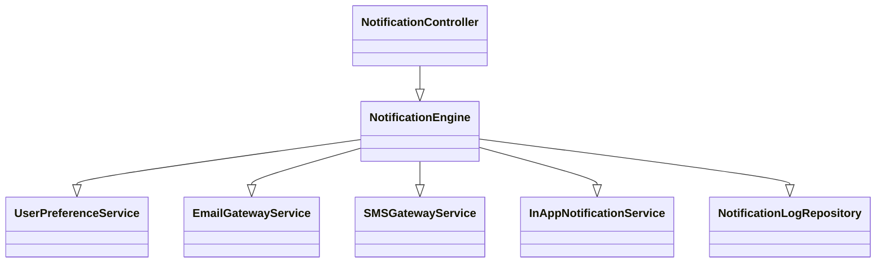
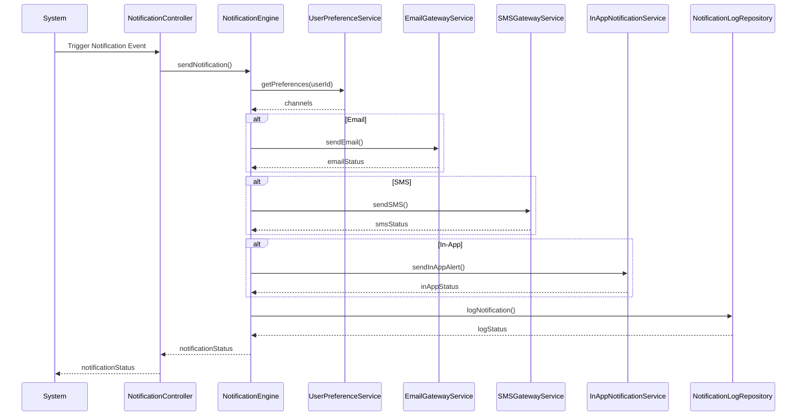
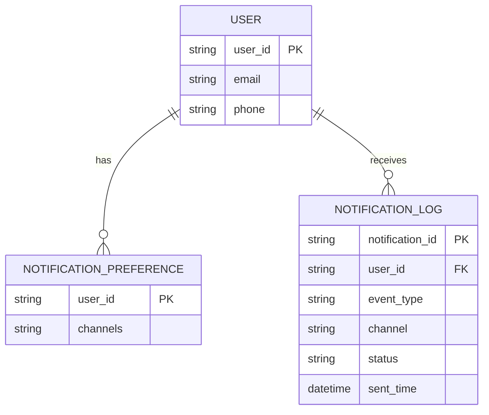

# For User Story Number [3]

1. Objective
The objective of this requirement is to ensure travelers receive timely and relevant notifications about their air transport bookings, including confirmations, schedule changes, reminders, and cancellations. Notifications should be delivered through email, SMS, and in-app alerts based on user preferences. This enhances user experience, keeps travelers informed, and supports operational transparency.

2. API Model
  2.1 Common Components/Services
  - NotificationEngine (new): Core service for triggering and sending notifications.
  - UserPreferenceService (existing): Stores and retrieves user notification preferences.
  - EmailGatewayService (existing): Handles email delivery.
  - SMSGatewayService (existing): Handles SMS delivery.
  - InAppNotificationService (existing): Handles in-app alerts.

  2.2 API Details
| Operation         | REST Method | Type     | URL                                   | Request (Sample JSON)                                                                 | Response (Sample JSON)                                                                 |
|-------------------|-------------|----------|---------------------------------------|---------------------------------------------------------------------------------------|----------------------------------------------------------------------------------------|
| Send Notification | POST        | Success  | /api/notifications/send               | {"userId":"U123","eventType":"BOOKING_CONFIRMED","bookingReference":"BR123456"} | {"notificationId":"N123","status":"SENT"}                                         |
| Set Preferences   | PUT         | Success  | /api/notifications/preferences        | {"userId":"U123","channels":["email","sms"]}                                   | {"userId":"U123","channels":["email","sms"],"status":"UPDATED"}             |
| Get Preferences   | GET         | Success  | /api/notifications/preferences/{userId}| N/A                                                                                   | {"userId":"U123","channels":["email","sms"]}                                   |
| Notification Log  | GET         | Success  | /api/notifications/logs/{userId}      | N/A                                                                                   | [{"notificationId":"N123","status":"SENT","timestamp":"2025-09-26T12:00:00Z"}]|

  2.3 Exceptions
| API                              | Exception Type           | HTTP Status | Error Message                                    |
|----------------------------------|-------------------------|-------------|--------------------------------------------------|
| /api/notifications/send          | DeliveryFailedException | 500         | Notification delivery failed                     |
| /api/notifications/preferences   | InvalidInputException   | 400         | Invalid notification channel                     |
| /api/notifications/preferences/* | NotFoundException       | 404         | User not found                                   |
| /api/notifications/logs/*        | NotFoundException       | 404         | No notifications found for user                  |

3 Functional Design
  3.1 Class Diagram

  3.2 UML Sequence Diagram

  3.3 Components
| Component Name              | Description                                                      | Existing/New |
|----------------------------|------------------------------------------------------------------|--------------|
| NotificationController     | Handles notification API endpoints                               | New          |
| NotificationEngine         | Core logic for triggering, sending, and logging notifications    | New          |
| UserPreferenceService      | Manages user notification preferences                            | Existing     |
| EmailGatewayService        | Sends email notifications                                        | Existing     |
| SMSGatewayService          | Sends SMS notifications                                          | Existing     |
| InAppNotificationService   | Sends in-app notifications                                       | Existing     |
| NotificationLogRepository  | Stores notification logs                                         | New          |

  3.4 Service Layer Logic and Validations
| FieldName        | Validation                                               | Error Message                        | ClassUsed                |
|------------------|---------------------------------------------------------|--------------------------------------|--------------------------|
| userId           | Must exist and be valid                                  | User not found                       | NotificationEngine       |
| channels         | Must be subset of [email, sms, in-app]                   | Invalid notification channel         | UserPreferenceService    |
| eventType        | Must be a supported event                                | Unsupported notification event       | NotificationEngine       |
| content          | Accurate and relevant to booking                         | Invalid notification content         | NotificationEngine       |

4 Integrations
| SystemToBeIntegrated   | IntegratedFor           | IntegrationType |
|-----------------------|-------------------------|----------------|
| Email Gateway         | Email notifications     | API            |
| SMS Gateway           | SMS notifications       | API            |
| In-App Service        | In-app alerts           | API            |
| Airline API           | Schedule updates        | API            |

5 DB Details
  5.1 ER Model

  5.2 DB Validations
- user_id must exist in USER for preferences and logs
- channels must be valid values
- sent_time must be recorded for each notification

6 Non-Functional Requirements
  6.1 Performance
  - Notifications sent within 1 minute of event.
  - System supports at least 10,000 notifications per hour.

  6.2 Security
    6.2.1 Authentication
    - Secure handling of user contact information.
    6.2.2 Authorization
    - Only system or authorized services can trigger notifications.

  6.3 Logging
    6.3.1 Application Logging
    - INFO: Notification sent, delivery status
    - ERROR: Failed notification delivery
    - WARN: Retry attempts for failed notifications
    6.3.2 Audit Log
    - All notification events logged with user, event, channel, and status

7 Dependencies
- Email/SMS gateway providers
- Airline APIs for real-time schedule updates
- User preference management system

8 Assumptions
- Users have opted in to receive notifications
- Gateway services are reliable and scalable
- User preferences are up-to-date and respected
