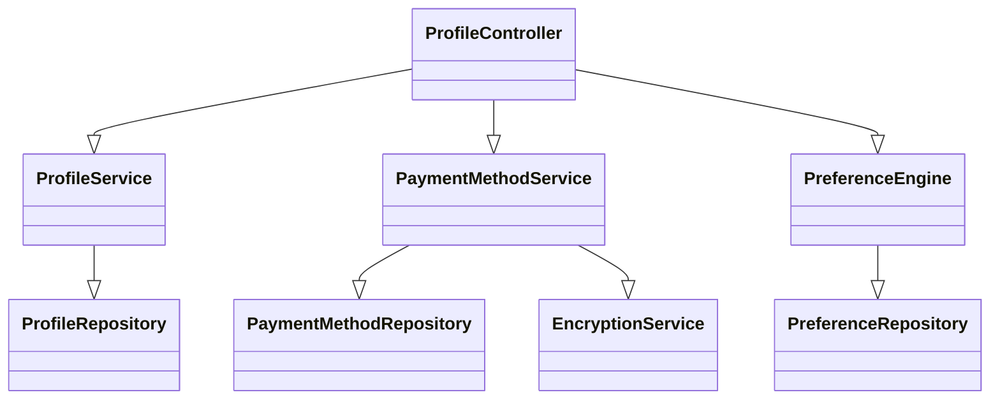
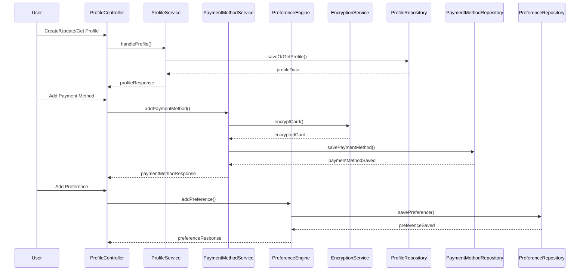
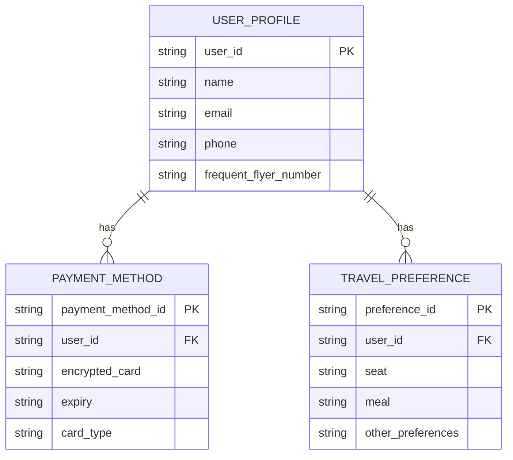

# For User Story Number [4]

1. Objective
The objective of this requirement is to provide travelers with the ability to manage their profile and saved preferences, including personal information, payment methods, frequent flyer numbers, and travel preferences. This enables quick booking, personalized service, and secure handling of sensitive data. The system should ensure data integrity, privacy, and compliance with industry standards.

2. API Model
  2.1 Common Components/Services
  - AuthenticationService (existing): Handles user authentication and session management.
  - ProfileService (new): Manages user profile creation, updates, and retrieval.
  - PaymentMethodService (new): Manages secure storage and retrieval of payment methods.
  - PreferenceEngine (new): Stores and applies user travel preferences.
  - EncryptionService (existing): Encrypts sensitive data at rest and in transit.

  2.2 API Details
| Operation         | REST Method | Type     | URL                                   | Request (Sample JSON)                                                                 | Response (Sample JSON)                                                                 |
|-------------------|-------------|----------|---------------------------------------|---------------------------------------------------------------------------------------|----------------------------------------------------------------------------------------|
| Create Profile    | POST        | Success  | /api/profile                          | {"userId":"U123","name":"John Doe","email":"john@example.com"}                | {"userId":"U123","status":"CREATED"}                                            |
| Update Profile    | PUT         | Success  | /api/profile                          | {"userId":"U123","name":"John Doe","email":"john@example.com"}                | {"userId":"U123","status":"UPDATED"}                                            |
| Get Profile       | GET         | Success  | /api/profile/{userId}                 | N/A                                                                                   | {"userId":"U123","name":"John Doe","email":"john@example.com",...}           |
| Add Payment Method| POST        | Success  | /api/profile/payment-methods           | {"userId":"U123","cardNumber":"****","expiry":"12/27"}                       | {"paymentMethodId":"PM123","status":"ADDED"}                                    |
| Add Preference    | POST        | Success  | /api/profile/preferences               | {"userId":"U123","seat":"aisle","meal":"vegetarian"}                        | {"userId":"U123","status":"PREFERENCE_ADDED"}                                   |

  2.3 Exceptions
| API                              | Exception Type           | HTTP Status | Error Message                                    |
|----------------------------------|-------------------------|-------------|--------------------------------------------------|
| /api/profile                     | InvalidInputException   | 400         | Invalid profile data                             |
| /api/profile/payment-methods      | ValidationException     | 400         | Invalid payment method                           |
| /api/profile/preferences         | InvalidInputException   | 400         | Invalid preference data                          |
| /api/profile/*                   | UnauthorizedException   | 401         | User not authenticated                           |

3 Functional Design
  3.1 Class Diagram

  3.2 UML Sequence Diagram

  3.3 Components
| Component Name           | Description                                                      | Existing/New |
|-------------------------|------------------------------------------------------------------|--------------|
| ProfileController       | Handles profile, payment, and preference endpoints                | New          |
| ProfileService          | Manages profile creation, updates, and retrieval                  | New          |
| PaymentMethodService    | Handles secure storage of payment methods                         | New          |
| PreferenceEngine        | Stores and applies user travel preferences                        | New          |
| EncryptionService       | Encrypts sensitive data                                           | Existing     |
| ProfileRepository       | Data access for user profiles                                     | New          |
| PaymentMethodRepository | Data access for payment methods                                   | New          |
| PreferenceRepository    | Data access for preferences                                       | New          |

  3.4 Service Layer Logic and Validations
| FieldName        | Validation                                               | Error Message                        | ClassUsed                |
|------------------|---------------------------------------------------------|--------------------------------------|--------------------------|
| name             | Not empty, valid string                                 | Name is required                     | ProfileService           |
| email            | Valid email format, unique                              | Invalid or duplicate email           | ProfileService           |
| cardNumber       | Valid card, PCI DSS compliant, not expired              | Invalid payment method               | PaymentMethodService     |
| seat, meal, etc. | Valid preference values                                 | Invalid preference                   | PreferenceEngine         |
| userId           | Authenticated user only                                 | User not authenticated               | ProfileService           |

4 Integrations
| SystemToBeIntegrated   | IntegratedFor           | IntegrationType |
|-----------------------|-------------------------|----------------|
| Encryption Service    | Secure data storage     | API            |
| Payment Gateway       | Payment method validation| API           |

5 DB Details
  5.1 ER Model

  5.2 DB Validations
- Unique constraint on email in USER_PROFILE
- Foreign key constraints for payment methods and preferences
- Not null constraints on all required fields
- Encrypted storage for payment data

6 Non-Functional Requirements
  6.1 Performance
  - Profile updates reflected instantly across services.
  - System supports high availability (99.9%).

  6.2 Security
    6.2.1 Authentication
    - Secure authentication (JWT/OAuth2) required for all profile APIs.
    6.2.2 Authorization
    - Users can only access and modify their own profile.
    - PCI DSS compliance for payment data.
    - GDPR compliance for personal data.

  6.3 Logging
    6.3.1 Application Logging
    - INFO: Profile updates, payment method changes, preference updates
    - ERROR: Invalid data, failed updates
    - WARN: Suspicious access attempts
    6.3.2 Audit Log
    - All changes logged with user, timestamp, and action details

7 Dependencies
- Encryption service for secure data storage
- Payment gateway for card validation

8 Assumptions
- Users are authenticated before accessing profile APIs
- Payment gateway and encryption service are compliant and reliable
- Profile data is consistent and synchronized across services
