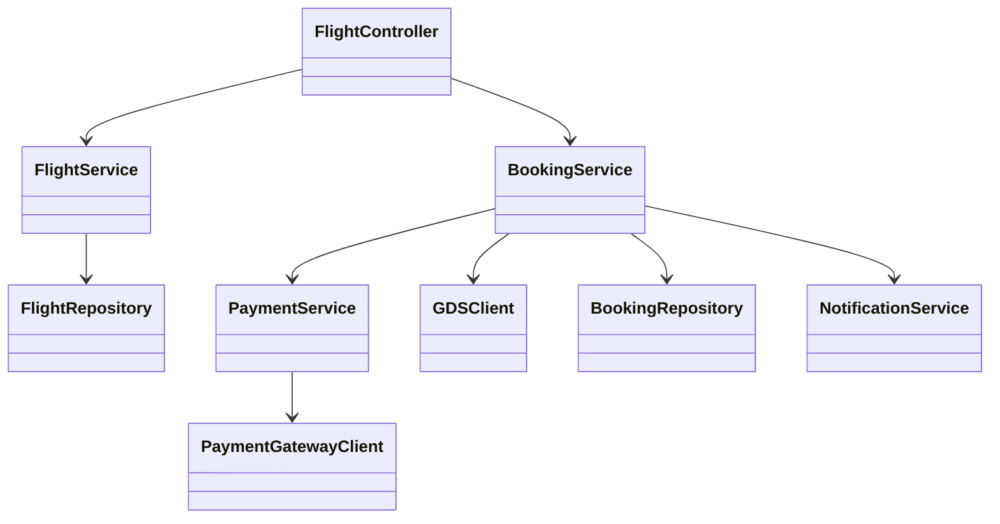
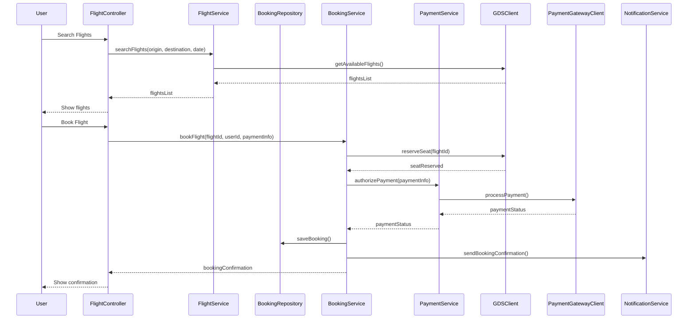
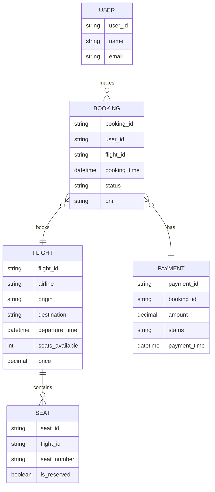

# For User Story Number [1]

1. Objective
The objective is to enable travelers to search for available flights, select preferred options, and book air transport tickets online. The system must provide real-time availability, pricing, and booking confirmation. This will allow users to conveniently plan and manage their trips end-to-end.

2. API Model
2.1 Common Components/Services
- Authentication Service (OAuth2/JWT)
- Flight Search Service
- Booking Service
- Payment Service
- GDS Integration Service
- Notification Service

2.2 API Details
| Operation   | REST Method | Type     | URL                               | Request (Sample JSON)                                                                 | Response (Sample JSON)                                                               |
|-------------|-------------|----------|------------------------------------|--------------------------------------------------------------------------------------|--------------------------------------------------------------------------------------|
| Search      | GET         | Success  | /api/flights/search                | {"origin": "JFK", "destination": "LAX", "date": "2025-10-01"}              | [{"flightId": "F123", "airline": "AA", "price": 300, "seatsAvailable": 5}] |
| Book        | POST        | Success  | /api/flights/book                  | {"flightId": "F123", "userId": "U456", "paymentInfo": {...}}                | {"bookingId": "B789", "status": "CONFIRMED", "pnr": "XYZ123"}             |
| Book        | POST        | Failure  | /api/flights/book                  | {"flightId": "F123", "userId": "U456", "paymentInfo": {...}}                | {"error": "Payment authorization failed."}                                        |

2.3 Exceptions
- FlightNotFoundException
- NoSeatsAvailableException
- PaymentAuthorizationException
- InvalidInputException
- ExternalServiceException (GDS/Payment Gateway)

3 Functional Design
3.1 Class Diagram

3.2 UML Sequence Diagram

3.3 Components
| Component Name        | Description                                         | Existing/New |
|----------------------|-----------------------------------------------------|--------------|
| FlightController     | REST controller for flight search and booking        | New          |
| FlightService        | Business logic for searching flights                 | New          |
| BookingService       | Handles booking logic and seat reservation           | New          |
| PaymentService       | Handles payment authorization and processing         | New          |
| GDSClient            | Integrates with airline GDS APIs                     | New          |
| FlightRepository     | CRUD operations for flight data                      | New          |
| BookingRepository    | CRUD operations for booking data                     | New          |
| PaymentGatewayClient | Integrates with external payment gateway             | New          |
| NotificationService  | Sends booking confirmations to users                 | New          |

3.4 Service Layer Logic and Validations
| FieldName         | Validation                              | Error Message                        | ClassUsed         |
|-------------------|-----------------------------------------|--------------------------------------|-------------------|
| origin            | Must not be empty                       | "Origin cannot be empty"             | FlightService     |
| destination       | Must not be empty                       | "Destination cannot be empty"        | FlightService     |
| date              | Must be in the future                   | "Travel date must be in the future"  | FlightService     |
| paymentInfo       | Must be authorized                      | "Payment authorization failed"       | PaymentService    |
| flightId          | Must have available seats                | "No seats available"                 | BookingService    |

4 Integrations
| SystemToBeIntegrated | IntegratedFor           | IntegrationType |
|----------------------|------------------------|-----------------|
| Airline GDS          | Flight search/booking  | API (REST)      |
| Payment Gateway      | Payment authorization  | API (REST)      |
| Notification Service | Booking confirmation   | API (REST)      |

5 DB Details
5.1 ER Model

5.2 DB Validations
- Booking cannot be created if seats_available <= 0
- Payment status must be 'AUTHORIZED' before confirming booking

6 Non-Functional Requirements
6.1 Performance
- Response time for search and booking APIs must be < 2 seconds.
- Use caching for frequent flight search queries at the API layer.

6.2 Security
6.2.1 Authentication
- OAuth2 authentication for all endpoints.
- HTTPS enforced for all API traffic.
6.2.2 Authorization
- Role-based access for booking endpoints (only authenticated users can book).

6.3 Logging
6.3.1 Application Logging
- DEBUG: API request/response payloads (excluding sensitive data)
- INFO: Successful bookings, payment authorizations
- ERROR: Failed bookings, payment failures, integration errors
- WARN: GDS or Payment API latency above threshold
6.3.2 Audit Log
- Log all booking and payment transactions with user, timestamp, and status.

7 Dependencies
- Airline GDS API availability
- Payment gateway uptime
- Notification service reliability

8 Assumptions
- All users are pre-registered and authenticated.
- GDS API provides real-time seat and pricing data.
- Payment gateway is PCI DSS compliant.
- Notification service is available for confirmations.
