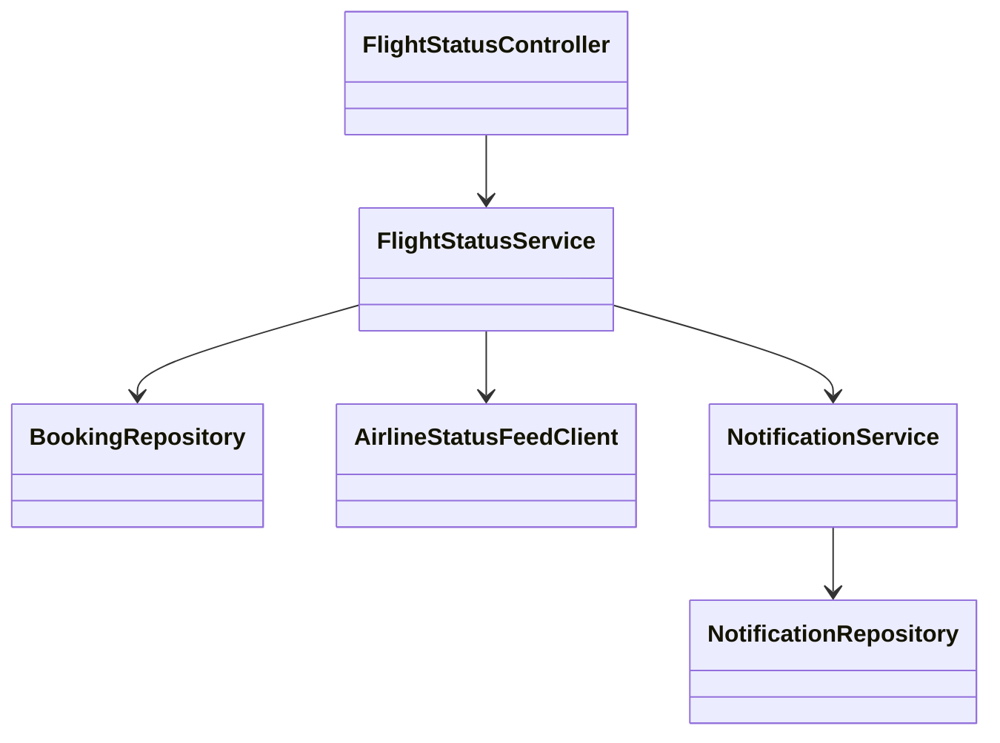
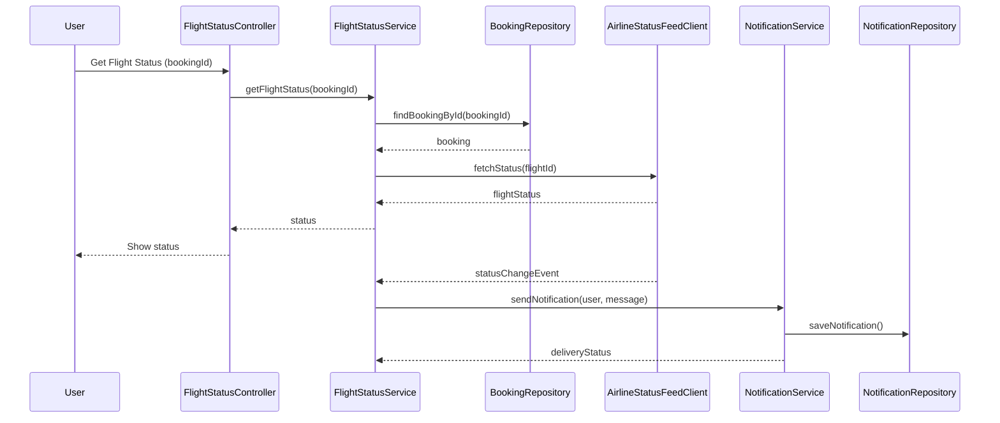
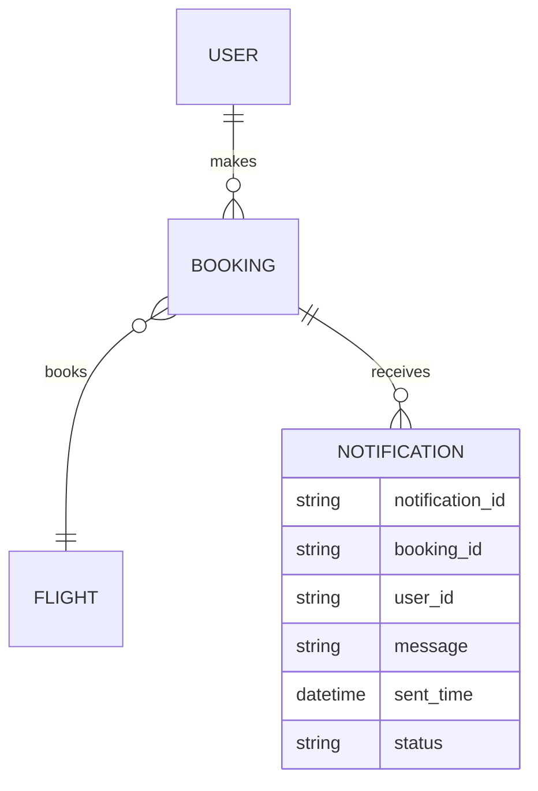

# For User Story Number [2]

1. Objective
The objective is to enable travelers to track the real-time status of their booked flights, including departure/arrival times, delays, gate assignments, and cancellations. The system should provide timely notifications for any changes in flight schedules or gates. This ensures users are always informed and can adjust their plans accordingly.

2. API Model
2.1 Common Components/Services
- Authentication Service (JWT)
- Flight Status Service
- Notification Service
- Airline Status Feed Integration Service

2.2 API Details
| Operation   | REST Method | Type     | URL                                 | Request (Sample JSON)                                 | Response (Sample JSON)                                         |
|-------------|-------------|----------|--------------------------------------|------------------------------------------------------|----------------------------------------------------------------|
| Get Status  | GET         | Success  | /api/flights/status/{bookingId}      | Path: bookingId                                      | {"flightId": "F123", "status": "DELAYED", "gate": "A12"} |
| Get Status  | GET         | Failure  | /api/flights/status/{bookingId}      | Path: bookingId                                      | {"error": "Booking not found or unauthorized"}               |
| Notify      | POST        | Success  | /api/notifications/flight-status     | {"bookingId": "B789", "message": "Gate changed"} | {"status": "DELIVERED"}                                         |
| Notify      | POST        | Failure  | /api/notifications/flight-status     | {"bookingId": "B789", "message": "Gate changed"} | {"error": "Notification delivery failed"}                      |

2.3 Exceptions
- BookingNotFoundException
- UnauthorizedAccessException
- AirlineStatusFeedException
- NotificationDeliveryException

3 Functional Design
3.1 Class Diagram

3.2 UML Sequence Diagram

3.3 Components
| Component Name              | Description                                              | Existing/New |
|----------------------------|----------------------------------------------------------|--------------|
| FlightStatusController     | REST controller for flight status endpoints               | New          |
| FlightStatusService        | Business logic for fetching and updating flight status    | New          |
| BookingRepository          | CRUD operations for booking data                         | New          |
| AirlineStatusFeedClient    | Integrates with airline status feed APIs                 | New          |
| NotificationService        | Sends notifications to users                             | New          |
| NotificationRepository     | CRUD operations for notification logs                    | New          |

3.4 Service Layer Logic and Validations
| FieldName   | Validation                                | Error Message                          | ClassUsed              |
|-------------|-------------------------------------------|----------------------------------------|------------------------|
| bookingId   | Must be a valid, existing booking         | "Booking not found or unauthorized"    | FlightStatusService    |
| user        | Must be authorized for the booking        | "Unauthorized access"                  | FlightStatusService    |
| statusFeed  | Must update every 2 minutes               | "Status feed not refreshed"            | AirlineStatusFeedClient|
| notification| Must confirm delivery                     | "Notification delivery failed"         | NotificationService    |

4 Integrations
| SystemToBeIntegrated | IntegratedFor           | IntegrationType |
|----------------------|------------------------|-----------------|
| Airline Status Feed  | Flight status updates  | API (REST/SOAP) |
| Notification Service | User notifications     | API (REST)      |

5 DB Details
5.1 ER Model

5.2 DB Validations
- Only users with valid bookings can access status.
- Notification status must be updated after delivery.

6 Non-Functional Requirements
6.1 Performance
- Flight status updates must be reflected within 2 minutes.
- Notification delivery success rate must be >= 99.9%.

6.2 Security
6.2.1 Authentication
- JWT authentication for all endpoints.
- HTTPS enforced for all API traffic.
6.2.2 Authorization
- Only users with valid bookings can access flight status.

6.3 Logging
6.3.1 Application Logging
- DEBUG: Status feed responses, notification payloads
- INFO: Status changes, notification deliveries
- ERROR: Feed/API failures, notification errors
- WARN: Notification delivery retries
6.3.2 Audit Log
- Log all status queries and notifications with user, timestamp, and status.

7 Dependencies
- Airline status feed API availability
- Notification service reliability

8 Assumptions
- Airline status feeds provide real-time updates.
- Notification service is available and reliable.
- Users have valid contact information for notifications.
