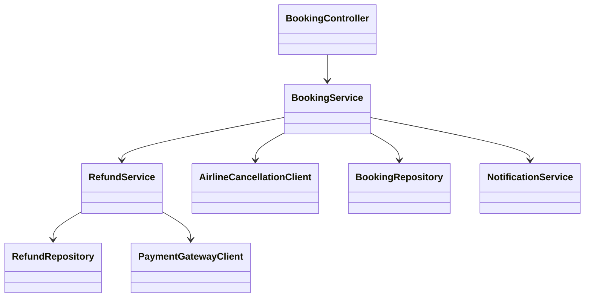
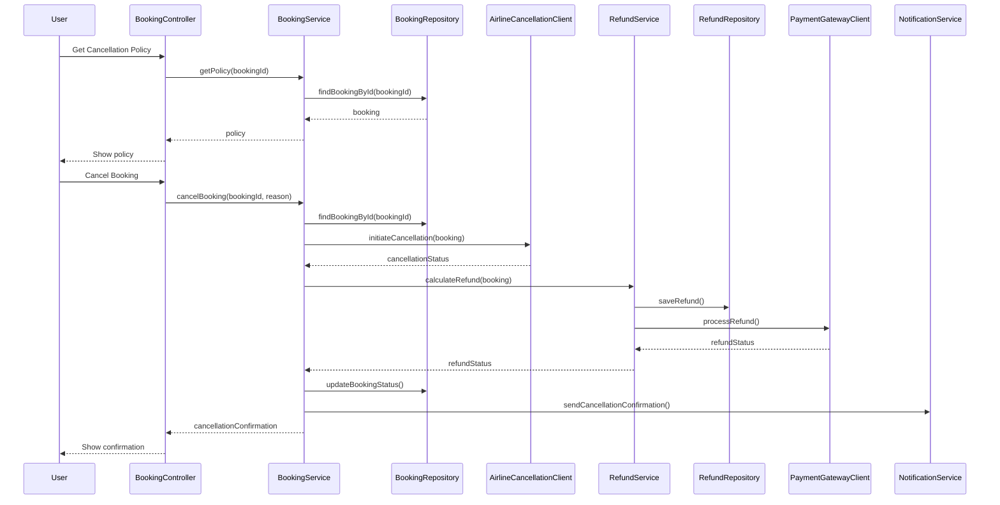
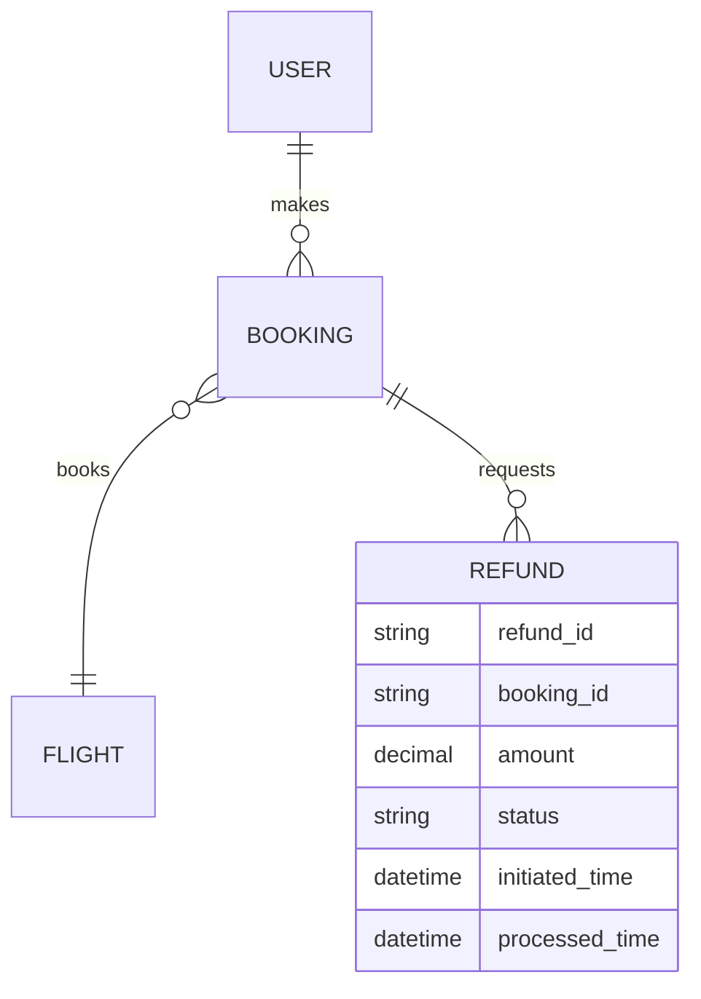

# For User Story Number [3]

1. Objective
The objective is to provide travelers the ability to cancel their booked flights and request refunds through the application. The system must display applicable cancellation and refund policies, process cancellations as per airline rules, and update users on refund status. This ensures flexibility and transparency in managing travel plans.

2. API Model
2.1 Common Components/Services
- Authentication Service (JWT/OAuth2)
- Booking Service
- Refund Service
- Airline Cancellation Integration Service
- Notification Service

2.2 API Details
| Operation   | REST Method | Type     | URL                                  | Request (Sample JSON)                                                  | Response (Sample JSON)                                                   |
|-------------|-------------|----------|--------------------------------------|------------------------------------------------------------------------|--------------------------------------------------------------------------|
| Get Policy  | GET         | Success  | /api/bookings/{bookingId}/policy     | Path: bookingId                                                        | {"policy": "Refundable with $50 fee"}                                 |
| Cancel      | POST        | Success  | /api/bookings/{bookingId}/cancel     | Path: bookingId, {"reason": "Change of plans"}                        | {"status": "CANCELLED", "refundAmount": 200, "refundStatus": "INITIATED"} |
| Cancel      | POST        | Failure  | /api/bookings/{bookingId}/cancel     | Path: bookingId, {"reason": "Change of plans"}                        | {"error": "Booking not eligible for cancellation"}                     |
| Refund      | GET         | Success  | /api/bookings/{bookingId}/refund     | Path: bookingId                                                        | {"refundStatus": "PROCESSED", "amount": 200}                          |

2.3 Exceptions
- BookingNotFoundException
- CancellationNotAllowedException
- RefundCalculationException
- AirlineCancellationAPIException
- RefundProcessingException

3 Functional Design
3.1 Class Diagram

3.2 UML Sequence Diagram

3.3 Components
| Component Name              | Description                                              | Existing/New |
|----------------------------|----------------------------------------------------------|--------------|
| BookingController          | REST controller for booking cancellation endpoints        | New          |
| BookingService             | Business logic for cancellation and eligibility checks    | New          |
| RefundService              | Handles refund calculation and processing                 | New          |
| AirlineCancellationClient  | Integrates with airline cancellation/refund APIs          | New          |
| BookingRepository          | CRUD operations for booking data                         | New          |
| RefundRepository           | CRUD operations for refund data                          | New          |
| PaymentGatewayClient       | Integrates with external payment gateway                  | New          |
| NotificationService        | Sends cancellation/refund notifications to users          | New          |

3.4 Service Layer Logic and Validations
| FieldName   | Validation                                | Error Message                          | ClassUsed              |
|-------------|-------------------------------------------|----------------------------------------|------------------------|
| bookingId   | Must be eligible for cancellation         | "Booking not eligible for cancellation"| BookingService         |
| refund      | Amount calculated as per fare rules       | "Refund calculation error"             | RefundService          |
| refund      | Status must be updated and visible        | "Refund status update failed"          | RefundService          |

4 Integrations
| SystemToBeIntegrated | IntegratedFor           | IntegrationType |
|----------------------|------------------------|-----------------|
| Airline API          | Cancellation/refund    | API (REST/SOAP) |
| Payment Gateway      | Refund processing      | API (REST)      |
| Notification Service | User notifications     | API (REST)      |

5 DB Details
5.1 ER Model

5.2 DB Validations
- Only eligible bookings can be canceled.
- Refund status must be updated after processing.

6 Non-Functional Requirements
6.1 Performance
- Cancellations processed within 1 minute.
- Refunds initiated within 24 hours of cancellation.

6.2 Security
6.2.1 Authentication
- OAuth2/JWT authentication for all endpoints.
- HTTPS enforced for all API traffic.
6.2.2 Authorization
- Only users with valid bookings can cancel and request refunds.

6.3 Logging
6.3.1 Application Logging
- DEBUG: Cancellation/refund API requests and responses
- INFO: Successful cancellations, refund initiations
- ERROR: API failures, refund errors
- WARN: Airline or payment API latency above threshold
6.3.2 Audit Log
- Log all cancellation and refund transactions with user, timestamp, and status.

7 Dependencies
- Airline cancellation/refund API availability
- Payment gateway uptime
- Notification service reliability

8 Assumptions
- Airline APIs provide real-time cancellation and refund processing.
- Payment gateway supports refund transactions.
- Notification service is available for confirmations.
