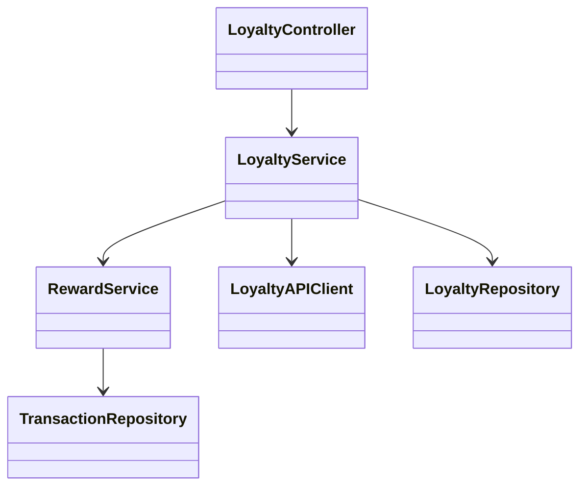
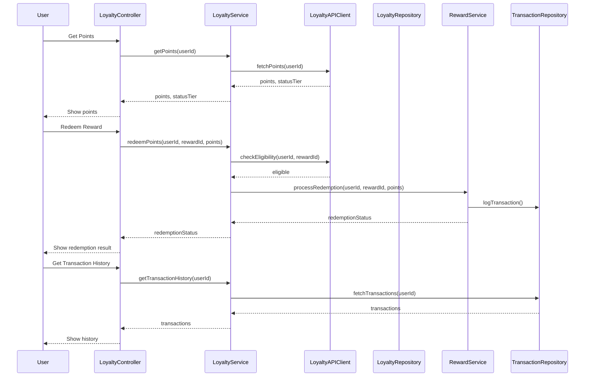
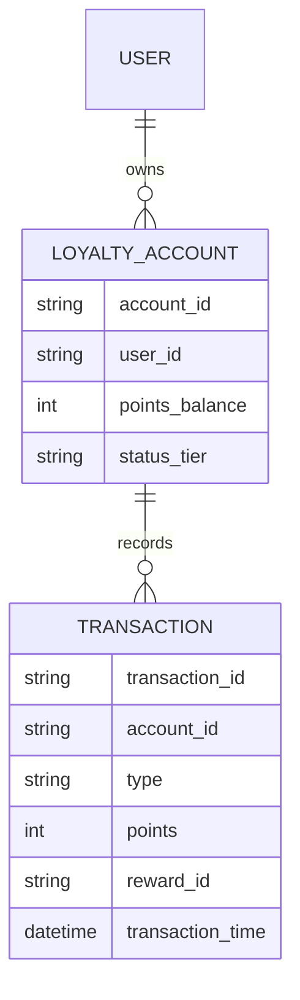

# For User Story Number [4]

1. Objective
The objective is to enable frequent flyers to manage their loyalty program points within the application. Users should be able to view their current points and status tier, redeem points for rewards, and access a detailed transaction history. This feature ensures users can maximize the benefits of their loyalty program membership.

2. API Model
2.1 Common Components/Services
- Authentication Service (OAuth2)
- Loyalty Points Service
- Reward Redemption Service
- Loyalty Program Integration Service
- Transaction History Service

2.2 API Details
| Operation   | REST Method | Type     | URL                                         | Request (Sample JSON)                               | Response (Sample JSON)                                               |
|-------------|-------------|----------|----------------------------------------------|----------------------------------------------------|-----------------------------------------------------------------------|
| Get Points  | GET         | Success  | /api/loyalty/points/{userId}                | Path: userId                                       | {"points": 15000, "statusTier": "Gold"}                            |
| Redeem      | POST        | Success  | /api/loyalty/redeem                         | {"userId": "U123", "rewardId": "R456", "points": 5000} | {"status": "REDEEMED", "reward": "Free Flight"}                    |
| Redeem      | POST        | Failure  | /api/loyalty/redeem                         | {"userId": "U123", "rewardId": "R456", "points": 20000}| {"error": "Insufficient points balance"}                              |
| History     | GET         | Success  | /api/loyalty/transactions/{userId}           | Path: userId                                       | [{"date": "2025-09-01", "type": "EARNED", "points": 1000}]      |

2.3 Exceptions
- LoyaltyMemberNotFoundException
- InsufficientPointsException
- RewardEligibilityException
- LoyaltyAPIException
- TransactionLoggingException

3 Functional Design
3.1 Class Diagram

3.2 UML Sequence Diagram

3.3 Components
| Component Name              | Description                                              | Existing/New |
|----------------------------|----------------------------------------------------------|--------------|
| LoyaltyController          | REST controller for loyalty endpoints                    | New          |
| LoyaltyService             | Business logic for points management and redemption      | New          |
| RewardService              | Handles reward redemption and eligibility                | New          |
| LoyaltyAPIClient           | Integrates with airline loyalty program APIs             | New          |
| LoyaltyRepository          | CRUD operations for loyalty data                         | New          |
| TransactionRepository      | CRUD operations for transaction history                  | New          |

3.4 Service Layer Logic and Validations
| FieldName   | Validation                                | Error Message                          | ClassUsed              |
|-------------|-------------------------------------------|----------------------------------------|------------------------|
| userId      | Must be a registered loyalty member        | "Loyalty member not found"             | LoyaltyService         |
| points      | Redemption must not exceed balance         | "Insufficient points balance"          | LoyaltyService         |
| rewardId    | Must be eligible for selected reward       | "Reward not eligible for redemption"   | RewardService          |
| transaction | All actions must be logged                 | "Transaction logging failed"           | TransactionRepository  |

4 Integrations
| SystemToBeIntegrated | IntegratedFor           | IntegrationType |
|----------------------|------------------------|-----------------|
| Airline Loyalty API  | Points/status fetch    | API (REST/SOAP) |
| Airline Loyalty API  | Points redemption      | API (REST/SOAP) |

5 DB Details
5.1 ER Model

5.2 DB Validations
- Points balance must not go negative after redemption.
- All transactions must be logged with timestamp and type.

6 Non-Functional Requirements
6.1 Performance
- Points balance updates reflected within 1 minute of transaction.
- 99.99% data accuracy for loyalty points.

6.2 Security
6.2.1 Authentication
- OAuth2 authentication for all endpoints.
- HTTPS enforced for all API traffic.
6.2.2 Authorization
- Only registered loyalty members can access and redeem points.

6.3 Logging
6.3.1 Application Logging
- DEBUG: Loyalty API requests/responses, redemption attempts
- INFO: Successful redemptions, points updates
- ERROR: API failures, redemption errors
- WARN: Data accuracy or sync issues
6.3.2 Audit Log
- Log all loyalty transactions and redemptions with user, timestamp, and status.

7 Dependencies
- Airline loyalty program API availability

8 Assumptions
- Airline loyalty API provides real-time points and status data.
- Reward eligibility rules are enforced by the loyalty API.
- All users are registered loyalty program members.
