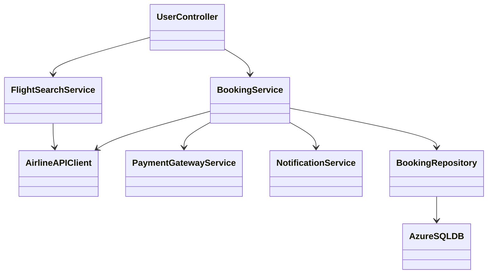
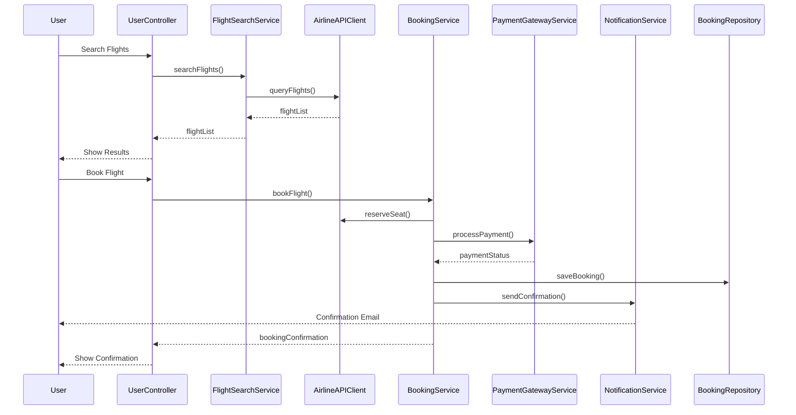
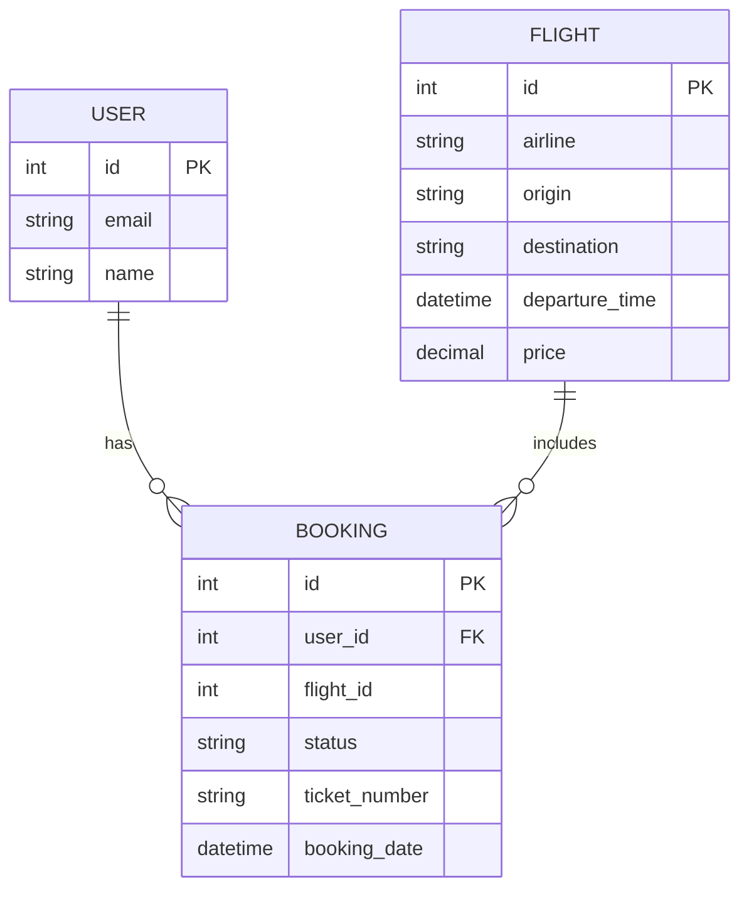

# For User Story Number [1]
1. Objective
Enable travelers to search, compare, and book air transport tickets online. The system supports multiple airlines, destinations, and seat preferences. It integrates secure payment and sends confirmation notifications upon booking.

2. API Model
  2.1 Common Components/Services
  - AirlineAPIClient (for external airline API integration)
  - PaymentGatewayService (for payment processing)
  - NotificationService (for sending confirmation emails)
  - FlightSearchService (for searching and comparing flights)

  2.2 API Details
| Operation   | REST Method | Type    | URL                         | Request (JSON)                                                                                 | Response (JSON)                                                                                 |
|-------------|-------------|---------|-----------------------------|------------------------------------------------------------------------------------------------|-------------------------------------------------------------------------------------------------|
| Search      | GET         | Success | /api/flights/search         | {"origin":"JFK","destination":"LAX","date":"2025-10-01","airline":"Delta"}         | [{"flightId":1,"airline":"Delta","price":300,"departureTime":"10:00"}, ...]           |
| Book        | POST        | Success | /api/flights/book           | {"flightId":1,"userId":123,"seatPreference":"Aisle","paymentInfo":{...}}               | {"bookingId":456,"status":"CONFIRMED","ticketNumber":"XYZ123"}                         |
| Book        | POST        | Failure | /api/flights/book           | {"flightId":1,"userId":123,"seatPreference":"Aisle","paymentInfo":{...}}               | {"errorCode":"PAYMENT_FAILED","message":"Payment declined"}                              |
| Confirm     | GET         | Success | /api/flights/confirmation/456| N/A                                                                                           | {"bookingId":456,"status":"CONFIRMED","emailSent":true}                                 |

  2.3 Exceptions
| API                   | Exception Type         | Description                          |
|-----------------------|-----------------------|--------------------------------------|
| /api/flights/search   | InvalidInputException | Invalid dates or destinations        |
| /api/flights/book     | PaymentFailedException| Payment processing failed            |
| /api/flights/book     | SeatUnavailableException| Selected seat is no longer available |
| /api/flights/confirmation/{id}| NotFoundException | Booking not found                    |

3 Functional Design
  3.1 Class Diagram

  3.2 UML Sequence Diagram

  3.3 Components
| Component Name         | Description                                             | Existing/New |
|-----------------------|---------------------------------------------------------|--------------|
| UserController        | Handles user requests for search and booking            | New          |
| FlightSearchService   | Business logic for searching flights                    | New          |
| BookingService        | Handles booking, payment, and notifications             | New          |
| AirlineAPIClient      | Integrates with external airline APIs                   | New          |
| PaymentGatewayService | Integrates with payment gateway                         | New          |
| NotificationService   | Sends confirmation emails                               | New          |
| BookingRepository     | Persists booking data                                   | New          |
| AzureSQLDB            | Database for storing booking and user info              | Existing     |

  3.4 Service Layer Logic and Validations
| FieldName     | Validation                         | Error Message                     | ClassUsed           |
|---------------|------------------------------------|-----------------------------------|---------------------|
| travelDate    | Must be a valid future date        | Invalid travel date               | FlightSearchService |
| destination   | Must be a supported destination    | Invalid destination               | FlightSearchService |
| paymentInfo   | Must pass payment validation       | Payment details invalid           | PaymentGatewayService|
| userEmail     | Must be a valid/verified email     | Email not verified                | NotificationService |

4 Integrations
| SystemToBeIntegrated | IntegratedFor            | IntegrationType |
|----------------------|--------------------------|-----------------|
| Airline APIs         | Flight search/booking    | API             |
| Payment Gateway      | Payment processing       | API             |
| Email Service        | Confirmation notification| API             |

5 DB Details
  5.1 ER Model

  5.2 DB Validations
- Booking must reference valid user and flight IDs.
- Unique constraint on ticket_number.
- Booking status must be one of [PENDING, CONFIRMED, CANCELLED].

6 Non-Functional Requirements
  6.1 Performance
  - API response time < 2 seconds for search and booking.
  - Caching of frequent search queries at API layer.

  6.2 Security
    6.2.1 Authentication
    - OAuth2/JWT authentication for all endpoints.
    - Secure HTTPS enforced.
    6.2.2 Authorization
    - Only authenticated users can book flights.

  6.3 Logging
    6.3.1 Application Logging
    - DEBUG: API request/response payloads (excluding sensitive data)
    - INFO: Successful bookings, payments
    - WARN: Validation failures
    - ERROR: Payment failures, API errors
    6.3.2 Audit Log
    - Log booking creation, payment, and confirmation events

7 Dependencies
- External airline APIs must be available.
- Payment gateway integration must be configured.
- Email service for notifications.

8 Assumptions
- All airlines provide real-time API access.
- Payment gateway supports PCI DSS compliance.
- Email delivery is reliable and fast.
