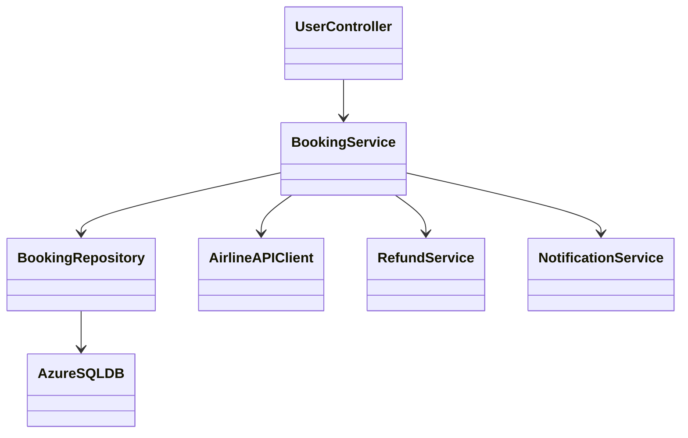
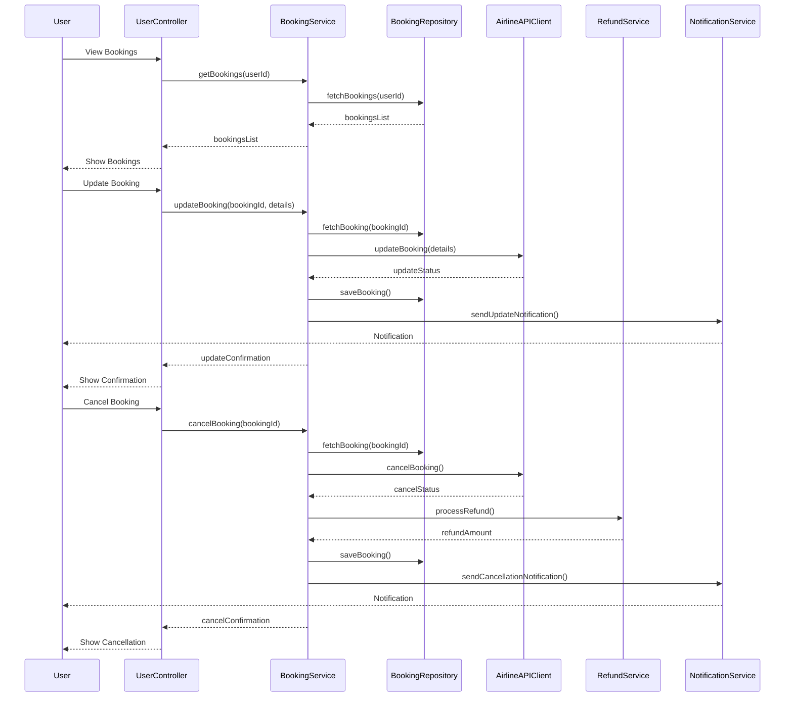
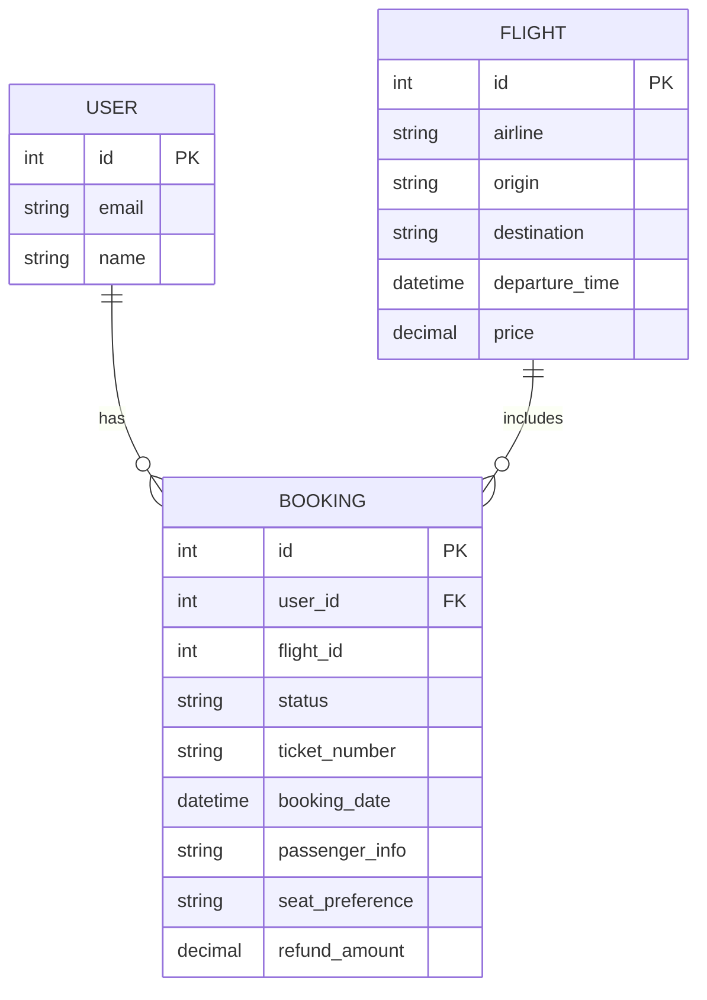

# For User Story Number [2]
1. Objective
Allow travelers to view and manage their air transport bookings, including updating passenger details, changing seats, or cancelling reservations. The system provides real-time updates and notifications for any changes. Secure access and refund processing are integral to the solution.

2. API Model
  2.1 Common Components/Services
  - BookingService (handles booking retrieval, updates, and cancellations)
  - NotificationService (for sending update/cancellation notifications)
  - AirlineAPIClient (for real-time airline booking updates)
  - RefundService (for processing refunds)

  2.2 API Details
| Operation   | REST Method | Type    | URL                              | Request (JSON)                                                                 | Response (JSON)                                                                 |
|-------------|-------------|---------|----------------------------------|--------------------------------------------------------------------------------|---------------------------------------------------------------------------------|
| View        | GET         | Success | /api/bookings?userId=123         | N/A                                                                            | [{"bookingId":456,"flightId":1,"status":"CONFIRMED","details":{...}}, ...] |
| Update      | PUT         | Success | /api/bookings/456                | {"passengerInfo":{...},"seatPreference":"Window"}                           | {"bookingId":456,"status":"UPDATED","details":{...}}                        |
| Cancel      | DELETE      | Success | /api/bookings/456                | N/A                                                                            | {"bookingId":456,"status":"CANCELLED","refundAmount":100}                   |
| Cancel      | DELETE      | Failure | /api/bookings/456                | N/A                                                                            | {"errorCode":"CUTOFF_EXCEEDED","message":"Cannot cancel within 24 hours"}    |

  2.3 Exceptions
| API                   | Exception Type         | Description                              |
|-----------------------|-----------------------|------------------------------------------|
| /api/bookings         | UnauthorizedException | User not authenticated                   |
| /api/bookings/{id}    | NotFoundException     | Booking ID not found                     |
| /api/bookings/{id}    | CutoffExceededException| Update/cancellation after cutoff time    |
| /api/bookings/{id}    | RefundPolicyException | Refund not applicable                    |

3 Functional Design
  3.1 Class Diagram

  3.2 UML Sequence Diagram

  3.3 Components
| Component Name         | Description                                             | Existing/New |
|-----------------------|---------------------------------------------------------|--------------|
| UserController        | Handles user requests for booking management            | New          |
| BookingService        | Business logic for viewing/updating/cancelling bookings | New          |
| BookingRepository     | Persists and retrieves booking data                     | New          |
| AirlineAPIClient      | Integrates with airline booking APIs                    | New          |
| RefundService         | Calculates and processes refunds                        | New          |
| NotificationService   | Sends update/cancellation notifications                 | New          |
| AzureSQLDB            | Database for storing booking and user info              | Existing     |

  3.4 Service Layer Logic and Validations
| FieldName     | Validation                              | Error Message                     | ClassUsed           |
|---------------|-----------------------------------------|-----------------------------------|---------------------|
| bookingId     | Must exist and belong to user           | Invalid booking ID                | BookingService      |
| updateTime    | Must be before airline cutoff time      | Update not allowed after cutoff   | BookingService      |
| cancelTime    | Must be before airline cutoff time      | Cancellation not allowed after cutoff | BookingService  |
| refundPolicy  | Must match fare rules                   | Refund not applicable             | RefundService       |

4 Integrations
| SystemToBeIntegrated | IntegratedFor            | IntegrationType |
|----------------------|--------------------------|-----------------|
| Airline APIs         | Booking update/cancellation | API             |
| Email/SMS Service    | Notifications               | API             |

5 DB Details
  5.1 ER Model

  5.2 DB Validations
- Booking must reference valid user and flight IDs.
- Only bookings with status CONFIRMED can be updated/cancelled.
- Refund amount must be non-negative.

6 Non-Functional Requirements
  6.1 Performance
  - Booking management APIs must be available 24/7.
  - Real-time sync with airline systems.

  6.2 Security
    6.2.1 Authentication
    - OAuth2 authentication for all endpoints.
    - Secure HTTPS enforced.
    6.2.2 Authorization
    - Only authenticated users can access their bookings.

  6.3 Logging
    6.3.1 Application Logging
    - DEBUG: API request/response payloads (excluding sensitive data)
    - INFO: Booking updates, cancellations
    - WARN: Validation failures
    - ERROR: Update/cancellation failures
    6.3.2 Audit Log
    - Log all booking changes and cancellations

7 Dependencies
- Airline APIs must be available for real-time updates.
- Email/SMS service for notifications.

8 Assumptions
- Airline APIs support real-time booking updates/cancellations.
- Refunds are processed instantly via payment gateway.
- Notification delivery is reliable and timely.
